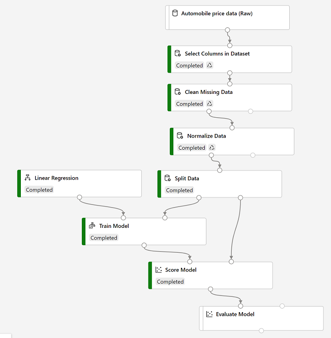

To evaluate a regression model, you could simply compare the predicted labels to the actual labels in the validation dataset to held back during training, but this is an imprecise process and doesn't provide a simple metric that you can use to compare the performance of multiple models.

## Add an Evaluate Model module

1. Open the **Auto Price Training** pipeline you created in the previous unit if it's not already open.
2. In the pane on the left, in the **Model Scoring & Evaluation** section, drag an **Evaluate Model** module to the canvas, under the **Score Model** module, and connect the output of the **Score Model** module to the **Scored dataset** (left) input of the **Evaluate Model** module.
3. Ensure your pipeline looks like this:

> [!div class="centered"]
> 

4. Select **Submit**, and run the pipeline using the existing experiment named **mslearn-auto-training**.
5. Wait for the experiment run to complete.
6. When the experiment run has completed, select the **Evaluate Model** module and in the settings pane, on the **Outputs + logs** tab, under **Data outputs** in the **Evaluation results** section, use the **Visualize** icon to view the results. These include the following regression performance metrics:
    - **Mean Absolute Error (MAE)**: The average difference between predicted values and true values. This value is based on the same units as the label, in this case dollars. The lower this value is, the better the model is predicting.
    - **Root Mean Squared Error (RMSE)**: The square root of the mean squared difference between predicted and true values. The result is a metric based on the same unit as the label (dollars). When compared to the MAE (above), a larger difference indicates greater variance in the individual errors (for example, with some errors being very small, while others are large).
    - **Relative Squared Error (RSE)**: A relative metric between 0 and 1 based on the square of the differences between predicted and true values. The closer to 0 this metric is, the better the model is performing. Because this metric is relative, it can be used to compare models where the labels are in different units.
    - **Relative Absolute Error (RAE)**: A relative metric between 0 and 1 based on the absolute differences between predicted and true values. The closer to 0 this metric is, the better the model is performing. Like RSE, this metric can be used to compare models where the labels are in different units.
    - **Coefficient of Determination (R2)**: This metric is more commonly referred to as *R-Squared*, and summarizes how much of the variance between predicted and true values is explained by the model. The closer to 1 this value is, the better the model is performing.
7. Close the **Evaluate Model result visualization** window.

You can try a different regression algorithm and compare the results by connecting the same outputs from the **Split Data** module to a second **Train model** module (with a different algorithm) and a second **Score Model** module; and then connecting the outputs of both **Score Model** modules to the same **Evaluate Model** module for a side-by-side comparison.

When you've identified a model with evaluation metrics that meet your needs, you can prepare to use that model with new data.
