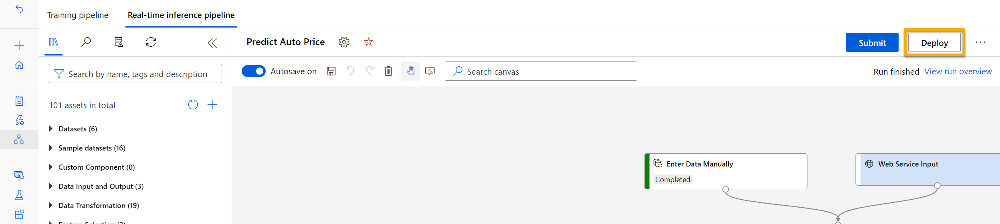

After you've created and tested an inference pipeline for real-time inferencing, you can publish it as a service for client applications to use.

> [!NOTE] 
> In this exercise, you'll deploy the web service to an Azure Container Instance (ACI). This type of compute is created dynamically, and is useful for development and testing. For production, you should create an *inference cluster*, which provides an Azure Kubernetes Service (AKS) cluster that provides better scalability and security.

## Deploy a service

1. View the **Predict Auto Price** inference pipeline you created in the previous unit.
2. Select **Job detail** on the left hand pane. This will open up another window. 

    

3. In the new window, select **Deploy**.

    
    
4. In the configuration screen, select **Deploy a new real-time endpoint**, using the following settings:
    -  **Name**: predict-auto-price
    -  **Description**: Auto price regression
    - **Compute type**: Azure Container Instance

5. Wait for the web service to be deployed - this can take several minutes. The deployment status is shown at the top left of the designer interface.

## Test the service

1. On the **Endpoints** page, open the **predict-auto-price** real-time endpoint.

    
    
2. When the **predict-auto-price** endpoint opens, select the **Test** tab. We will use it to test our model with new data. Delete the current data under **Input data to test real-time endpoint**. Copy and paste the below data into the data section:  

    ```json
    {
    "Inputs": {
                "WebServiceInput0":
                [
                    {
                        "symboling": 3,
                        "normalized-losses": 1.0,
                        "make": "alfa-romero",
                        "fuel-type": "gas",
                        "aspiration": "std",
                        "num-of-doors": "two",
                        "body-style": "convertible",
                        "drive-wheels": "rwd",
                        "engine-location": "front",
                        "wheel-base": 88.6,
                        "length": 168.8,
                        "width": 64.1,
                        "height": 48.8,
                        "curb-weight": 2548,
                        "engine-type": "dohc",
                        "num-of-cylinders": "four",
                        "engine-size": 130,
                        "fuel-system": "mpfi",
                        "bore": 3.47,
                        "stroke": 2.68,
                        "compression-ratio": 9,
                        "horsepower": 111,
                        "peak-rpm": 5000,
                        "city-mpg": 21,
                        "highway-mpg": 27
                    }
                ]
            },
    "GlobalParameters": {}
    }
    ```

3. Select **Test**. On the right hand of the screen, you should see the output **'predicted_price'**. The output is the predicted price for a vehicle with the particular input features specified in the data. 

    
