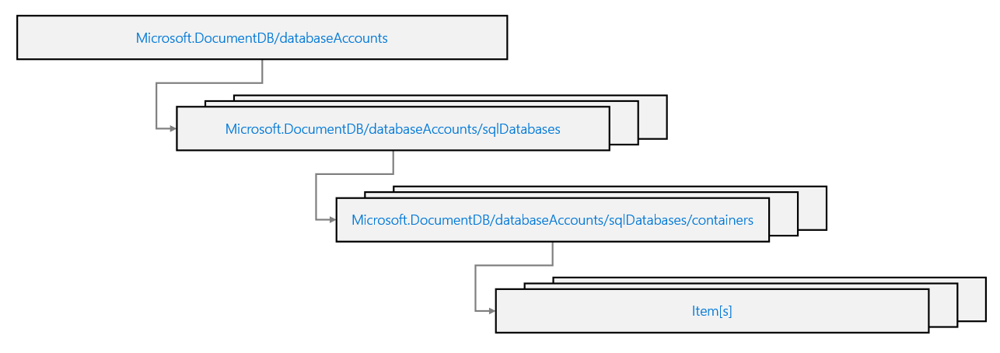

When creating Bicep files or Azure Resource Manager templates (ARM templates), you need to understand what resource types are available, and what values to use in your template.

Each of the resources available for Azure Cosmos DB is all listed under the **Microsoft.DocumentDB** resource provider:

| **Resource type** | **Description** |
| --- | --- |
| **Microsoft.DocumentDB/databaseAccounts** | Represents an account |
| **Microsoft.DocumentDB/databaseAccounts/sqlDatabases** | Represents a SQL API database |
| **Microsoft.DocumentDB/databaseAccounts/sqlDatabases/containers** | Represents a SQL API container |

Visually, you can think of these resources as a hierarchy.

This list is not exhaustive, other resources can be created in a template such as:

- Stored procedures
- User-defined functions
- Pre-triggers
- Post-triggers

> [!TIP]
> These example container-level resources can be created with their code automatically deployed using a template.
