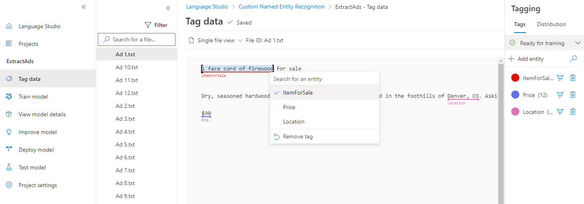

Tagging your data is one of the most important steps since these tags are what teaches your model which entities to look for. Three things to focus on are:

- **Consistency** - Tag your data the same way across all files for training. This allows your model to learn without any conflicting inputs.
- **Precision** - Tag your entities consistently, without unnecessary additional words. This ensures only the correct data is included in your extracted entity.
- **Completness** - Tag your data completely, and don't miss any entities. This helps your model always recognize the entities present.



## How to tag your data

The most straighforward method for tagging your data is through Language Studio, which allows you to see the file, select the beginning and end of your entity, and specify which entity it is.

Each tag that you identify gets saved into a file that lives in your storage account with your dataset, in an auto-generated JSON file. This file then gets used by the model to learn how to extract custom entities. It is possible to provide this file when creating your project (if you're importing the same tags from a different project, for example) however it must be in the approved format.

```json
{
    "entityNames": [
        "ItemForSale",
        "Price",
        "Location"
    ],
    "documents": [
        {
            "location": "Ad 1.txt",
            "culture": "en-us",
            "entities": [
                {
                    "regionStart": 0,
                    "regionLength": 137,
                    "labels": [
                        {
                            "entity": 0,
                            "start": 0,
                            "length": 23,
                            "autoTagged": false
                        },
                        {
                            "entity": 2,
                            "start": 115,
                            "length": 10,
                            "autoTagged": false
                        },
                        {
                            "entity": 1,
                            "start": 134,
                            "length": 3,
                            "autoTagged": false
                        }
                    ]
                }
            ],
            "datasets": [
                "Train"
            ]
        },
        {
            "location": "Ad 10.txt",
            "culture": "en-us",
            "entities": [
                {
                    "regionStart": 0,
                    "regionLength": 163,
                    "labels": [
                        {
                            "entity": 0,
                            "start": 0,
                            "length": 29
                        },
                        {
                            "entity": 2,
                            "start": 33,
                            "length": 12
                        },
                        {
                            "entity": 1,
                            "start": 159,
                            "length": 4
                        }
                    ]
                }
            ],
            "datasets": [
                "Train"
            ]
        }
    ]
}
```

| Field | Description |
|-------|-------------|
| `entityNames` | Array of entites to extract |
| `documents` | Array of tagged documents |
| `location` | Path to file within container connected to the project |
| `culture` | Language of the file |
| `entities` | Array of information on the entities present in the current document |
| `regionStart` | Inclusive character position for start of text |
| `regionLength` | Length in characters of the data used in training |
| `labels` | Array of tagged entities in the files |
| `entity` | Which entity this tag references, by index in `entityNames` |
| `start` | Inclusive character position for start of entity |
| `length` | Length in characters of the entity |
| `datasets` | Which dataset the file is assigned to |

