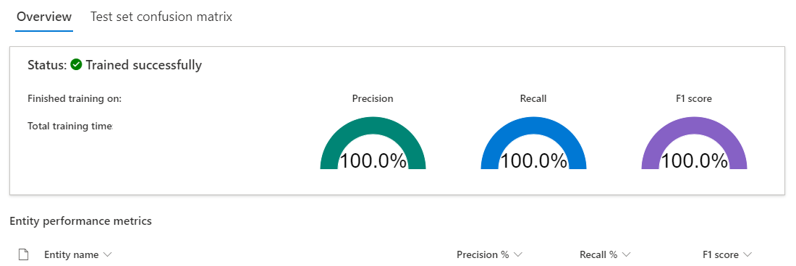
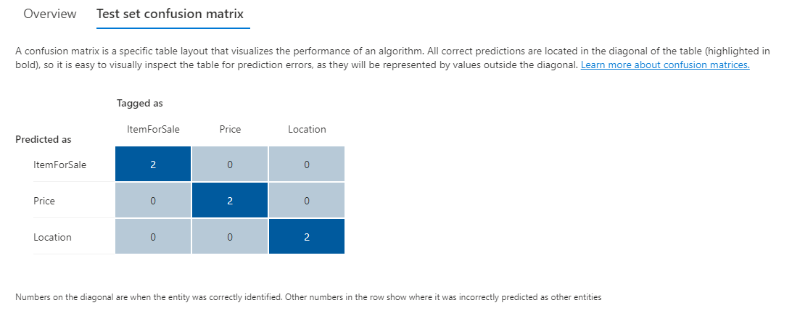

Training and evaluating your model is an iterative process of adding data and tags to your training dataset to teach the model more accurately. To know what types of data and tags need to be improved, Language Studio provides scoring in the **View model details** page on the left hand pane.

Individual entities as well as your overall model score are broken down into three metrics to explain how they are performing and where they need to improve.

| Metric | Description |
|--------|-------------|
| Precision | The ratio of successful entity recognitions to all attempted recognitions. A high score means that as long as the entity is recognized, it's labeled correctly.  |
| Recall    | The ratio of successful entity recognitions to the actual number of entities in the document. A high score means it finds the entity or entities well, regardless of if it assigns them the right label  |
| F1 score    | Combination of precision and recall to provide a single scoring metric  |

Scores are available both per entity and for the model as a whole. You may find an entity scores well, but the whole model does not.

## How to interpret metrics

Ideally we want our model to score well in both precision and recall, which means the entity recognition works well. If both score low, it means the model is both struggling to recognize entities in the document, and when it does extract that entity, it doesn't assign it the correct label with high confidence.

If precision is low but recall is high, it means that the entity is recognized well but it's not labeled as the correct entity type.

If precision is high but recall is low, it means that the entity doesn't always get recognized, but when the entity is extracted the correct label is applied.

## Confusion matrix

On the same **View model details** page, there is another tab on the top for the *Confusion matrix*. This provides a visual table of all the entities and how each performed, giving a complete view of the model as well as where it's falling short.

