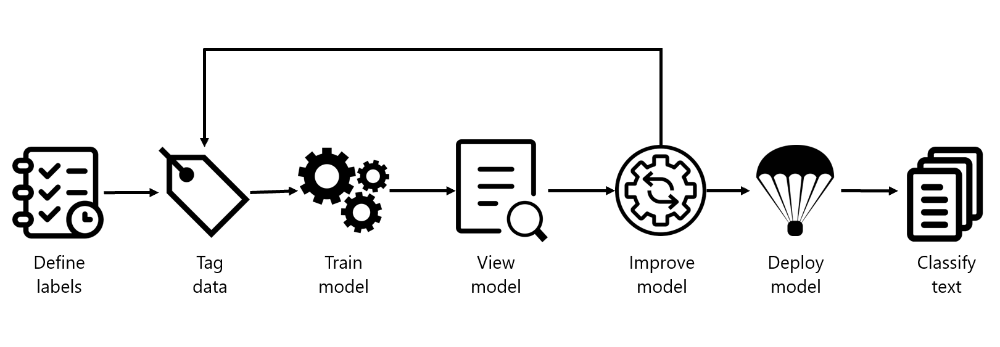

Custom text classification projects are your workspace to build, train, improve, and deploy your classification model. Working with your project can be done two ways: through the *Language Studio* and via the REST API. The Language Studio will be used in the lab, but the REST API has the same functionality. Regardless of which method you prefer, the steps for developing your model are the same.

## Language service project lifecycle

1. **Define labels**: Understanding the data you want to classify, identify the possible labels you want to categorize into.
2. **Tag data**: Tag your existing data, specifying the label or labels each file falls under. This is an important step, as it is how your model will learn how to classify future files. Best practice is to have clear differences between labels to avoid ambiguity, and provide good examples of each label for the model to learn from.
3. **Train model**: Once your data is tagged, train it with the labeled data.
4. **View model**: After your model is trained, view the results of the model. This includes a score of 0 to 1 that is based on the precision and recall of the data tested.
5. **Improve model**: Improve your model by seeing which classifications failed to evaluate to the appropriate label, see your label distribution, and find out what data needs to be added to your model to improve performance.
6. **Deploy model**: Once your model performs as desired, deploy your model to make it available via the API.
7. **Classify text**: Use your model for classifying text. The lab covers how to use the API, and you can view the [API reference](https://aka.ms/ct-runtime-swagger)
