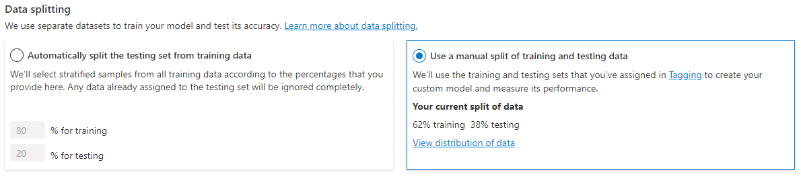

Custom text classification projects are your workspace to build, train, improve, and deploy your classification model. Working with your project can be done two ways: through the *Language Studio* and via the REST API. The Language Studio is the GUI that will be used in the lab, but the REST API has the same functionality. Regardless of which method you prefer, the steps for developing your model are the same.

## Language service project lifecycle


1. **Define labels**: Understanding the data you want to classify, identify the possible labels you want to categorize into.
2. **Tag data**: Tag your existing data, specifying the label or labels each file falls under. Remember this is an important step, as it is how your model will learn how to classify future files. Best practice is to have clear differences between labels to avoid ambiguity, and provide good examples of each label for the model to learn from.
3. **Train model**: Once your data is tagged, train it with the labeled data.
4. **View model**: After your model is trained, view the results of the model. This includes a score of 0 to 1 that is based on the precision and recall of the data tested.
5. **Improve model**: Improve your model by seeing which classifications failed to evaluate to the appropriate label, see your label distribution, and find out what data needs to be added to your model to improve performance.
6. **Deploy model**: Once your model performs as desired, deploy your model to make it available via the API.
7. **Classify text**: Use your model for classifying text. The lab covers how to use the API, and you can view the [API reference](https://aka.ms/ct-runtime-swagger)

## How to split datasets for training

When tagging your data, you have the option to specify which dataset you want each file to be: 

- **Training** - The training dataset is used to actually train the model; the data and tags provided are fed into the machine learning algorithm to teach your model what data should be classified to which label. This will be be the larger of the two datasets, usually recommended to be about 80% of your tagged data. 
- **Testing** - The testing dataset is tagged data used to verify you model after it's trained. Azure will take the data in the testing dataset, submit it to the model, and compare the output to how you tagged your data to determine how well the model performed. The result of that comparison is how your model gets scored and helps you know how to improve your predicitive performance.

During the **Train model** step, there are two options for how to train your model:



- **Automatic split** - Azure takes all of your data, splits it into the specified percentages randomly, and applies them in training the model. This option is best when you have a larger dataset, data is naturally more consistent, or the distribution of your data extensively covers your classes. 
- **Manual split** - Manually specify which files should be in each dataset. When you submit the training job, the Language service will tell you the split of the dataset and the distribution. This is best used with smaller datasets to ensure the correct distribution of classes and variation in data are present to correctly train your model.

To use the automatic split, put all files into the *training* dataset when tagging your data (this is the default). To use the manual split, specify which files should be in testing versus traing during the tagging of your data. 

## Deployment options

The Language service allows each project to create both multiple models and multiple deployments, each with their own unique name. Benefits include ability to:

- Test two models side by side
- Compare how the split of datasets impact performance
- Deploy multiple versions of your model

> [!NOTE]
> Each project has a limit of ten deployment names

During deployment you can choose the name for the deployed model, which can then be selected when submitting a classification task:

```json
<...>
    "customClassificationTasks":[
        {
            "parameters": {
                    "project-name": "<YOUR PROJECT>",
                    "deployment-name": "<YOUR DEPLOYMENT>"
            }
        }
    ]
<...>
```

## Using the REST API

The REST API available for the Language service allows for command line development of Language service projects in the same way that Language Studio, explored further in this module's lab, provides a user interface for building projects.

### Pattern of using the API

The API for the Language service operates asynchronously for most calls, which means for each step we submit a request to the service and then have to check back with the service via a subsequent call to get the status or result.

With each request, a header is required to authenticate your request:

|Key|Value|
|--|--|
|`Ocp-Apim-Subscription-Key`| The key to your Language resource |

#### Submit initial request

Which exact URL the request is submitted to depends on which step you are on, but all will be prefixed with the endpoint provided by your Language resource in your Azure subscription.

For example, to train a model, you would create a **POST** to the URL that would look something like the following:

```rest
<YOUR-ENDPOINT>/language/analyze-text/projects/<PROJECT-NAME>/:train?api-version=2021-11-01-preview
```

|Placeholder  |Value  | Example |
|---------|---------|---------|
|`<YOUR-ENDPOINT>`     | The endpoint for your API request  | `https://<your-custom-resource>.cognitiveservices.azure.com` |
|`<PROJECT-NAME>`     | The name for your project (value is case-sensitive)  | `myProject` |

The following body would be attached to the request:

```json
{
  "modelLabel": "<YOUR-MODEL>",
  "runValidation": true,
  "evaluationOptions":
    {
        "type":"percentage",
        "testingSplitPercentage":"30",
        "trainingSplitPercentage":"70"
    }
}
```

|Key  |Value  |
|---------|---------|
|`<YOUR-MODEL>`    | Your model name.   |
|`runValidation`     | Boolean value to run validation on the test set.  |
|`evaluationOptions`     | Specifies evaluation options.   |
|`type`     | Specifies datasplit type. Can be `percentage` if you're using an automatic split, or `set` if you manually split your dataset  |
|`testingSplitPercentage`     | Required integer field only if `type` is *percentage*. Specifies testing split.   |
|`trainingSplitPercentage`     | Required integer field only if `type`  is *percentage*. Specifies training split.   |

The response to the above request will be a `202`, meaning the request was successful. In the response headers, grab the `location` value which will look something like the following:

```rest
<YOUR-ENDPOINT>/language/analyze-text/projects/<PROJECT-NAME>/train/jobs/<JOB-ID>?api-version=2021-11-01-preview
``` 

|Key|Value|
|--|--|
|`<JOB-ID>`| Identifier for your request |

This URL is used in the next step to get the training status.

#### Get training status

To get the training status, use the URL from the header of the request response, with same header that provides our Language service key for authentication. The response body will be similar to the following:

```json
{
  "jobs": [
    {
      "result": {
        "trainedModelLabel": "<YOUR-MODEL>",
        "trainStatus": {
          "percentComplete": 0,
          "elapsedTime": "string"
        },
        "evaluationStatus": {
          "percentComplete": 0,
          "elapsedTime": "string"
        }
      },
      "jobId": "string",
      "createdDateTime": "string",
      "lastUpdatedDateTime": "string",
      "expirationDateTime": "string",
      "status": "unknown",
      "errors": [
        {
          "code": "unknown",
          "message": "string"
        }
      ]
    }
  ],
  "nextLink": "string"
}
```

Training a model can take some time, so periodically check back at this status URL until the response `status` returns `succeeded`. Once the training has succeeded, you can view, verify, and deploy your model.
