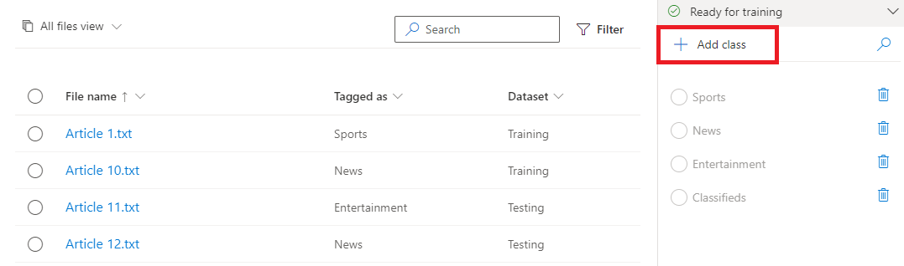

Microsoft Azure Language service provides several natural language processing capabilities, including the identification of key phrases in text, text summarization, and sentiment analysis. The Language service also provides custom features like custom question answering and custom text classification.

To test the custom text classification of the Language service, we'll configure the model using Language Studio then use a simple command-line application that runs in the Cloud Shell to test it. The same pattern and functionality used here can be followed for real-world applications.

## Create a *Language service* resource

To use custom text classificiation, you'll need to create an Azure Language service resource and select **Custom text classification & extraction** custom feature.

If you haven't already done so, create a **Language service** resource in your Azure subscription.

1. In a browser, open the [Azure portal](https://portal.azure.com?azure-portal=true), and sign in with your Microsoft account.
2. Select the **Create a resource** button, search for *Language*, and create a **Language service** resource. When asked about additional features, select **Custom text classification & extraction**. Create the resource with the following settings:
    - **Subscription**: *Your Azure subscription*.
    - **Resource group**: *Select or create a resource group with a unique name*.
    - **Region**: *Choose any available region*:
    - **Name**: *Enter a unique name*.
    - **Pricing tier**: Standard S pricing tier
    - **Storage account**: Create new
      - **Name**: *Enter a unique name*
      - **Account kind**: Storage (general purpose v1)
      - **Performance**: Standard
      - **Replication**: Locally redundant storage (LRS)
    - **Legal terms**: Selected.
    - **Responsible AI notice**: Selected.

    >[!TIP]
    >You can reuse existing resources from previous labs if you have them available. Be sure to use a new container in the storage account to connect the custom entity extraction project to.

3. Review and create the resource. 

### Get Language resource key and endpoint

1. Navigate to the resource group in the [Azure portal](https://portal.azure.com?azure-portal=true), and select the Language resource
2. Select **Keys and Endpoint** from the menu on the left side, located under **Resource Management**. Save one of the keys and the endpoint for later.

## Upload sample articles

Once you have created the language service and storage account, you'll need to upload example articles to train your model later.

1. [Download sample articles](https://aka.ms/classification-articles) from this repo on GitHub. Extract the files in the `.zip` provided.

2. In the [Azure portal](https://portal.azure.com?azure-portal=true), navigate to the storage account you created, and select it

3. In your storage account, select **Containers** from the left menu, located below **Data storage**. On the screen that appears, select **+ Container**. Give the container a name you'll remember, and set **Public access level** to *Container (anonymous read access for containers and blobs)*.

  > [!NOTE]
  > When you configure a storage account outside of this module, be careful to assign the appropriate access level. To learn more about each access level, see the [docs on Azure Storage](/azure/storage/blobs/anonymous-read-access-configure).

4. After creating the container, select it and click the **Upload** button to upload the sample articles you downloaded.

## Create project

Once configuration is complete, create a custom text classification project. This project provides a working place to build, train, and deploy your model.

> [!NOTE]
> This lab utilizes **Language Studio**, but you can also create, build, train, and deploy your model through the REST API if you prefer.

1. Log into the [Language Studio](https://aka.ms/languageStudio) with your Azure account, and select the Azure subscription that you created your Language resource in, and select your Language resource
2. Under the **Classify text** section, select **Custom text classification**
3. Select **Create new project**
4. In the **Create a project** popout, choose the following and create your project:
  - **Select project type**: Single label classification
  - **Name**: *Enter a unique name*
  - **Description**: Custom text lab
  - **Text primary language**: English (US)
  - **Blob store container**: *Choose the container you created*
  - **Are you files tagged**: No, I need to tag my files as part of this project

## Tag your data

Now that your project is created, you need to tag your data to train your model how to classify text. 

1. On the left, click on **Tag data**. You'll see a list of the files you uploaded to your storage account. 
2. On the right side, in the **Tagging** pane, click on **Add class**. The articles in this lab fall into four classes you'll need to create: Classifieds, Sports, News, and Entertainment.

    

3. After you've created your four classes, start by clicking on *Article 1*. Here you can read the article, define which class this file is, and which dataset to assign it to.
4. Assign each article the appropriate class and dataset. For the purposes of this lab, we'll define which are to be used for training the model vs. testing the model.

    | Article  | Class  | Dataset  |
    |---------|---------|---------|
    | Article 1 | Sports | Training |
    | Article 2 | Sports | Training |
    | Article 3 | Classifieds | Training |
    | Article 4 | Classifieds | Training |
    | Article 5 | Entertainment | Training |
    | Article 6 | Entertainment | Training |
    | Article 7 | News | Training |
    | Article 8 | News | Training |
    | Article 9 | Entertainment | Training |
    | Article 10 | News | Training |
    | Article 11 | Entertainment | Testing |
    | Article 12 | News | Testing |
    
5. Click **Save tags**

## Train your model

Once you've tagged your data, you need to train your model.

1. Select **Train model** on the left side menu
2. Click **Start a training job**
3. Enter a name for your model, such as *ClassifyArticles*
4. Choose **Use a manual split of training and testing data**

  > [!TIP]
  > In your own classification projects, the Language service will automatically split the testing set by percentage which is useful with a large dataset. With smaller datasets, it's important to train with the right class distribution.

5. Click **Train**

## Improve your model

In real world applications of text classification, it's important to evaluate and improve your model to verify it's performing as you expect. Two pages on the left show you the details of your trained model, and any testing that failed.

1. Select **View model details**. There you can see the scoring of your model, performance metrics, and when it was trained.
2. Select **Improve model**. Your model is already selected in the dropdown, and it defaults to show incorrect predictions only. Toggle that selection to see the articles you indicated for testing and what they predicted as.

## Deploy your model

Once you're satisfied with the training of your model, it's time to deploy it, which allows you to start classifying text through the API.

1. On the left panel, select **Deploy model**
2. Select **Add deployment**, then enter a new deployment name and select your trained model from the dropdown
3. Click **Submit** to deploy your model
4. Once your model is deployed, save your *deployment name*, and your *project name* for use in the next step

## Send text classification to your model

To test the text analytics capabilities of the Language service, we'll use a simple command-line application that runs in the Cloud Shell on Azure.

### Run Cloud Shell 

1. In the [Azure portal](https://portal.azure.com?azure-portal=true), select the **[>_]** (*Cloud Shell*) button at the top of the page to the right of the search box. This opens a Cloud Shell pane at the bottom of the portal. 

    

2. The first time you open the Cloud Shell, you may be prompted to choose the type of shell you want to use (*Bash* or *PowerShell*). Select **PowerShell**. If you do not see this option, skip the step.  

3. If you are prompted to create storage for your Cloud Shell, ensure your subscription is specified and select **Create storage**. Then wait a minute or so for the storage to be created. 

4. Make sure the type of shell indicated on the top left of the Cloud Shell pane is switched to *PowerShell*. If it is *Bash*, switch to *PowerShell* by using the drop-down menu. 
    
5. Wait for PowerShell to start. You should see the following screen in the Azure portal:  

     

### Configure and run Powershell

Now that you have a custom model, you can run a simple client application that uses the Language service.

1. In the command shell, enter the following command to download the sample application and save it to a folder called ai-language.

  ```
  git clone https://github.com/MicrosoftLearning/ai-language ai-language
  ```
  
  > [!TIP] 
  > If you already used this command in another lab to clone the *ai-language* repository, you can skip this step.

2. The files are downloaded to a folder named **ai-language**. Now we want to see all of the files in your Cloud Shell storage and work with them. Navigate to the `Text Classification` folder and type the following command into the shell: 

  ```
  code .
  ```

3. Open `classify-text.ps1`, and note the top two lines of the script with places for your Language service key and endpoint, as well as your project and model names. Replace the placeholders for `$key`, `$endpoint`, `$projectName`, and `$modelName` with your values, and save the file.

  > [!TIP]
  > If you don't have these values readily available, navigate to the [Azure portal](https://portal.azure.com?azure-portal=true), find the Language resource you created earlier, and select the **Keys and endpoint** page on the left

4. Run the following command to call your model and classify the text provided. The script won't output the whole file it's classifying for the sake of space, but you can view the contents [here on Github](https://aka.ms/text-classification-repo). Review the output.

  ```
  .\classify-text.ps1 test1.txt
  ```

5. Run the following command again, this time with a different file to classify. Review the output.

  ```
  .\classify-text.ps1 test2.txt
  ```

## Clean up

When you don't need your project anymore, you can delete if from your **Projects** page in Language Studio. You can also remove the Language service and associated storage account in the [Azure portal](https://portal.azure.com?azure-portal=true).
