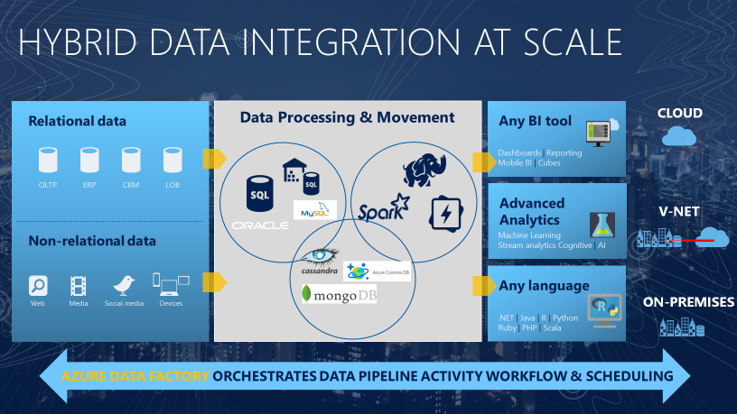

The need to trigger the batch movement of data, or to set up a regular schedule is a requirement for most analytics solutions. Azure Data Factory (ADF) is the service that can be used to fulfill such a requirement. ADF provides a cloud-based data integration service that orchestrates the movement and transformation of data between various data stores and compute resources.

Azure Data Factory is the cloud-based ETL and data integration service that allows you to create data-driven workflows for orchestrating data movement and transforming data at scale. Using Azure Data Factory, you can create and schedule data-driven workflows (called pipelines) that can ingest data from disparate data stores. You can build complex ETL processes that transform data visually with data flows or by using compute services such as Azure HDInsight Hadoop, Azure Databricks, and Azure Synapse Analytics.

Much of the functionality of Azure Data Factory appears in Azure Synapse Analytics as a feature referred to as Pipelines, which enables you to integrate data pipelines between SQL Pools, Spark Pools and SQL Serverless, providing a one stop shop for all your analytical needs.
## What is meant by orchestration

To use an analogy, think about a symphony orchestra. The central member of the orchestra is the conductor. The conductor does not play the instruments, they simply lead the symphony members through the entire piece of music that they perform. The musicians use their own skills to produce particular sounds at various stages of the symphony, so they may only learn certain parts of the music. The conductor orchestrates the entire piece of music, and therefore is aware of the entire score that is being performed. They will also use specific arm movements that provide instructions to the musicians how a piece of music should be played.

ADF can use a similar approach, whilst it has native functionality to ingest and transform data, sometimes it will instruct another service to perform the actual work required on its behalf, such as a Databricks to execute a transformation query. So, in this case, it would be Databricks that performs the work, not ADF. ADF merely orchestrates the execution of the query, and then provides the pipelines to move the data onto the next step or destination.

It also provides rich visualizations to display the lineage and dependencies between your data pipelines, and monitor all your data pipelines from a single unified view to easily pinpoint issues and setup monitoring alerts.

