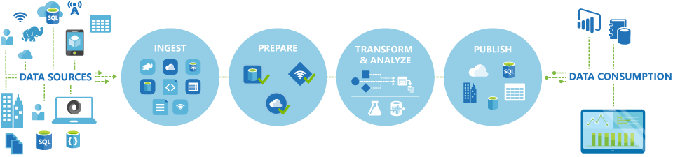

## Data-driven workflows

The pipelines (data-driven workflows) in Azure Data Factory typically perform the following four steps:

## Connect and collect

The first step in building an orchestration system is to define and connect all the required sources of data together, such as databases, file shares, and FTP web services. The next step is to ingest the data as needed to a centralized location for subsequent processing.

## Transform and enrich

Compute services such as Databricks and Machine Learning can be used to prepare or produce transformed data on a maintainable and controlled schedule to feed production environments with cleansed and transformed data. In some instances, you may even augment the source data with additional data to aid analysis, or consolidate it through a normalization process to be used in a Machine Learning experiment as an example.

## Publish

After the raw data has been refined into a business-ready consumable form from the transform and enrich phase, you can load the data into Azure Data Warehouse, Azure SQL Database, Azure Cosmos DB, or whichever analytics engine your business users can point to from their business intelligence tools

## Monitor

 Azure Data Factory has built-in support for pipeline monitoring via Azure Monitor, API, PowerShell, Azure Monitor logs, and health panels on the Azure portal, to monitor the scheduled activities and pipelines for success and failure rates.
