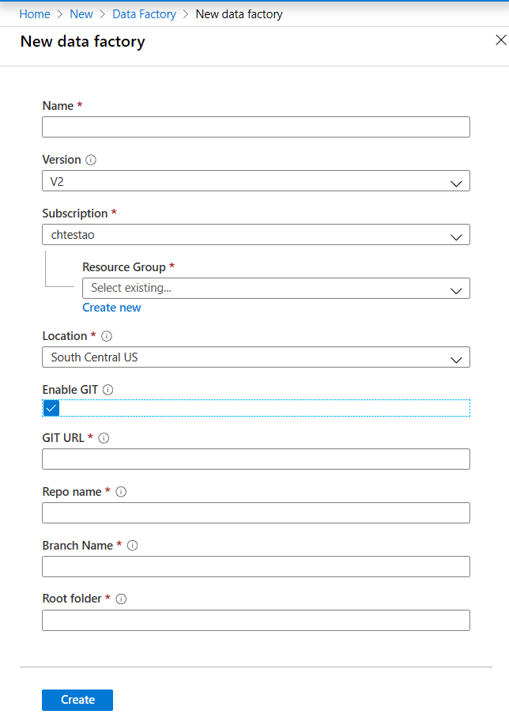

It's easy to set up Azure Data Factory (ADF) from within the Azure portal, you only require the following information:

- **Name**: The name of the Azure Data Factory instance
- **Subscription**: The subscription in which the ADF instance is created
- **Resource group**: The resource group where the ADF instance will reside
- **Version**: select V2 for the latest features
- **Location**: The datacenter location in which the instance is stored

Enable Git provides the capability to integrate the code that you create with a Git repository enabling you to source control the code that you would create. Define the GIT url, repository name, branch name, and the root folder. 

> [!div class="mx-imgBorder"]
> 

Alternatively, there are many different ways that you can provision the service programmatically. In this example you can see PowerShell at work to set up the environment.


``` PowerShell
# Sign in to Azure
Connect-AzAccount

# Select the target subscription
$SubscriptionId = "add your subscription in the quotes"
Select-AzSubscription -SubscriptionId $SubscriptionId

# Register the Microsoft Azure Data Factory resource provider
Register-AzResourceProvider -ProviderNamespace Microsoft.DataFactory

# Define resource group name and location
$resourceGroupName = "cto_ignite"
$rglocation = "West US 2"

# Create Azure Data Factory
Set-AzDataFactoryV2 -ResourceGroupName $resourceGroupName -Name "ctoigniteADF" -Location $rglocation
```