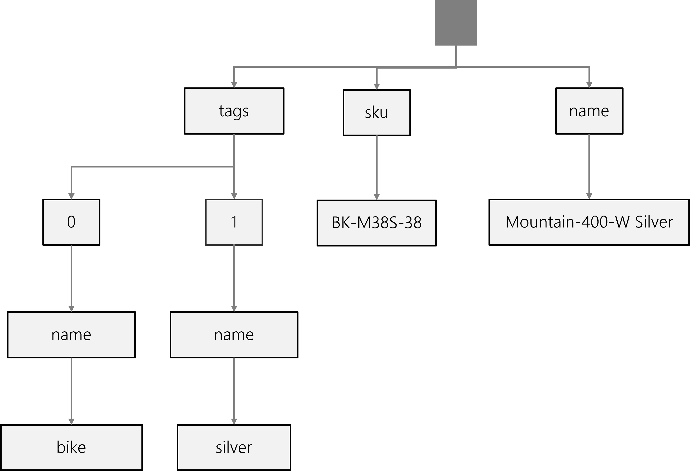
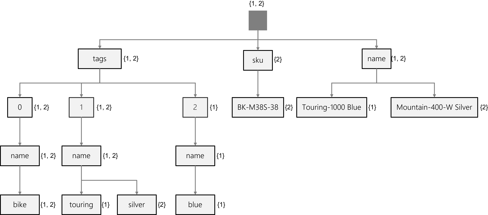
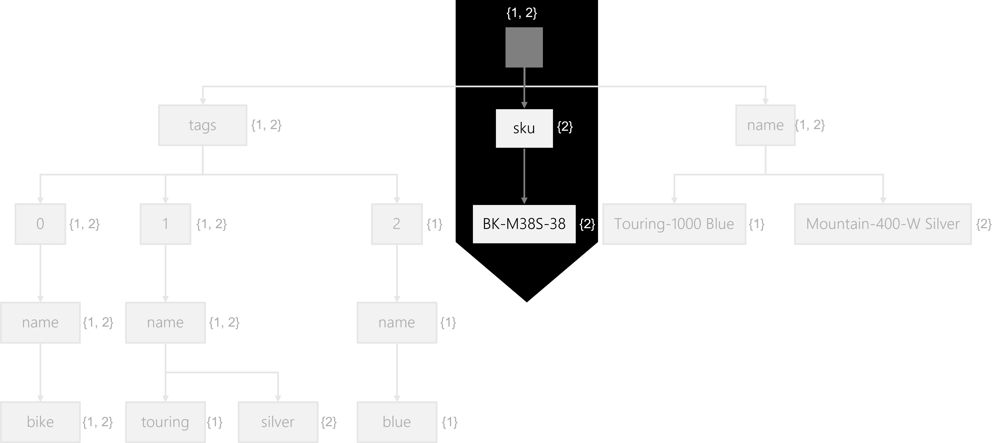
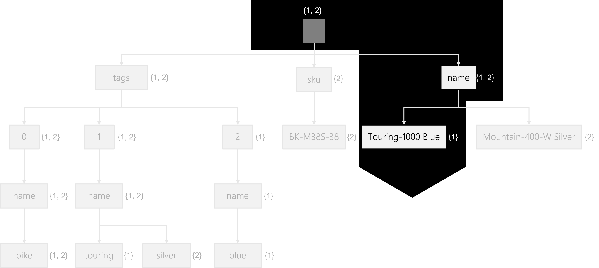

Every Azure Cosmos DB SQL API container has a built-in policy that determines how each item should be indexed. By default, this policy dictates that create, update, or delete operations for any item should update the index and that the index should include all properties of every item. This intelligent default is excellent at the start of many solutions as you get good and predictable query performance without having to dive too deeply into tuning an index.

Let’s review an example of the default policy in action.

Here, we have a JSON object representing a product named **Touring-1000 Blue** with three tags (**bike**, **touring**, and **blue**). You should pay attention to the number of things in the **tags** array.

```json
{
  "name": "Touring-1000 Blue",
  "tags": [
    {
      "name": "bike"
    },
    {
      "name": "touring"
    },
    {
      "name": "blue"
    }
  ]
}
```

If we were to represent this JSON object as a tree, this representation would include traversal paths for both the **name** property and its value (**Touring-1000 Blue**). The tree also contains three traversal paths for the three objects in the **tags** array, each with a leaf node for their **name** properties and respective values.


As a counterpoint, here is another JSON object representing a product named **Mountain-400-W Silver** that only contains two tags (**bike** and **silver**). This object is also unique in that it includes a **sku** property with a value of **BK-M38S-38**.

```json
{
  "name": "Mountain-400-W Silver",  
  "sku": "BK-M38S-38",
  "tags": [
    {
      "name": "bike"
    },
    {
      "name": "silver"
    }
  ]
}
```

The tree representation for this JSON object includes simple traversal paths for the **name** and **sku** properties. It also contains two traversal paths for the two objects in the **tags** array and corresponding leaf nodes for their **name** properties and respective values.



To conceptualize our container’s index, we tend to think of the index as a union of all trees for each item in the container. Altogether, this creates an **inverted index** which gives our database engine something fast and efficient to traverse when performing query operations. Each node in the tree has metadata indicating which items in our index matches that specific node.



To illustrate this example, consider the following SQL query:

```sql
SELECT * FROM products p WHERE p.sku = 'BK-M38S-38'
```

Instead of traversing through each item individually, the search engine will traverse the inverted index. For this query, let’s walk through a sample traversal:

1. First, the search engine will start at the root. As of now, all items match.
2. Next, the search will traverse the **sku** property. Now, only the **#2** item matches.
3. Finally, the search will end at the **BK-M38S-28** node. Still, only the **#2** item matches.

The search results are that the #2 item (**Mountain-400-W Silver**) matches, and the SQL query will return all fields from this item.



Using another example SQL query:

```sql
SELECT p.id FROM products p WHERE p.name = 'Touring-1000 Blue'
```

You can walk through a similar traversal:

1. Starting at the root, all items match.
2. Moving to the **name** property, Still, all items match.
3. Finally, ending at the **Touring-1000 Blue** node, Only the **#1** item matches.

The search results are that the #1 item (**Touring-1000 Blue**) matches, and the SQL query will return only the **name** field from this item.


