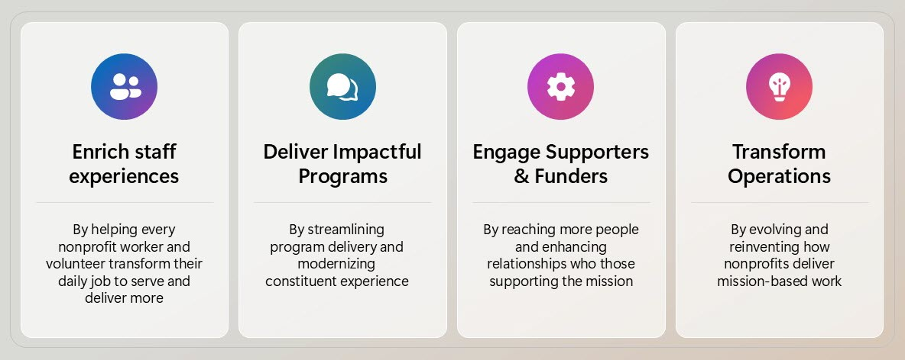

Microsoft is committed to empowering nonprofits to achieve their missions through innovative technology solutions. Our initiative, Microsoft Tech for Social Impact, provides grants and discounts on Microsoft cloud solutions, including Microsoft 365, Azure, and Dynamics 365, as well as nonprofit-specific solutions like Microsoft Cloud for Nonprofit.

By leveraging AI, nonprofits can drive sustainable growth and enhance their impact. Through our social investment model, incremental revenue is reinvested in nonprofit sector innovation and social causes, ensuring that technology serves as a catalyst for positive change.

## AI-enabled sustainable growth

There are several key drivers of AI value for nonprofits.

The following table describes how these drivers collectively enable nonprofits to use AI for sustainable growth.

| - | Driver | Description |
|--------|--------|--------|
|  | **Mission Alignment**     | AI enhances nonprofit missions by providing tools and insights that amplify impact and improve efficiency through data-driven strategies.                                                                        |
|  | **Strategic Planning**    | AI supports strategic goals by analyzing data to identify trends, optimize resources, and predict outcomes, boosting donor engagement and developing growth plans.                                               |
|  | **Operational Efficiency**| AI improves efficiency by automating tasks, streamlining data management, reducing manual work, and allowing teams to focus on essential activities.                                                             |
|  | **Data Privacy & Security**| AI ensures ethical practices by automating data protection, detecting vulnerabilities, maintaining compliance, building trust with stakeholders.                                                                |
|  | **Accelerate Fundraising**| AI optimizes fundraising by identifying potential donors, predicting behavior to maximize contributions, providing insights into donor preferences to tailor approaches.                                        
## Microsoft Tech for Social Impact

Microsoft Tech for Social Impact provides grants and discounts on Microsoft cloud solutions across Microsoft 365, Azure, and Dynamics 365, as well as nonprofit-specific solutions like Microsoft Cloud for Nonprofit.

The Microsoft Partner ecosystem provides further innovation and scale, helping nonprofits of all sizes with sector-specific solutions and support. We also offer digital skills training to help nonprofits be successful with their technology.

Tech for Social Impact runs as a social investment model, where incremental revenue is reinvested in nonprofit sector innovation and social good causes. These include causes such as affordable housing, skills and employability programs, and technology donations. To learn more, visit the [Microsoft for Nonprofits](https://www.microsoft.com/nonprofits) website.

In the following video, see how Microsoft partners to support nonprofit organizations.

> [!VIDEO https://learn-video.azurefd.net/vod/player?id=e9795fb8-cfc3-489b-8f9c-216961329a3c]

Next, let’s explore some goals and challenged to consider when planning AI-powered nonprofit initiatives.