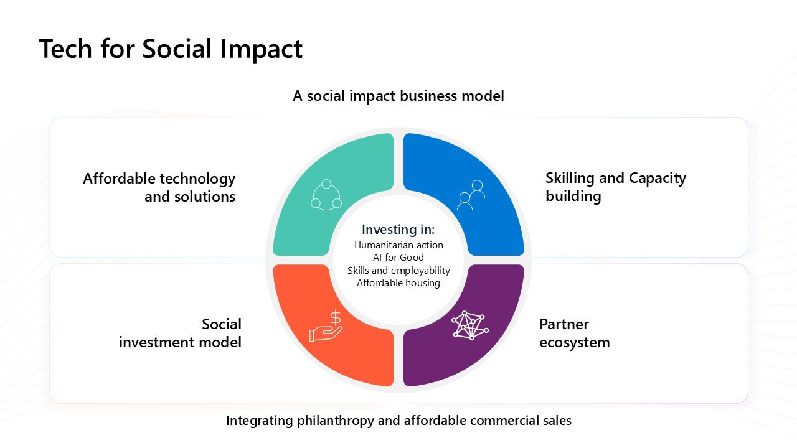

Microsoft is committed to empowering nonprofits to achieve their missions through innovative technology solutions.

AI helps nonprofits by improving fundraising, streamlining operations, and enhancing outreach. AI can:
- **Boost donations** through personalized donor engagement.
- **Save time** by helping write grants and create content.
- **Automate tasks** like scheduling and data entry.
- **Support clients** with tools for translation, legal aid, and accessibility.
- **Reduce costs** and help organizations scale their impact efficiently.

## AI-enabled sustainable growth

There are several key drivers of AI value for nonprofits.

The following table describes how these drivers collectively enable nonprofits to use AI for sustainable growth.

| - | Drivers | Description |
|--------|--------|--------|
|  | **Enrich staff experiences**     | Empower nonprofit staff to transform their daily work through digital tools and AI, improving efficiency across fundraising, program delivery, HR, and finance.                                                                        |
|  | **Deliver impactful programs**    | Use technology to enhance program delivery, monitoring, and evaluation, ensuring alignment and measurable outcomes for staff and participants.                                               |
|  | **Engage supporters & funders**| Expand and deepen relationships with supporters and funders by streamlining funding and marketing strategies to reach a broader audience.                                                             |
|  | **Transform operations**| Modernize operations and financial processes with AI and automation to shift focus from back-office tasks to mission-driven program delivery. |

## Microsoft Tech for Social Impact

Microsoft Tech for Social Impact (TSI) is a global initiative that empowers nonprofits with technology to drive social good. It operates as a social investment model, reinvesting revenue into causes like affordable housing, job training, and tech donations. It also offers grants and discounts on Microsoft 365, Azure, Dynamics 365, and nonprofit-specific tools like Microsoft Cloud for Nonprofit. Learn more at the [Microsoft for Nonprofits](https://www.microsoft.com/nonprofits) website.

The Microsoft TSI Partner ecosystem provides further innovation and scale, helping nonprofits of all sizes with sector-by providing specific solutions and support for AI implementation and deployment. TSI offers [free digital skills training](https://www.microsoft.com/nonprofits/resources?azure-portal=true) to help nonprofits be successful with their technology.

In the following video, see how Microsoft partners to support nonprofit organizations.

> [!VIDEO https://learn-video.azurefd.net/vod/player?id=e9795fb8-cfc3-489b-8f9c-216961329a3c]

Next, let’s explore some goals and challenges to consider when planning AI-powered nonprofit initiatives.