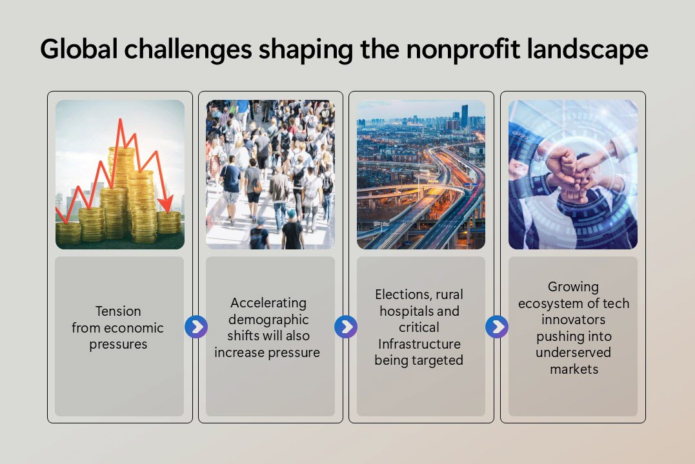

When you adopt AI in a nonprofit project, what can you expect? What potential obstacles must you watch for?

## Goals

The main goal for AI projects in the Nonprofit industry is to use AI technology to **enhance the impact and efficiency of nonprofit organizations**. This goal includes optimizing grant writing and fundraising efforts, improving donor engagement, and using data-driven decision-making to better serve their missions.

When nonprofit organizations implement AI solutions, they're often trying to address challenges to achieve these goals:
 - Program delivery
 - Fundraising & grant management
 - Donor relations
 - Volunteer management
 - People development

## Challenges

Nonprofits play a large role in the global workforce, employing 7.4% of workers worldwide. Among international nonprofit staff, 70% are full-time paid employees, while about 29% are dedicated volunteers. According to the United Nation’s 2018 World Volunteerism Report, over 1 billion volunteers contribute their time and skills globally, equivalent to a workforce of 109 million full-time workers.

There are several global challenges shaping today's nonprofit sector, including economic pressures, accelerating demographic shifts, security attacks on critical infrastructure, and lack of technology access.

In the United States alone, there are over 1.5 million nonprofits, making up 10% of the US workforce and ranking as the third-largest industry after retail and manufacturing. These organizations contribute 5.7% to the overall GDP. However, nearly two-thirds of these nonprofits have annual revenues less than $50,000.

According to the [2024 State of the Nonprofit Sector Report](https://www.forvismazars.us/forsights/2024/02/2024-state-of-the-nonprofit-sector-report), the top five challenges nonprofits face are:
 - Rising operating costs
 - Lack of adequate finances and resources
 - Limited staff skills and capacity
 - Difficulty recruiting and retaining quality staff
 - Economic uncertainty

>[!TIP]
>Take a moment to identify the goals and challenges specific to _your_ organization. To start, consider what legacy or in-house apps AI might help optimize.
>

Next, let’s explore common scenarios in which AI can help you attain these goals.
