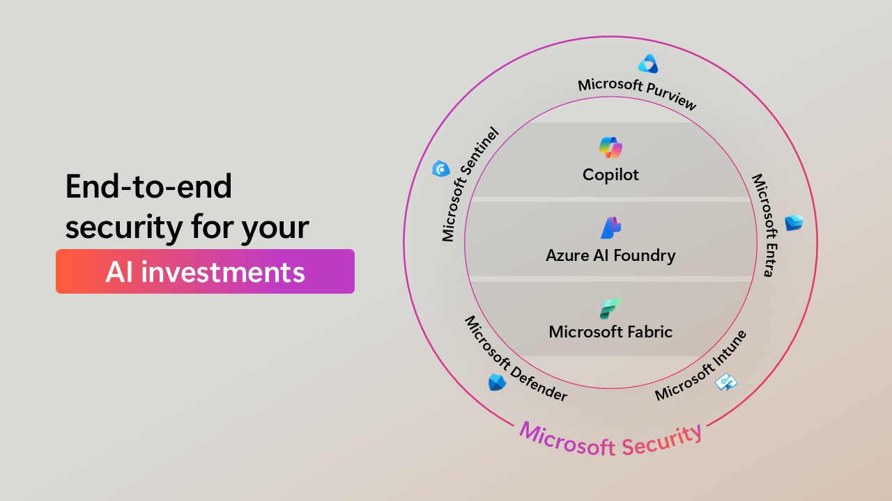

Limited staffing, rising demand for services, donor fatigue, and operational inefficiencies can stretch even the most dedicated nonprofit teams thin. These obstacles don’t just affect internal workflows—they directly impact the people and communities nonprofits serve.

Challenges that affect effective service delivery include:
- Complex financial environments.
- Staff capacity, skills, and retention.
- Manual and time-consuming processes.
- Tech disruptions.
- Decision-making inefficiency.

In addition to these internal pressures, nonprofits must also navigate broader global challenges such as economic uncertainty, demographic shifts, cybersecurity threats, and unequal access to technology. These factors compound the difficulty of sustaining impact and scaling services.

## The role of AI in overcoming nonprofit challenges

AI offers a powerful opportunity to help nonprofits overcome these barriers. Rather than replacing the human touch that defines nonprofit work, AI enhances it. By automating routine tasks, surfacing insights from data, and enabling more personalized engagement, AI empowers nonprofits to do more with less. AI helps leaders make informed decisions faster, tailor outreach to supporters, and streamline operations so that more energy can be focused on mission-critical work.

When thoughtfully applied, AI can unlock new capacity, resilience, and potential—ultimately allowing nonprofits to serve their constituents more effectively and sustainably.

## AI objectives in nonprofit

The primary goal of AI initiatives in the nonprofits is to help address these challenges by integrating intelligent technologies and address specific challenges. This includes improving grant writing and fundraising, deepening donor engagement, and using data-driven insights to make smarter, faster decisions.

To achieve these outcomes, nonprofits are applying AI across key functional areas to achieve specific objectives:
- **Program delivery**. Improving service reach and effectiveness.
- **Fundraising and grant management**. Streamlining processes and identifying new opportunities.
- **Donor relations**. Personalizing engagement and strengthening relationships.
- **Volunteer management**. Optimizing recruitment, scheduling, and retention.
- **People development**. Supporting staff training and leadership growth.

This is where AI can be a transformative ally. Rather than replacing the human touch that defines nonprofit work, AI enhances it.

This infographic illustrates how AI can address key pain points across three vital areas: delivering impactful programs, engaging supporters and funders, and maintaining secure, efficient operations. When nonprofits harness AI thoughtfully, they unlock new capacity, resilience, and potential, ultimately allowing them to serve their constituents more effectively and sustainably.

## Security and privacy

Ensuring the privacy, security, and ethical use of AI is vital for nonprofits. Microsoft provides robust security and governance solutions to help you maintain compliance and protect your data. By prioritizing data security, you can build confidence among your supporters and beneficiaries, demonstrating your commitment to ethical and responsible data management.

Consider the following pillars of governing and securing AI:

- **Visibility**. Eliminate shadow AI and monitor enterprise-wide usage.
- **Security**. Measure and mitigate security and privacy risk.
- **Forensics**. Investigate incidents and perform audits.
- **Intent**. Understand user intent and productivity.
- **Education**. Provide education and policy enforcement.

You can learn more by reviewing [Security Program for Nonprofits](https://www.microsoft.com/nonprofits/data-security).

>[!TIP]
>Take a moment to identify the goals and challenges specific to _your_ organization.
> 
>

Next, let’s explore some common scenarios where AI can help you attain these goals.
