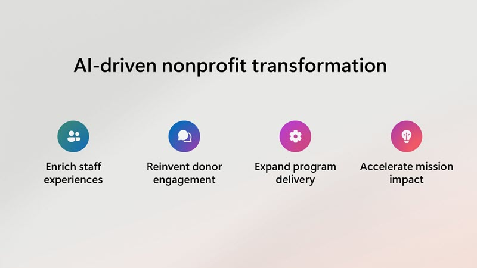
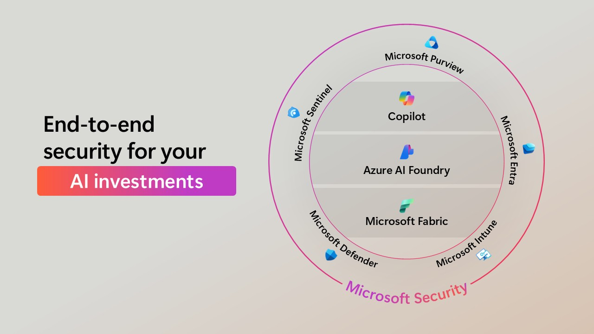

AI is transforming the nonprofit sector by offering innovative solutions to enhance efficiency and impact. Let's explore some of the ways Microsoft AI can help organizations achieve their missions more effectively. From automating administrative tasks to providing valuable insights for decision-making, AI empowers nonprofits to enrich staff experiences, reinvent donor engagement, expand program delivery, and accelerate mission impact.

## AI-driven transformation

Let's take a  closer look at some top opportunities for AI-driven transformation.

### Enrich staff experiences

### Reinvent donor engagement

### Expand program delivery

### Accelerate mission impact

## Security and privacy

Ensuring the privacy, security, and ethical use of AI is crucial for nonprofits. Microsoft provides robust security and governance solutions to help you maintain compliance and protect your data. By prioritizing data security, you can build confidence among your supporters and beneficiaries, demonstrating your commitment to ethical and responsible data management.

You can learn more about how to implement them in by reviewing [Security Program for Nonprofits](https://www.microsoft.com/nonprofits/data-security).

> [!TIP]
> Take a moment to consider what opportunities you hope to realize with AI in your organization.
> 
> 

Next, let’s explore how Microsoft AI enables evidence-based public policy and data-backed best practices.
