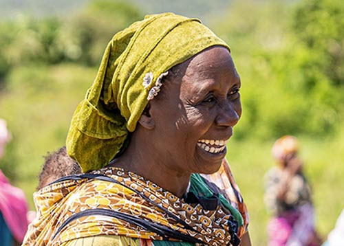

Learn how Amref Health Africa, a global health nonprofit, is using Azure AI to predict and prevent malnutrition in Kenya. This initiative involves collaboration with the Kenyan Ministry of Health, the University of Southern California (USC), and the Microsoft AI for Good Lab to develop an AI-powered tool that forecasts malnutrition hotspots and informs proactive interventions.

## The organization

Amref Health Africa is a nonprofit organization dedicated to creating lasting health changes across Africa. They focus on various health projects, including nutrition programs in Kenya. Amref aims to address malnutrition proactively to save lives and improve health outcomes. Their goal is to end malnutrition in Kenya by 2027.

## The challenge

Malnutrition is a significant issue in Kenya, affecting 18 percent of children under five, leading to impaired growth and development. The Kenyan Ministry of Health has collected extensive health data over the past decade, but transforming this data into actionable insights has been challenging due to its sheer volume. Manual data processing is nearly impossible, making it difficult to predict and address malnutrition effectively.

## The solution

The AI-based malnutrition forecasting model developed by the Microsoft AI for Good Lab and USC utilizes anonymized health data from the District Health Information System and other complementary data sources like satellite imagery. The model, built using Microsoft Azure, predicts malnutrition risks at sub-county levels and at one-, three-, and six-month intervals. This allows Amref and its partners to plan interventions, mobilize resources, and prevent malnutrition more effectively.

> "AI helps us predict cases of malnutrition and channel resources to where they are truly needed. The future looks more bright because we’re using technology to save children."- Herbert Basra, Monitoring and Evaluation Lead, Amref

## The results

The AI-powered tool enables Amref to act earlier and more precisely, improving health outcomes for children and mothers. By predicting malnutrition hotspots, Amref can strategically deploy resources and staff, preventing hunger before it sets in. The tool also allows for better program evaluation and design, helping Amref quantify their impact and refine their strategies. The success of this tool has led to plans for replicating the framework to address other health concerns and potentially expanding its use to other countries.

> “By using AI, we will always be ready to act.” - Samuel Mburu, Head of Digital Transformation at Amref.

To learn more, read [Amref Health Africa predicts and prevents malnutrition in Kenya with AI](https://www.microsoft.com/customers/story/18916-amref-health-africa-azure?msockid=28b8f1b4a48c60e10eaee4a3a52b61e6).

Next, let’s explore how Microsoft AI transforms lives through access to essential surgery.