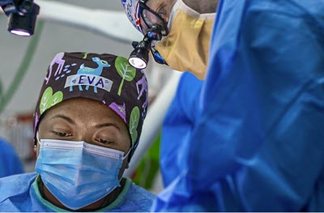

Discover how nonprofit organizations can use AI to expand access to essential care. Operation Smile shows how Microsoft AI solutions can enhance patient care and operational efficiency.

## The organization

Operation Smile bridges the gap in access to essential surgeries and healthcare by providing cleft surgery and comprehensive care, medical education and training, and long-term investments in strengthening local health systems and workforces. The organization is committed to creating access and providing gold-standard care for its patients and their communities.

> “Creating access to care relies on real-time data, which enables us to better understand patients, their needs, and the challenges they face. Insights from Microsoft Azure OpenAI Service allow us to deliver more effective care and create a lasting impact in communities." - _Sean Riordan, Associate Vice President of Information Technology at Operation Smile_

## The challenge

To serve its global patients, Operation Smile needed better support for translation and localized data input, faster ways to identify and classify cleft conditions, and a replacement for manual data analysis in spreadsheets.

> “We were manually processing spreadsheet data to analyze our worldwide performance. We needed Azure AI solutions to make this process more efficient and streamline operations." - _Dr. Bryan Zimmerman, Vice President of Medical Quality at Operation Smile_

## The solution

Operation Smile worked with **Azure OpenAI Service**, **Microsoft Fabric**, and **Microsoft Power Apps** to streamline data input, accelerate patient triage, and replace manual processes.

Working closely with **Microsoft Tech for Social Impact** and **Microsoft AI Cloud Partner Program** member Squadra, Operation Smile embarked on a transformative journey with Azure AI technologies to enhance its processes.

The first step was to digitalize the registration process and provide multi-language support with Microsoft Power Apps, eliminating error-prone manual data entry and providing offline service in areas without internet connection. This helps Operation Smile operate more efficiently and serve more patients in low-resource areas.

Operation Smile uses Azure AI services to enhance patient care through streamlined medical event tracking and triage. By tying in Azure OpenAI Service, the organization unlocks real-time analysis of event reports and images, revealing performance trends that can help improve patient safety. This data-driven approach empowers Operation Smile to continually refine processes and elevate the overall patient experience.

Microsoft Fabric and OneLake play crucial roles in centralizing data processes and patient record management through a unified Fabric dashboard view. This centralization offers more efficient data querying and analysis, which is essential for making informed decisions quickly.

> “Fabric provides fast querying of data from multiple sources, such as financials, programmatic data, and medical quality data." - _Sean Riordan, Associate Vice President of Information Technology at Operation Smile_

The project was architected and deployed in less than two months, showcasing the efficiency and effectiveness of the collaboration between Operation Smile and Squadra.

## The results

Translation errors are down by 90 percent, repeated medical events are down by 15 percent, report generation is happening up to 95 percent quicker, and patients are getting the help they need faster with AI-powered visual assessments.

> "Creating access to care relies on real-time data, which enables us to better understand patients, their needs, and the challenges they face. Insights from Microsoft Azure OpenAI Service allow us to deliver more effective care and create a lasting impact in communities." - _Sean Riordan, Associate Vice President of Information Technology at Operation Smile_

### Measuring impact and looking ahead

Operation Smile can already see the impact of these tools on its processes, and it looks forward to continuing to measure their effectiveness as these deployments mature.

Using Power Apps for data collection, Operation Smile already reduced translation errors by about 90 percent. The organization sees a 15 percent decrease in recurring medical issues, because the organization can now quickly identify and address problems with greater precision. The digitalization of forms and the use of Azure AI reduced the time required for completing reports from four to five hours to just 15 to 20 minutes.

> “Our Azure AI solutions have significantly reduced the time required to do many tasks, giving staff more time to focus on supporting medical professionals, patients, and families." - _Dr. Bryan Zimmerman, Vice President of Medical Quality at Operation Smile_

This is just the beginning of Operation Smile’s AI journey with Microsoft.

> "Microsoft is an ideal collaborator for us because of its focus on Responsible AI. We are hyper-careful about how we use AI, ensuring it is always handled with the utmost respect for patients and ethics. Microsoft understands that." - _Sean Riordan, Associate Vice President of Information Technology at Operation Smile_

To learn more, read [Operation Smile bridges the gap in access to care with Azure OpenAI and Fabric](https://www.microsoft.com/customers/story/19752-operation-smile-azure-ai-and-machine-learning?azure-portal=true).

Next, let’s check your knowledge.
