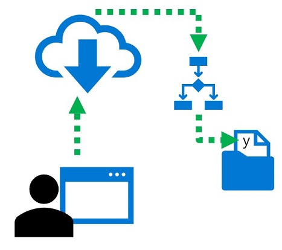

In many production scenarios, long-running tasks that operate on large volumes of data are performed as *batch* operations. In machine learning, *batch inferencing* is used to apply a predictive model to multiple cases asynchronously - usually writing the results to a file or database.

In Azure Machine Learning, you can implement batch inferencing solutions by creating a pipeline that includes a step to read the input data, load a registered model, predict labels, and write the results as its output.

## Learning objectives

In this module, you will learn how to:

- Publish batch inference pipeline for a trained model.  
- Use a batch inference pipeline to generate predictions.
