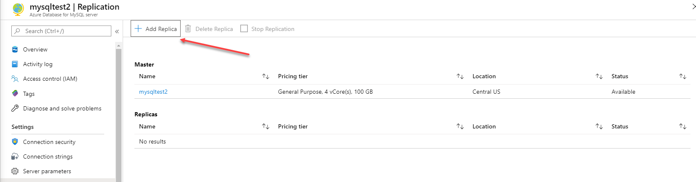
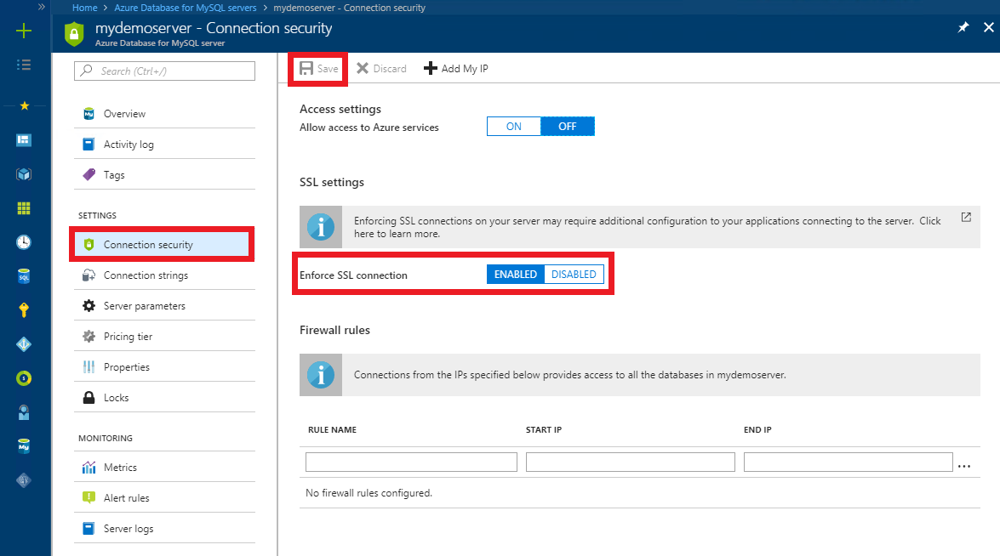

When deploying MySQL or MariaDB, you have similar options to PostgreSQL; you can deploy using the Azure portal, Azure CLI, or Azure Resource Manager templates. There are similar sizing and availability choices as detailed below.

## HA configuration

High availability for both Azure Database for MySQL and Azure Database for MariaDB comes packaged in with the service so there is less administrative work that needs to be done. The service provides a guaranteed high level of availability, offering an uptime of 99.99%. This percentage of uptime equates to a maximum of 52.60 minutes of downtime per year.

Transactions on either platform are written synchronously to storage. If a node interruption occurs, the database server will automatically create a new node and subsequently attach the storage to the new node. Any transactions in flight are not committed and active connections to the database are dropped. As mentioned with Azure SQL Database, it is important to ensure that applications that connect to the database service include retry logic, also known as connection resiliency, in their database connections.

## Scale out reads using read replicas

The Azure Service makes it easy to scale out read workloads using read replicas for MySQL and MariaDB. The example below illustrates the procedure for MySQL however MariaDB uses a similar process.

To enable replication click on **Replication** in the **Settings** section of the **MySQL** blade in the Azure portal as shown in the image below.

:::image type="content" source="../media/module-22-plan-implement-final-27.png" alt-text="MySQL blade in the Azure portal highlighting Replication":::

Click **Add Replica** as shown in the image below.

> [!div class="mx-imgBorder"]
> 

Provide a new server name and specify which Azure region it should reside in, as shown in the image below.

:::image type="content" source="../media/module-22-plan-implement-final-29.png" alt-text="Configuring a replica in MySQL":::

Click **OK**.

## SSL Options for MySQL and MariaDB

Azure Database for MySQL and MariaDB both support the use of SSL to encrypt network traffic between the database and the client application. In order to implement this encryption, you must both change the setting Enforce SSL Connection for your database, as shown in the image below.

> [!div class="mx-imgBorder"]
> 

You also need to download the public root certificate and include the path to the certificate in your client connection.  After completing both of these tasks your network traffic will be encrypted. 