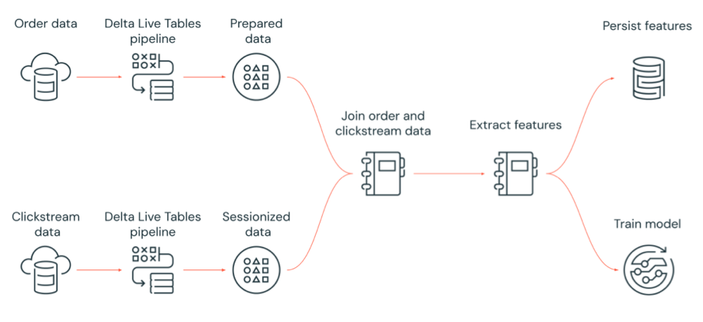

Lakeflow Jobs are a set of tools and features within the Azure Databricks environment designed to help you orchestrate, schedule, and automate data processing tasks. These workflows allow you to define, manage, and run multi-step data pipelines that can include data ingestion, transformation, and analysis processes. They provide an efficient way to build, execute, and monitor batch and streaming data jobs that are scalable and optimized for performance.

The Lakeflow Jobs are deeply integrated with Azure's cloud infrastructure, benefiting from its security, scalability, and compliance features. They support dependencies between tasks, allowing for sophisticated job scheduling and management. Additionally, Azure Databricks provides a user-friendly interface for creating, monitoring, and managing these workflows, which enhances productivity and collaboration among data teams. This setup is ideal for organizations looking to streamline their data operations in a robust and scalable cloud environment.

Triggers determine when a Job is run. The following table shows the different trigger types, when each is useful, and what constraints to watch out for:

| Trigger Type              | Use Case Examples                                      | Benefits                                                                 | Limitations / Things to Watch                                                                 |
|----------------------------|--------------------------------------------------------|--------------------------------------------------------------------------|-----------------------------------------------------------------------------------------------|
| **Scheduled (time-based)** | Nightly ETL, report generation at fixed times           | Predictable, easy to manage, integrates with time logic, well supported  | May lead to idle compute if no new data; rigid schedule; delay until next run if failures occur |
| **File Arrival**           | Processing incoming data as soon as it drops into storage (e.g. logs, uploads) | More responsive; compute used only when needed; reduces lag              | File listing overhead; detection latency; requires Unity Catalog external locations; limits on triggers |
| **Continuous**             | Stream-like jobs, always-on pipelines, constantly processing as earlier run finishes | Low latency; automatic restarting; ideal for streaming workloads         | Not supported on all compute types; limited dependency/retry options; careful overlap handling needed |
| **Manual / External**      | Ad hoc runs; triggered by API or orchestrator when upstream is ready | Flexible; good for testing, backfills, integration                        | Less predictable; requires external logic; more potential for human error; weaker monitoring if unmanaged |

Lakeflow Jobs simplify complex data operations, making it easier for your organization to deploy, monitor, and manage big data applications.
