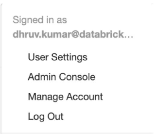
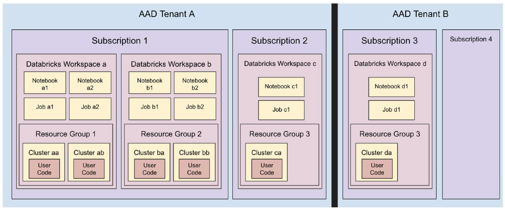

Azure Databricks (ADB) is a Big Data analytics service. Being a Cloud Optimized managed [PaaS](https://azure.microsoft.com/overview/what-is-paas/)  offering, it is designed to hide the underlying distributed systems and networking complexity as much as possible from the end user. It is backed by a team of support staff who monitor its health, debug tickets filed via Azure, etc. This allows ADB users to focus on developing value generating apps rather than stressing over infrastructure management.

Recall, in this scenario, you are a data engineer who has been tasked with re-evaluating your organization's Azure Databricks environment due to a high volume of growth, which highlighted some weaknesses in your current configuration. A part of this strategy is evaluating the need for separating development, staging, and production Azure Databricks environments to contend with capacity limits. Automation is key when you need to deploy multiple instances of an environment.

You can deploy Azure Databricks using Azure portal or using [Azure Resource Manager templates](https://docs.microsoft.com/azure/azure-resource-manager/resource-group-overview#template-deployment). One successful ADB deployment produces exactly one Workspace, a space where users can log in and author analytics apps. It comprises the file browser, notebooks, tables, clusters, [DBFS](https://docs.azuredatabricks.net/user-guide/dbfs-databricks-file-system.html#dbfs) storage, etc. More importantly, Workspace is a fundamental isolation unit in Databricks. All workspaces are isolated from each other.

Each workspace is identified by a globally unique 53-bit number, called ***Workspace ID or Organization ID***. The URL that a customer sees after logging in always uniquely identifies the workspace they are using:

`https://regionName.azuredatabricks.net/?o=workspaceId`

Example: `https://eastus2.azuredatabricks.net/?o=12345`

Azure Databricks uses [Azure Active Directory (Azure AD)](/azure/active-directory/fundamentals/active-directory-whatis) as the exclusive Identity Provider and there's a seamless out of the box integration between them. This makes ADB tightly integrated with Azure just like its other core services. Any Azure AD member assigned to the Owner or Contributor role can deploy Databricks and is automatically added to the ADB members list upon first login. If a user is not a member of the Active Directory tenant, they can't log in to the workspace.

Azure Databricks comes with its own user management interface. You can create users and groups in a workspace, assign them certain privileges, etc. While users in Azure AD are equivalent to Databricks users, by default Azure AD roles have no relationship with groups created inside ADB, unless you use [SCIM](https://docs.azuredatabricks.net/administration-guide/admin-settings/scim/aad.html) for provisioning users and groups. With SCIM, you can import both groups and users from Azure AD into Azure Databricks, and the synchronization is automatic after the initial import. ADB also has a special group called ***Admins***, not to be confused with Azure AD's role Admin.

The first user to login and initialize the workspace is the workspace ***owner***, and they are automatically assigned to the Databricks admin group. This person can invite other users to the workspace, add them as admins, create groups, etc. The ADB logged in user's identity is provided by Azure AD, and shows up under the user menu in Workspace:

  

Figure 1: Databricks user menu

Multiple clusters can exist within a workspace, and there's a one-to-many mapping between a Subscription to Workspaces, and further, from one Workspace to multiple Clusters.

  

Figure 2: Relationship Between Azure AD, Workspace, Resource Groups, and Clusters

With this basic understanding, let's discuss how to plan a typical ADB deployment. We first grapple with the issue of how to divide workspaces and assign them to users and teams.

## Map workspaces to business divisions

How many workspaces do you need to deploy? The answer to this question depends a lot on your organization's structure. We recommend that you assign workspaces based on a related group of people working together collaboratively. This also helps in streamlining your access control matrix within your workspace (folders, notebooks etc.) and also across all your resources that the workspace interacts with (storage, related data stores like Azure SQL DB, Azure SQL DW etc.). This type of division scheme is also known as the [Business Unit Subscription](/azure/cloud-adoption-framework/decision-guides/subscriptions/) design pattern and it aligns well with the Databricks chargeback model.

  

Figure 3: Business Unit Subscription Design Pattern

## Deploy workspaces in multiple subscriptions to honor Azure capacity limits

Customers commonly partition workspaces based on teams or departments and arrive at that division naturally. But it is also important to partition keeping Azure Subscription and ADB Workspace limits in mind.

### Databricks workspace limits

Azure Databricks is a multitenant service and to provide fair resource sharing to all regional customers, it imposes limits on API calls. These limits are expressed at the Workspace level and are due to internal ADB components. For instance, you can only run up to 150 concurrent jobs in a workspace. Beyond that, ADB will deny your job submissions. There are also other limits such as max hourly job submissions, max notebooks, etc.

Key workspace limits are:

- The maximum number of jobs that a workspace can create in an hour is **1000**
- At any time, you cannot have more than **150 jobs** simultaneously running in a workspace
- There can be a maximum of **150 notebooks or execution contexts** attached to a cluster
- There can be a maximum of **1500** Azure Databricks API calls/hour

### Azure subscription limits

Next, there are [Azure limits](/azure/azure-subscription-service-limits) to consider since ADB deployments are built on top of the Azure infrastructure. 

Key Azure limits are:

- Storage accounts per region per subscription: **250**
- Maximum egress for general-purpose v2 and Blob storage accounts (all regions): **50 Gbps**
- Virtual Machines (VMs) per subscription per region: **25,000**
- Resource groups per subscription: **980**

These limits are at this point in time and might change going forward. Some of them can also be increased if needed. For more help in understanding the impact of these limits or options of increasing them, please contact Microsoft or Databricks technical architects.

> ***Due to scalability reasons, we highly recommend separating the production and dev/stage environments into separate subscriptions.***

### High availability / Disaster recovery (HA/DR)

Within each subscription, consider the following best practices for HA/DR:

- Deploy Azure Databricks in two [paired Azure regions](/azure/best-practices-availability-paired-regions), ideally mapped to different control plane regions.
  - For example, East US2 and West US2 will map to different control planes
  - Whereas West and North Europe will map to same control plane
- Use [Azure Traffic Manager](/azure/traffic-manager/traffic-manager-overview) to load balance and distribute API requests between two deployments, when the platform is primarily being used in a backend non-interactive mode.

## Additional considerations

- Create different workspaces by different department / business team / data tier, and per environment (development, staging, and production) - across relevant Azure subscriptions
- Define workspace level tags which propagate to initially provisioned resources in managed resource group (Tags could also propagate from parent resource group)
- Use [Azure Resource Manager templates templates](https://github.com/Azure/azure-quickstart-templates) (search "databricks") to have a more managed way of deploying the workspaces - whether via CLI, PowerShell, or some SDK
- Create relevant groups of users - using [Group REST API](https://docs.azuredatabricks.net/api/latest/groups.html) or by using [Azure Active Directory Group Sync with SCIM](https://docs.azuredatabricks.net/administration-guide/admin-settings/scim/index.html)