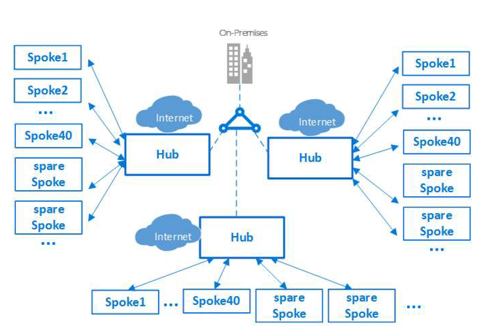
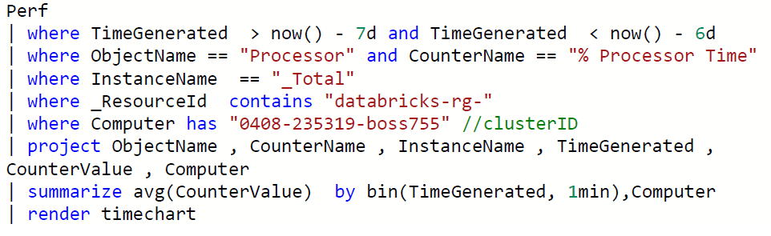
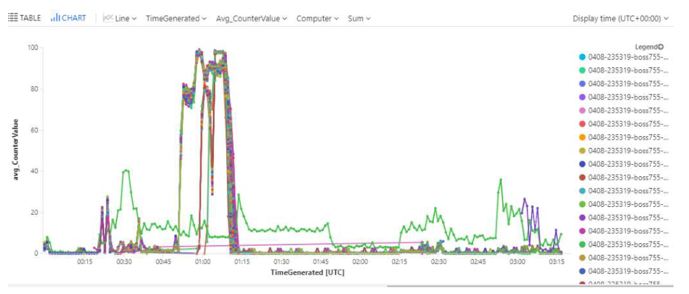

Security and infrastructure configuration go hand-in-hand. When you set up your Azure Databricks workspace(s) and related services, you need to make sure that security considerations do not take a back seat during the architecture design. In this scenario, you have chosen to deploy multiple Azure Databricks resources in multiple subscriptions. You also have related services, such as Azure SQL Database, that are hosted in a VNet and need private access to Azure Databricks.

## Consider isolating each workspace in its own VNet

While you can deploy more than one Workspace in a VNet by keeping the associated subnet pairs separate from other workspaces, we recommend that you should only deploy one workspace in any VNet. Doing this perfectly aligns with the ADB's Workspace level isolation model. Most often organizations consider putting multiple workspaces in the same VNet so that they all can share some common networking resource, like DNS, also placed in the same VNet because the private address space in a VNet is shared by all resources. You can easily achieve the same while keeping the Workspaces separate by following the [hub and spoke model](/azure/architecture/reference-architectures/hybrid-networking/hub-spoke) and using VNet Peering to extend the private IP space of the workspace VNet. Here are the steps:

1. Deploy each Workspace in its own spoke VNet.
1. Put all the common networking resources in a central hub VNet, such as your custom DNS server.  
1. Join the Workspace spokes with the central networking hub using [VNet Peering](https://docs.azuredatabricks.net/administration-guide/cloud-configurations/azure/vnet-peering.html)

More information: [Azure Virtual Datacenter: a network perspective](https://docs.microsoft.com/azure/architecture/vdc/networking-virtual-datacenter#topology)

Figure 1: Hub and Spoke Model

## Do not store any production data in Default Databricks Filesystem (DBFS) Folders

This recommendation is driven by security and data availability concerns. Every Workspace comes with a default Databricks File System (DBFS), primarily designed to store libraries and other system-level configuration artifacts such as initialization scripts. You should not store any production data in it, because:

1. The lifecycle of default DBFS is tied to the Workspace. Deleting the workspace will also delete the default DBFS and permanently remove its contents.
1. One can't restrict access to this default folder and its contents.

> [!IMPORTANT]
> This recommendation doesn't apply to Blob or ADLS folders explicitly mounted as DBFS by the end user.

More Information can be found in the [Databricks File System documentation](https://docs.databricks.com/user-guide/dbfs-databricks-file-system.html) 

## Always hide secrets in a key vault

It is a significant security risk to expose sensitive data such as access credentials openly in Notebooks or other places such as job configs, initialization scripts, etc. You should always use a vault to securely store and access them.
You can either use ADB's internal Key Vault for this purpose or use Azure's Key Vault (AKV) service.

If using Azure Key Vault, create separate AKV-backed secret scopes and corresponding AKVs to store credentials pertaining to different data stores. This will help prevent users from accessing credentials that they might not have access to. Since access controls are applicable to the entire secret scope, users with access to the scope will see all secrets for the AKV associated with that scope.

More Information can be found in the following urls:

[Create an Azure Key Vault-backed secret scope](https://docs.azuredatabricks.net/user-guide/secrets/secret-scopes.html)

[Example of using a secret in a notebook](https://docs.azuredatabricks.net/user-guide/secrets/example-secret-workflow.html)

[Best practices for creating secret scopes](https://docs.azuredatabricks.net/user-guide/secrets/secret-acl.html)

## Access control - Azure Data Lake Storage (ADLS) passthrough

When enabled, authentication automatically takes place in Azure Data Lake Storage (ADLS) from Azure Databricks clusters using the same Azure Active Directory (Azure AD) identity that one uses to log into Azure Databricks. Commands running on a configured cluster will be able to read and write data in ADLS without needing to configure service principal credentials. Any ACLs applied at the folder or file level in ADLS are enforced based on the user's identity.

ADLS Passthrough is configured when you create a cluster in the Azure Databricks workspace. ADLS Gen1 requires Databricks Runtime 5.1+. ADLS Gen2 requires 5.3+.

On a *standard cluster*, when you enable this setting you must set single user access to one of the Azure Active Directory (Azure AD) users in the Azure Databricks workspace. [Only one user is allowed to run commands](https://docs.microsoft.com/azure/databricks/data/data-sources/azure/adls-passthrough#single-user) on this cluster when Credential Passthrough is enabled.

*High-concurrency clusters* can be shared by multiple users. When you enable ADLS Passthrough on this type of cluster, it does not require you to select a single user.

## Configure audit logs and resource utilization metrics to monitor activity

An important facet of monitoring is understanding the resource utilization in Azure Databricks clusters. You can also extend this to understanding utilization across all clusters in a workspace. This information is useful in arriving at the correct cluster and VM sizes. Each VM does have a set of limits (cores/disk throughput/network throughput) which play an important role in determining the performance profile of an Azure Databricks job.

In order to get utilization metrics of an Azure Databricks cluster, you can stream the VM's metrics to an Azure Log Analytics Workspace (see Appendix A) by installing the Log Analytics Agent on each cluster node. 
> [!NOTE]
> This could increase your cluster startup time by a few minutes.

### Querying VM metrics in Log Analytics once you have started the collection using the above document

You can use Log analytics directly to query the Perf data. Here is an example of a query which charts out CPU for the VMs in question for a specific cluster ID. See log analytics overview for further documentation on log analytics and query syntax.

You can also use Grafana to visualize your data from Log Analytics.

#### References

- https://docs.microsoft.com/azure/azure-monitor/learn/quick-collect-linux-computer
- https://github.com/Microsoft/OMS-Agent-for-Linux/blob/master/docs/OMS-Agent-for-Linux.md
- https://github.com/Microsoft/OMS-Agent-for-Linux/blob/master/docs/Troubleshooting.md

## Additional considerations

- Configure encryption-at-rest for [Blob Storage](/azure/storage/common/storage-service-encryption-customer-managed-keys) and [ADLS](/azure/data-lake-store/data-lake-store-encryption), preferably by using customer-managed keys in Azure Key Vault.
- Prefer to use [ADLS credential passthrough](https://docs.azuredatabricks.net/administration-guide/cloud-configurations/azure/credential-passthrough.html) over Table ACLs (if possible).
- Configure [access control](https://docs.azuredatabricks.net/administration-guide/admin-settings/index.html#manage-access-control) for Databricks-native resources (clusters, notebooks, jobs etc.)