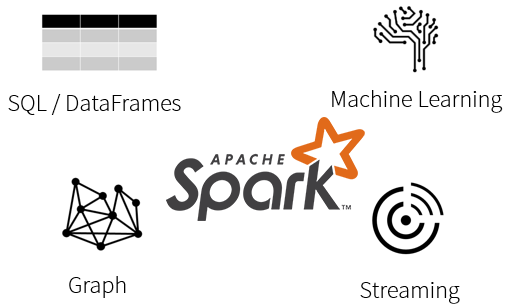

Azure Databricks is a fully-managed, cloud-based Big Data and Machine Learning platform, which empowers developers to accelerate AI and innovation by simplifying the process of building enterprise-grade production data applications. Built as a joint effort by the team that started Apache Spark and Microsoft, Azure Databricks provides data science and engineering teams with a single platform for Big Data processing and Machine Learning.

By combining the power of Databricks, an end-to-end, managed Apache Spark platform optimized for the cloud, with the enterprise scale and security of Microsoft's Azure platform, Azure Databricks makes it simple to run large-scale Spark workloads.

## Optimized environment

To address the problems seen on other Big Data platforms, Azure Databricks was optimized from the ground up, with a focus on performance and cost-efficiency in the cloud. The Databricks Runtime adds several key capabilities to Apache Spark workloads that can increase performance and reduce costs by as much as 10-100x when running on Azure, including:

- High-speed connectors to Azure storage services, such as Azure Blob Store and Azure Data Lake
- Auto-scaling and auto-termination of Spark clusters to minimize costs
- Caching
- Indexing
- Advanced query optimization

By providing an optimized, easy to provision and configure environment, Azure Databricks gives developers a performant, cost-effective platform that enables them to spend more time building applications, and less time focused on managing clusters and infrastructure.

## What is Databricks?

Databricks was founded by the creators of Apache Spark, Delta Lake, and MLflow.

Over 2000 global companies use the Databricks platform across big data & machine learning lifecycle.

**Databricks Vision**: Accelerate innovation by unifying data science, data engineering and business.

**Databricks Solution**: Big Data Analytics Platform

## What does Databricks offer that is not Open-Source Spark?

- Databricks Workspace - Interactive Data Science & Collaboration
- Databricks Workflows - Production Jobs & Workflow Automation
- Databricks Runtime
- Databricks I/O (DBIO) - Optimized Data Access Layer
- Databricks Serverless - Fully Managed Auto-Tuning Platform
- Databricks Enterprise Security (DBES) - End-To-End Security & Compliance

## What is Apache Spark?

Spark is a unified processing engine that can analyze big data using SQL, machine learning, graph processing, or real-time stream analysis:

- At its core is the Spark Engine.
- The DataFrames API provides an abstraction above RDDs while simultaneously improving performance 5-20x over traditional RDDs with its Catalyst Optimizer.
- Spark ML provides high quality and finely tuned machine learning algorithms for processing big data.
- The Graph processing API gives us an easily approachable API for modeling pairwise relationships between people, objects, or nodes in a network.
- The Streaming APIs give us End-to-End Fault Tolerance, with Exactly-Once semantics, and the possibility for sub-millisecond latency.

Spark is a distributed computing environment. Therefore, work is parallelized across executors. The first level of parallelization is the executor - a Java virtual machine running on a node, typically, one instance per node. Each executor has a number of slots to which parallelized tasks can be assigned to it by the driver.

And it all works together seamlessly!

## Azure Databricks

As a compute engine, Azure Databricks sits at the center of your Azure-based software platform and provides native integration with Azure Active Directory (Azure AD) and other Azure services.

## Scala, Python, Java, R & SQL

- Besides being able to run in many environments, Apache Spark makes the platform even more approachable by supporting multiple languages:
  - Scala - Apache Spark's primary language
  - Python - More commonly referred to as PySpark
  - R - [SparkR](https://spark.apache.org/docs/latest/sparkr.html) (R on Spark)
  - Java
  - SQL - Closer to ANSI SQL 2003 compliance
    - Now running all 99 TPC-DS queries
    - New standards-compliant parser (with good error messages!)
    - Subqueries (correlated & uncorrelated)
    - Approximate aggregate stats
- With the DataFrames API, the performance differences between languages are nearly nonexistence (especially for Scala, Java & Python).
