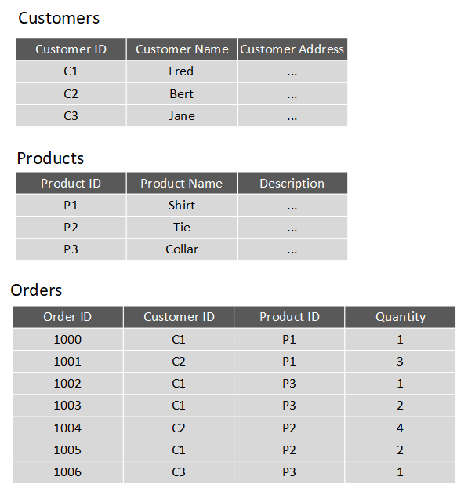
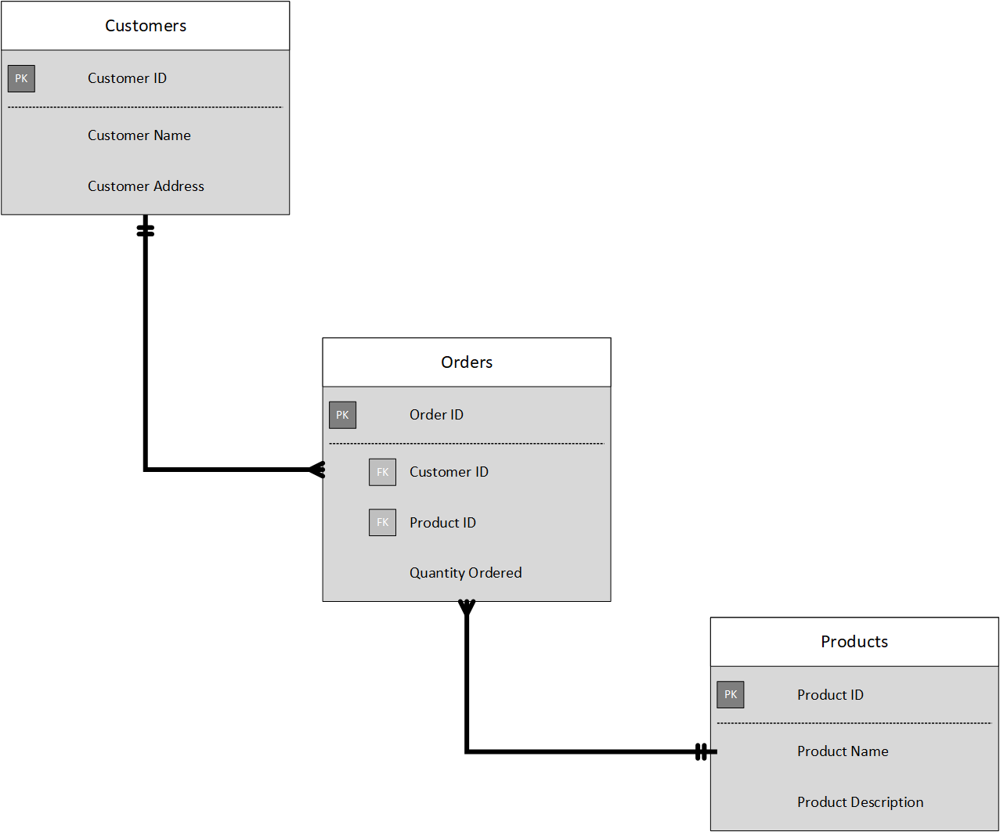

One of the main benefits of computer databases is that they make it easy to store information so it's quick and easy to find. For example, an ecommerce system might use a database to record information about the products an organization sells, and the details of customers and the orders they've placed. A relational database provides a model for storing the data, and a query capability that enables you to retrieve data quickly.

In this unit, you'll learn more about the characteristics of relational data, and how you can store this information and query it in a relational database.

## Understand the characteristics of relational data

In a relational database, you model collections of entities from the real world as tables. An entity is described as *a thing about which information needs to be known or held*. In the ecommerce example, you might create tables for customers, products, and orders. A table contains rows, and each row represents a single instance of an entity. In the ecommerce scenario, each row in the customers table contains the data for a single customer, each row in the products table defines a single product, and each row in the orders table represents an order made by a customer.

The rows in a table have one or more columns that define the properties of the entity, such as the customer name, or product ID. All rows in the same table have the same columns. Some columns are used to maintain relationships between tables. This is where the relational model gets its name from. In the image below, the Orders table contains both a Customer ID and a Product ID. The Customer ID relates to the Customers table to identify the customer that placed the order, and the Product ID relates to the Products table to indicate what product was purchased.

> [!div class="mx-imgBorder"]
> 

You design a relational database by creating a data model. The model below shows the structure of the entities from the previous example. In this diagram, the columns marked *PK* are the *Primary Key* for the table. The primary key indicates the column (or combination of columns) that uniquely identify each row. Every table should have a primary key.

The diagram also shows the relationships between the tables. The lines connecting the tables indicate the type of relationship. In this case, the relationship from customers to orders is *1-to-many* (one customer can place many orders, but each order is for a single customer). Similarly, the relationship between orders and products is *many-to-1* (several orders might be for the same product).  

The columns marked *FK* are *Foreign Key* columns. They reference, or link to, the primary key of another table, and are used to maintain the relationships between tables. A foreign key also helps to identify and prevent anomalies, such as orders for customers that don't exist in the Customers table. In the model below, the Customer ID and Product ID columns in the Orders table link to the customer that placed the order and the product that was ordered:

> [!div class="mx-imgBorder"]
> 

The main characteristics of a relational database are:

- All data is tabular. Entities are modeled as tables, each instance of an entity is a row in the table, and each property is defined as a column.

- All rows in the same table have the same set of columns.

- A table can contain any number of rows.

- A primary key uniquely identifies each row in a table. No two rows can share the same primary key. 

- A foreign key references rows in another, related table. For each value in the foreign key column, there should be a row with the same value in the corresponding primary key column in the other table.

> [!NOTE]
> Creating a relational database model for a large organization is a not a trivial task. It can take several iterations to define tables to match the characteristics described above. Sometimes you have to split an entity into more than one table. This process is called [*normalization*](https://docs.microsoft.com/office/troubleshoot/access/database-normalization-description).

Most relational databases support Structured Query Language (SQL). You use SQL to create tables, insert, update, and delete rows in tables, and to query data. You use the `CREATE TABLE` command to create a table, the `INSERT` statement to store data in a table, the `UPDATE` statement to modify data in a table, and the `DELETE` statement to remove rows from a table. The `SELECT` statement retrieves data from a table. The example query below finds the details of every customer from the sample database shown above. 

```SQL
SELECT CustomerID, CustomerName, CustomerAddress
FROM Customers
```

Rather than retrieve every row, you can filter data by using a *WHERE* clause. The next query fetches the order ID and product ID for all orders placed by customer 1.

```SQL
SELECT OrderID, ProductID
FROM Orders
WHERE CustomerID = 'C1'
```

You can combine the data from multiple tables in a query using a join operation. A join operation spans the relationships between tables, enabling you to retrieve the data from more than one table at a time. The following query retrieves the name of every customer, together with the product name and quantity for every order they've placed. Notice that each column is qualified with the table it belongs to:

```SQL
SELECT Customers.CustomerName, Orders.QuantityOrdered, Products.ProductName
FROM Customers JOIN Orders
ON Customers.CustomerID = Orders.CustomerID
JOIN Products
ON Orders.ProductID = Products.ProductID
```

You can find full details about SQL on the Microsoft website, on the [Structured Query Language (SQL)](https://docs.microsoft.com/sql/odbc/reference/structured-query-language-sql) page.

## Explore relational database use cases

You can use a relational database any time you can easily model your data as a collection of tables with a fixed set of columns. In theory, you could model almost any dataset in this way, but some scenarios lend themselves to the relational model better than others.

For example, if you have a collection of music, video, or other media files, attempting to force this data into the relational model could be difficult. You may be better off using unstructured storage, such as that available in Azure Blob storage. Similarly, social networking sites use databases to store data about millions of users, each of whom can be linked to any number of other users in a highly complex web of relationships. This type of data lends itself more to a graph database structure rather than a collection of relational tables.

Relational databases are commonly used in ecommerce systems, but one of the major use cases for using relational databases is Online Transaction Processing (OLTP). OLTP applications are focused on transaction-oriented tasks that process a very large number of transactions per minute. Relational databases are well suited for OLTP applications because they naturally support insert, update, and delete operations. A relational database can often be tuned to make these operations fast. Also, the nature of SQL makes it easy for users to perform ad-hoc queries over data.

Examples of OLTP applications that use relational databases are:
- Banking solutions
- Online retail applications
- Flight reservation systems
- Many online purchasing applications.