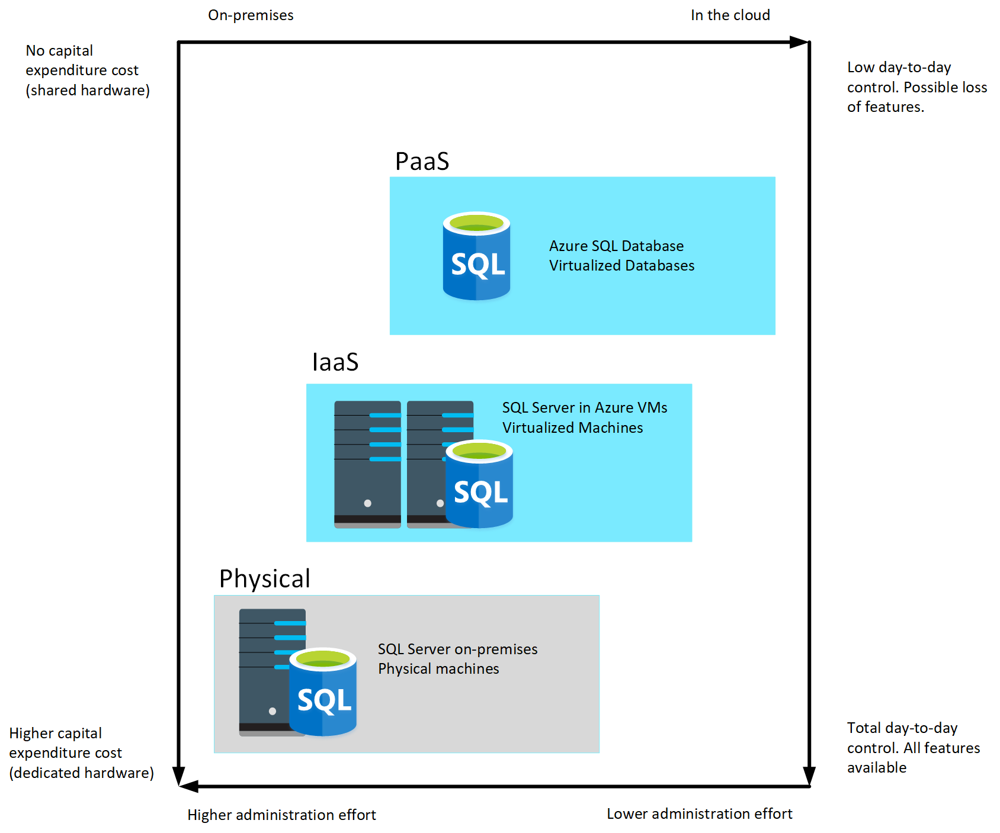

Cloud computing has grown in popularity, promising flexibility for enterprises, opportunities for saving time and money, and improving agility and scalability. On the other hand, on-premises software, installed on a company’s own servers and behind its firewall, still has its appeal. On-premises applications are reliable, secure, and allow enterprises to maintain close control.

Relational database management systems are one example of where the cloud has enabled organizations to take advantage of improved scalability. However, this scalability has to be balanced against the need for close control over the data. Data is arguably one of the most valuable assets that an organization has, and some companies aren't willing or able to hand over responsibility for protecting this data to a third party.

In this unit, you'll look at some of the advantages and disadvantages of running a database management system in the cloud.

## Compare on-premises hosting to the cloud

Whether a company places its relational workload in the cloud or whether it decides to keep it on premises, data security will always be paramount. But for those businesses in highly regulated industries, the decision might already be made for them as to whether to host their applications on-premises. Knowing that your data is located within your in-house servers and IT infrastructure might also provide more peace of mind.

Hosting a relational database on-premises requires that an enterprise not only purchases the database software, but also maintains the necessary hardware on which to run the database. The organization is responsible for maintaining the hardware and software, applying patches, backing up databases, restoring them when necessary, and generally performing all the day-to-day management required to keep the platform operational. Scalability is also a concern. If you need to scale your system, you will need to upgrade or add more servers. You then need to expand your database onto these servers. This can be a formidable task that requires you to take a database offline while the operation is performed. In the cloud, many of these operations can be handled for you by the data center staff, in many cases with no (or minimal) downtime. You're free to focus on the data itself and leave the management concerns to others (this is what you pay your Azure fees for, after all).

A cloud-based approach uses virtual technology to host a company’s applications offsite. There are no capital expenses, data can be backed up regularly, and companies only have to pay for the resources they use. For those organizations that plan aggressive expansion on a global basis, the cloud has even greater appeal because it allows you to connect with customers, partners, and other businesses anywhere with minimal effort. Additionally, cloud computing gives you nearly instant provisioning because everything is already configured. Thus, any new software that is integrated into your environment is ready to use immediately once a company has subscribed. With instant provisioning, any time spent on installation and configuration is eliminated and users can access the application right away.

:::image type="content" source="../media/4-on-premises-cloud.png" alt-text="Compare on-premises with cloud":::

## Understand IaaS and PaaS

You generally have two options when moving your operations and databases to the cloud. You can select an IaaS approach, or PaaS.

**IaaS** is an acronym for *Infrastructure-as-a-Service*. Azure enables you to create a virtual infrastructure in the cloud that mirrors the way an on-premises data center might work. You can create a set of virtual machines, connect them together using a virtual network, and add a range of virtual devices. In many ways, this approach is similar to the way in which you run your systems inside an organization, except that you don't have to concern yourself with buying or maintaining the hardware. However, you're still responsible for many of the day-to-day operations, such as installing and configuring the software, patching, taking backups, and restoring data when needed. You can think of IaaS as a *half-way-house* to fully managed operations in the cloud; you don't have to worry about the hardware, but running and managing the software is still very much your responsibility. 

You can run any software for which you have the appropriate licenses using this approach. You're not restricted to any specific database management system.

The IaaS approach is best for migrations and applications requiring operating system-level access. SQL virtual machines are *lift-and-shift*. That is, you can copy your on-premises solution directly to a virtual machine in the cloud. The system should work more or less exactly as before in its new location, except for some small configuration changes (changes in network addresses, for example) to take account of the change in environment.

**PaaS** stands for *Platform-as-a-service*. Rather than creating a virtual infrastructure, and installing and managing the database software yourself, a PaaS solution does this for you. You specify the resources that you require (based on how large you think your databases will be, the number of users, and the performance you require), and Azure automatically creates the necessary virtual machines, networks, and other devices for you. You can usually scale up or down (increase or decrease the size and number of resources) quickly, as the volume of data and the amount of work being done varies; Azure handles this scaling for you, and you don't have to manually add or remove virtual machines, or perform any other form of configuration.

Azure offers several PaaS solutions for relational databases, include Azure SQL Database, Azure Database for PostgreSQL, Azure Database for MySQL, and Azure Database for MariaDB. These services run managed versions of the database management systems on your behalf. You just connect to them, create your databases, and upload your data. However, you may find that there are some functional restrictions in place, and not every feature of your selected database management system may be available. These restrictions are often due to security issues. For example, they might not expose the underlying operating system and hardware to your applications. In these cases, you may need to rework your applications to remove any dependencies on these features. 

The image below illustrates the benefits and tradeoffs when running a database management system (in this case, SQL Server) on-premises, using virtual machines in Azure (IaaS), or using Azure SQL Database (PaaS). The same generalized considerations are true for other database management systems.

> [!div class="mx-imgBorder"]
> 
