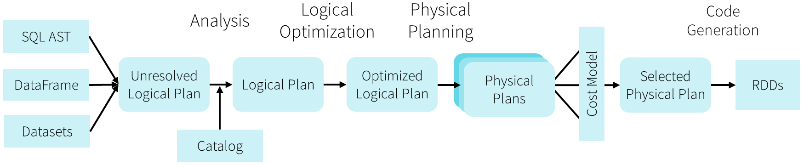

Because the Databricks API is declarative, a large number of optimizations are available to us.

Some of the examples include:

- Optimizing data type for storage
- Rewriting queries for performance
- Predicate push downs

Among the most powerful components of Spark are Spark SQL. At its core lies the Catalyst optimizer. This extensible query optimizer supports both rule-based and cost-based optimization.

When you execute code, Spark SQL uses Catalyst's general tree transformation framework in four phases, as follows.

1. Analyzing a logical plan to resolve references

1. Optimizing the logical plan

1. Physical planning

1. Generating code to compile parts of the query to Java bytecode

In the physical planning phase, Catalyst may generate multiple plans, and compare them based on cost. All other phases are purely rule-based.

]

Catalyst is based on functional programming constructs in Scala, and designed with these key two purposes:

- Easily add new optimization techniques and features to Spark SQL.
- Enable external developers to extend the optimizer (for example, adding data source specific rules, support for new data types, and so on).
