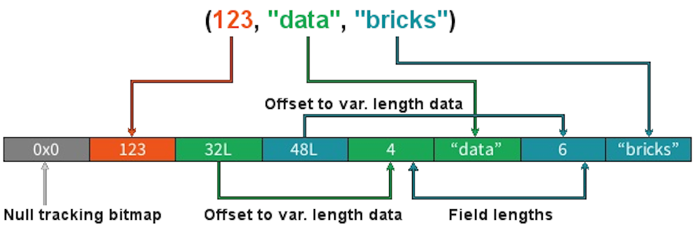

In the previous unit, you explored actions and transformations. As opposed to narrow transformations, wide transformations cause data to shuffle between executors. This is because a wide transformation requires sharing data across workers. **Pipelining** helps us optimize our operations based on the differences between the two types of transformations.

## Pipelining

- Pipelining is the idea of executing as many operations as possible on a single partition of data.
- Once a single partition of data is read into RAM, Spark will combine as many narrow operations as it can into a single **Task**.
- Wide operations force a shuffle, conclude a stage, and end a pipeline.

## Shuffles

A shuffle operation is triggered when data needs to move between executors.

To carry out the shuffle operation Spark needs to:

- Convert the data to the UnsafeRow, commonly referred to as **Tungsten Binary Format**.
- Write that data to disk on the local node - at this point the slot is free for the next task.
- Send that data across the wire to another executor
  - Technically the Driver decides which executor gets which piece of data.
  - Then the executor pulls the data it needs from the other executor's shuffle files.
- Copy the data back into RAM on the new executor
  - The concept, if not the action, is just like the initial read "every" `DataFrame` starts with.
  - The main difference being it's the 2nd+ stage.

As we will see in a moment, this amounts to a free cache from what is effectively temp files.

> Some actions induce in a shuffle. Good examples would include the operations `count()` and `reduce(..)`.

For more details on shuffling, refer to the [RDD Programming Guide](https://spark.apache.org/docs/latest/rdd-programming-guide.html#shuffle-operations).

### UnsafeRow (also known as Tungsten Binary Format)

Sharing data from one worker to another can be a costly operation.

Spark has optimized this operation by using a format called **Tungsten**.

Tungsten prevents the need for expensive serialization and de-serialization of objects in order to get data from one JVM to another.

The data that is *shuffled* is in a format known as `UnsafeRow`, or more commonly, the **Tungsten Binary Format**.

`UnsafeRow` is the in-memory storage format for Spark SQL, DataFrames & Datasets.

Advantages include:

- Compactness:
  - Column values are encoded using custom encoders, not as JVM objects (as with RDDs).
  - The benefit of using Spark 2.x's custom encoders is that you get almost the same compactness as Java serialization, but significantly faster encoding/decoding speeds.
  - Also, for custom data types, it is possible to write custom encoders from scratch.
- Efficiency: Spark can operate _directly out of Tungsten_, without first deserializing Tungsten data into JVM objects.

### How UnsafeRow works

- The first field, "123", is stored in place as its primitive.
- The next 2 fields, "data" and "bricks", are strings and are of variable length.
- An offset for these two strings is stored in place (32L and 48L, respectively, shown in the following image).
- The data stored in these two offset's are of format "length + data".
- At offset 32L, we store 4 + "data" and likewise at offset 48L we store 6 + "bricks".

## Stages

- When we shuffle data, it creates what is known as a stage boundary.
- Stage boundaries represent a process bottleneck.

For example, take the following transformations:

|Step |Transformation|
|----:|--------------|
| 1   | Read    |
| 2   | Select  |
| 3   | Filter  |
| 4   | GroupBy |
| 5   | Select  |
| 6   | Filter  |
| 7   | Write   |

Spark will break this one job into two stages (steps 1-4b and steps 4c-7):

**Stage #1**

|Step |Transformation|
|----:|--------------|
| 1   | Read |
| 2   | Select |
| 3   | Filter |
| 4a | GroupBy 1/2 |
| 4b | shuffle write |

**Stage #2**

|Step |Transformation|
|----:|--------------|
| 4c | shuffle read |
| 4d | GroupBy  2/2 |
| 5   | Select |
| 6   | Filter |
| 7   | Write |

In **Stage #1**, Spark will create a pipeline of transformations in which the data is read into RAM (Step #1), and then perform steps #2, #3, #4a & #4b.

All partitions must complete **Stage #1** before continuing to **Stage #2**.

- It's not possible to group all records across all partitions until every task is completed.
- This is the point at which all the tasks must synchronize.
- This creates our bottleneck.
- Besides the bottleneck, this is also a significant performance hit: disk IO, network IO and more disk IO.

After the data is shuffled, we can resume execution.

For **Stage #2**, Spark will again create a pipeline of transformations in which the shuffle data is read into RAM (Step #4c) and then perform transformations #4d, #5, #6 and finally the write action, step #7.

## Lineage

From the developer's perspective, we start with a read and conclude (in this case) with a write.

|Step |Transformation|
|----:|--------------|
| 1   | Read    |
| 2   | Select  |
| 3   | Filter  |
| 4   | GroupBy |
| 5   | Select  |
| 6   | Filter  |
| 7   | Write   |

However, Spark starts with the action (`write(..)` in this case).

Next, it asks the question, what do I need to do first?

It then proceeds to determine which transformation precedes this step until it identifies the first transformation.

|Step |Transformation| |
|----:|--------------|-|
| 7   | Write   | Depends on #6 |
| 6   | Filter  | Depends on #5 |
| 5   | Select  | Depends on #4 |
| 4   | GroupBy | Depends on #3 |
| 3   | Filter  | Depends on #2 |
| 2   | Select  | Depends on #1 |
| 1   | Read    | First |

### Why Work Backwards?

**Question:** So what is the benefit of working backward through your action's lineage?
**Answer:** It allows Spark to determine if it is necessary to execute every transformation.

Take another look at our example:

- Say we've executed this once already.
- On the first execution, step #4 resulted in a shuffle.
- Those shuffle files are on the various executors (`src` & `dst`).
- Because the transformations are immutable, no aspect of our lineage can change.
- That means the results of our last shuffle (if still available) can be reused.

|Step |Transformation| |
|----:|--------------|-|
| 7   | Write   | Depends on #6 |
| 6   | Filter  | Depends on #5 |
| 5   | Select  | Depends on #4 |
| 4   | GroupBy | <<< shuffle |
| 3   | Filter  | *don't care* |
| 2   | Select  | *don't care* |
| 1   | Read    | *don't care* |

In this case, what we end up executing is only the operations from **Stage #2**.

This saves us the initial network read and all the transformations in **Stage #1**.

|Step |Transformation|   |
|----:|---------------|:-:|
| 1   | Read          | *skipped* |
| 2   | Select        | *skipped* |
| 3   | Filter        | *skipped* |
| 4a  | GroupBy 1/2   | *skipped* |
| 4b  | shuffle write | *skipped* |
| 4c  | shuffle read  | - |
| 4d  | GroupBy  2/2  | - |
| 5   | Select        | - |
| 6   | Filter        | - |
| 7   | Write         | - |

### And Caching...

The reuse of shuffle files (also known as our temp files) is just one example of Spark optimizing queries anywhere it can.

We cannot assume this will be available to us.

Shuffle files are by definition temporary files and will eventually be removed.

However, we cache data to explicitly accomplish the same thing that happens inadvertently with shuffle files.

In this case, the lineage plays the same role, for example:

|Step |Transformation| |
|----:|--------------|-|
| 7   | Write   | Depends on #6 |
| 6   | Filter  | Depends on #5 |
| 5   | Select  | <<< cache |
| 4   | GroupBy | <<< shuffle files |
| 3   | Filter  | ? |
| 2   | Select  | ? |
| 1   | Read    | ? |

In this case we cached the result of the `select(..)`.

We never even get to the part of the lineage that involves the shuffle, let alone **Stage #1**.

Instead, we pick up with the cache and resume execution from there.

|Step |Transformation|   |
|----:|---------------|:-:|
| 1   | Read          | *skipped* |
| 2   | Select        | *skipped* |
| 3   | Filter        | *skipped* |
| 4a  | GroupBy 1/2   | *skipped* |
| 4b  | shuffle write | *skipped* |
| 4c  | shuffle read  | *skipped* |
| 4d  | GroupBy  2/2  | *skipped* |
| 5a  | cache read    | - |
| 5b  | Select        | - |
| 6   | Filter        | - |
| 7   | Write         | - |
