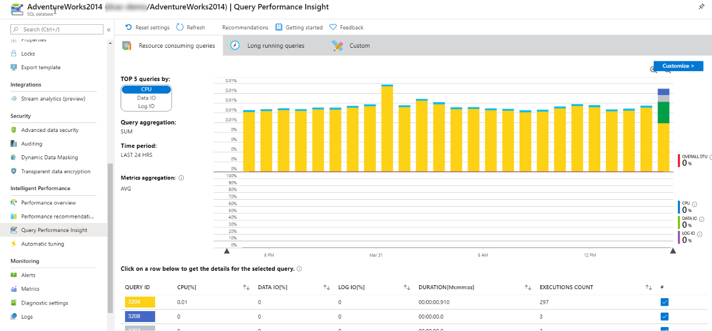
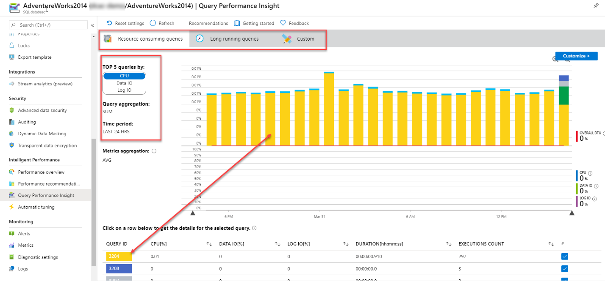
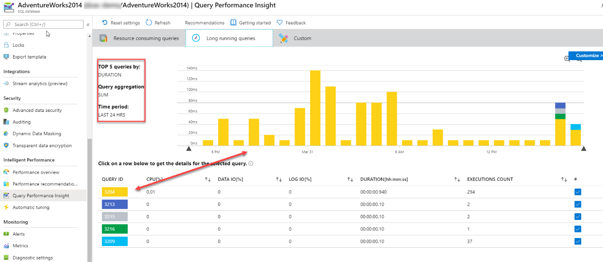
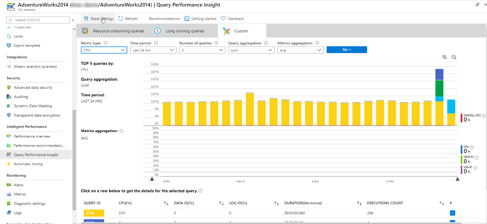

One of the benefits of using Azure SQL Database is that the baseline performance collection that is built into the Azure platform. Beyond the simple Azure Monitor data collection, Azure SQL Database Intelligent Insights is a component of Azure SQL Database that allows you to analyze performance of your queries. This feature is built using data from the Query Store, which is enabled in your Azure SQL Database at creation time. The Query Store automatically gathers query performance metrics including runtime statistics and execution plan history. It also retains this set of metrics over time (the duration is dependent on the storage option you choose) which allows you to investigate performance issues that you may have encountered in the past. Azure SQL Database Intelligent Insights uses Query Store data that was exposed to the Azure portal for viewing. You can access this dashboard by clicking Query Performance Insight in the Intelligent Performance section of the main blade of your Azure SQL Database.

In order to enable Intelligent Insights, you need to add diagnostic settings to your database.

:::image type="content" source="../media/module-44-optimize-resources-final-14.png" alt-text="A screenshot of a cell phone Description automatically generated":::

## Intelligent Insights storage options

You have three options for where to store the Intelligent Insights data, and the data is stored in a different format in each one. If you choose Azure storage, your data is stored in extended events format with an XEL extension. Those files can only be viewed on the Azure SQL server where they were created. If you choose an Event Hub, the data is stored in Avro format, which is a binary JSON format used for event reporting. Finally, if you use Log Analytics as a destination, your data is stored in Log Analytics, and can be queried using the Kusto Query Language.

## SQL Insights in Azure Log Analytics

The other benefit of storing your data in Azure Log Analytics is the Azure SQL Analytics dashboard.

:::image type="content" source="../media/module-44-optimize-resources-final-15.png" alt-text="A screenshot of a map Description automatically generated":::

The dashboard can be reached by navigating to your Log Analytics workspace and then clicking Workspace summary in the general section of the Overview blade. You can then click through to Azure SQL Analytics. Azure SQL Analytics is a cloud monitoring solution that brings together performance metrics at scale and across multiple subscriptions in a single view. In addition to visualization and data collection, it has built-in intelligence for troubleshooting activities. It also allows for custom monitoring alerts and rules that provide flexibility in being able to quickly identify issues and resolve them. It supports Azure SQL Database, both single instance and elastic pools, as well as Azure SQL Managed Instances.

## Identify problematic queries

Identifying which queries are consuming the most resources is the first step in any database performance tuning endeavor. In older versions of SQL Server, this required extensive tracing and a series of complex SQL scripts, which could make the process of data gathering cumbersome.

Azure SQL Database offers a tool called Query Performance Insight, that allows the administrator to quickly identity expensive queries. You can navigate to Query Performance Insight in the main blade for your Azure SQL Database in the Intelligent Performance section.

When you launch Query Performance Insight, you’ll discover three buttons to allow you to filter for long running queries, top resource consuming queries, or a custom filter. The default value is Resource Consuming Queries. This tab will show you the top five queries sorted by the particular resource that you select on the left. In this case, it was sorted by CPU. You also have the additional options of sorting by Data IO and Log IO metrics.

You can drill into individual queries by clicking on the row within the lower grid. Each row will be identified with a unique color that correlates to the color within the bar graph above it.

Switching to Long Running Queries, you can see a similar layout as before. In this case, the metrics are limited to the top five queries sorted by duration from the previous 24 hours and is a sum aggregation. As with top resource consuming queries, you can examine specific queries by clicking on the row within the grid below the graph.

Switching to the custom tab, there is a little more flexibility compared to the other two options.

Within this tab, we can further define how we wish to examine performance data. It offers us several drop-down menus that will drive the visual representation of the data. The key metrics are CPU, Log IO, Data IO, and memory. These metrics are the aspects of database performance, the upper limits of which are determined by the service tier and compute resources of your Azure SQL Database.

If we drill into an individual query, we will be able to see the query ID and the query itself, as well as the query aggregation type and associated time period. Furthermore, the query ID also correlates to the query ID located within the Query Store. Metrics gleaned from Query Performance Insights can then be easily located within the Query Store itself for deeper analysis or possibly problem resolution if needed.

:::image type="content" source="../media/module-44-optimize-resources-final-19.png" alt-text="Details of Query ID 3204 in Query Performance Insight":::

While Query Performance Insight does not show the query’s execution plan, you can quickly identify that query, and use the information to extract the plan from the Query Store in your database.
