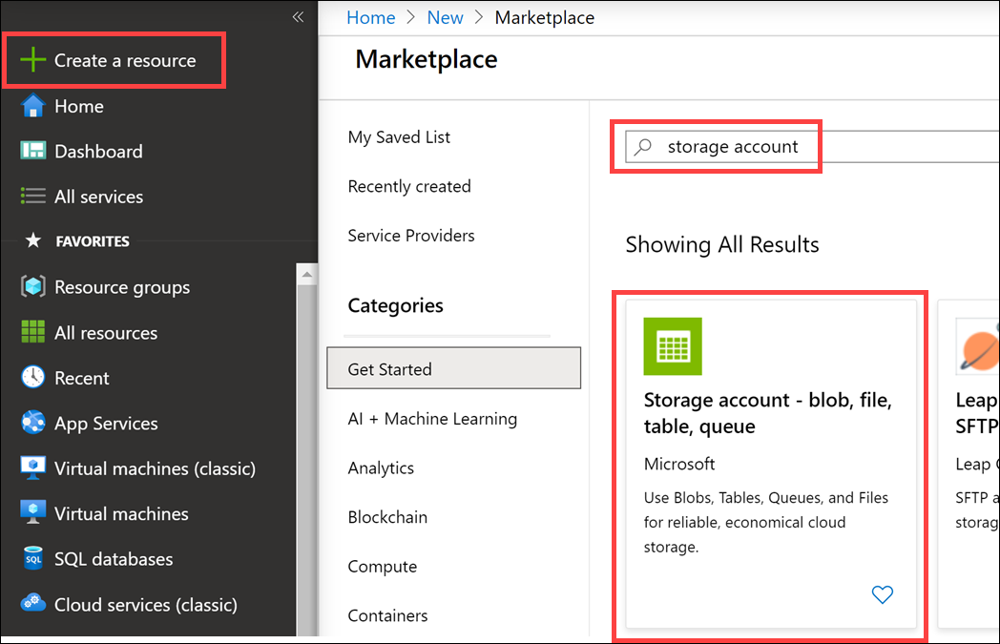
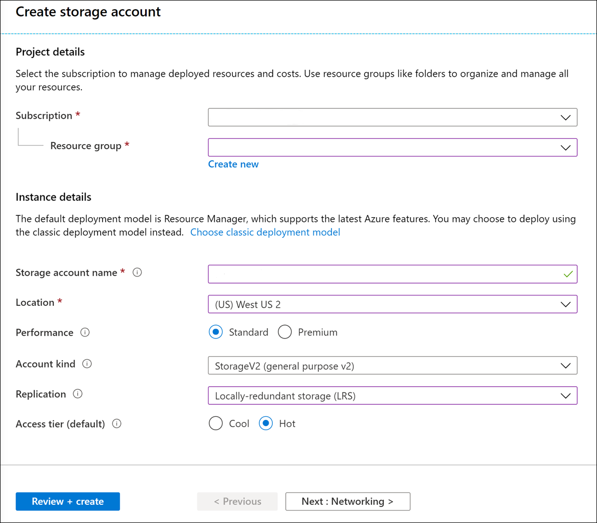
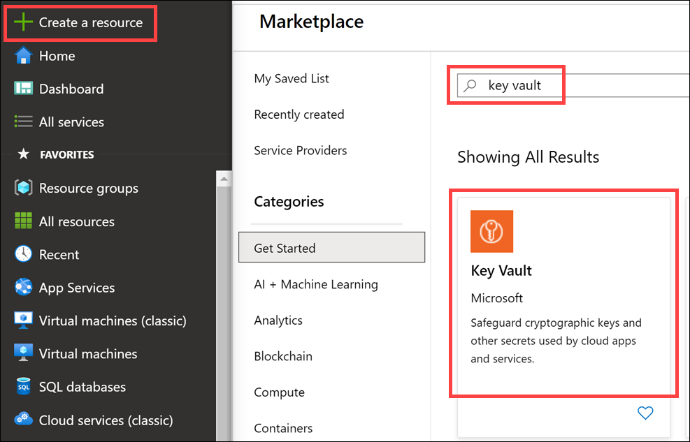
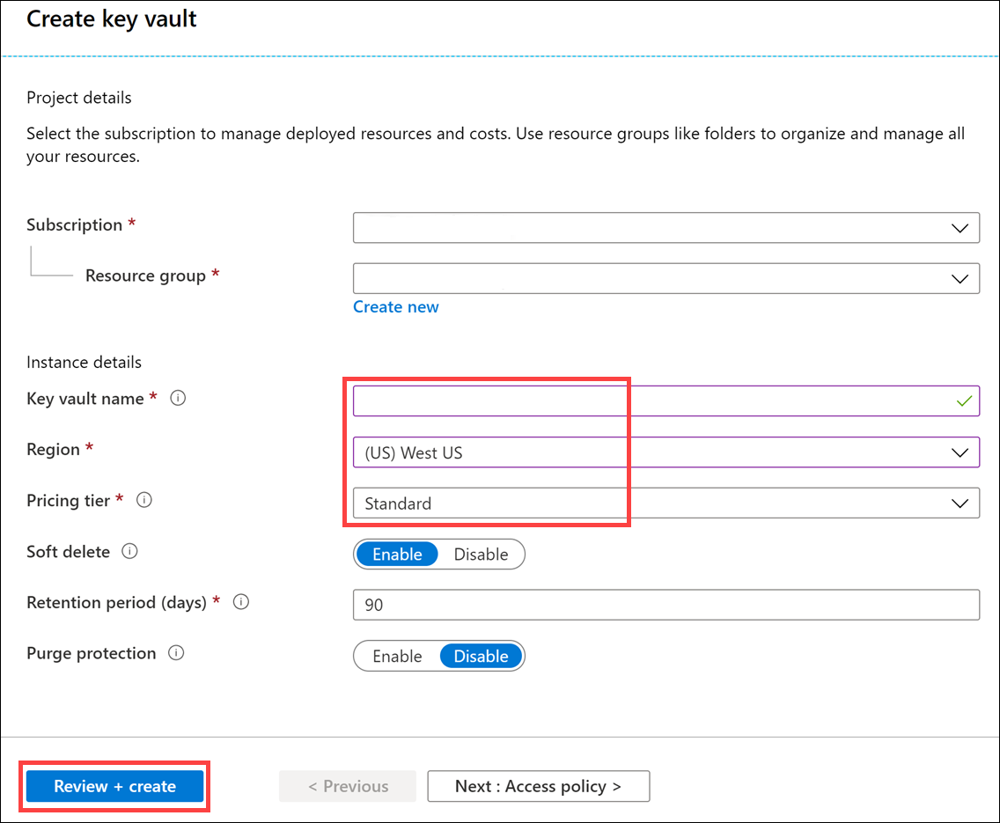

Suppose you're working for a data analytics startup that's now expanding along with its increasing customer base. You receive customer data from multiple sources and you process and save this data for reporting to both internal and external users. Due to this growth and level of access to data, security has become top priority. Your team is responsible for analyzing how to best configure security in Azure Databricks and ensure your company is maintaining compliance.

## Learning objectives

In this module, you'll:

- Learn the Azure Databricks platform architecture and how it is secured.
- Use Azure Key Vault to store secrets used by Azure Databricks and other services.
- Access Azure Storage with Key Vault-based secrets.

## Prerequisites

- An Azure subscription. If you don't have an Azure subscription, create a [free account](https://azure.microsoft.com/free).

There are a few Azure resources you need for the exercises in this module. If you are not using a pre-provisioned, or hosted, environment, follow the steps in this unit.

## Unit Pre-requisites

**Microsoft Azure Account**: You will need a valid and active Azure account for the Azure labs. If you do not have one, you can sign up for a [free trial](https://azure.microsoft.com/free/)

- If you are a Visual Studio Active Subscriber, you are entitled to Azure credits per month. You can refer to this [link](https://azure.microsoft.com/pricing/member-offers/msdn-benefits-details/) to find out more including how to activate and start using your monthly Azure credit.

- If you are not a Visual Studio Subscriber, you can sign up for the FREE [Visual Studio Dev Essentials](https://www.visualstudio.com/dev-essentials/) program to create Azure free account.

## Create the required resources

To complete this module, you will need to deploy an Azure Storage account, Azure Key Vault, and an Azure Databricks workspace in your Azure subscription.

## Create Azure Blob Storage account

1. In the [Azure portal](https://portal.azure.com), select **Create a resource**, enter **storage account** in the **Search the Marketplace** box, select **Storage account - blob, file, table, queue** in the results, and then select **Create**.

    

1. On the **Create storage account** pane, enter this information in the **Basics** tab:

   - _Subscription_: Select the subscription you're using for this module.
   - _Resource group_: Select the resource group you're using for this module.
   - _Storage account name_: Enter a unique name. (Make sure you see a green check mark.)
   - _Location_: Select the same location as the other resources in this module.
   - _Performance_: Select **StandardV2 (general purpose v2)**.
   - _Replication_: Select **Locally-redundant storage (LRS)**.
   - _Access tier (default)_: Select **Hot**.

    

1. Select **Review + create**, then select **Create**.

## Create Azure Key Vault

1. In the [Azure portal](https://portal.azure.com), select **Create a resource**, enter **key vault** in the **Search the Marketplace** box, select **Key Vault** in the results, and then select **Create**.

   

1. On the **Create storage account** pane, enter this information in the **Basics** tab:

   - _Subscription_: Select the subscription you're using for this module.
   - _Resource group_: Select the resource group you're using for this module.
   - _Key vault name_: Enter a unique name. (Make sure you see a green check mark.)
   - _Region_: Select the same location as the other resources in this module.
   - _Pricing tier_: Select **Standard**.

   

1. Select **Review + create**, then select **Create**.

### Deploy an Azure Databricks workspace

1. Click the following button to open the Azure Resource Manager template in the Azure portal.
   [Deploy Databricks from the Azure Resource Manager Template](https://portal.azure.com/#create/Microsoft.Template/uri/https%3A%2F%2Fraw.githubusercontent.com%2FAzure%2Fazure-quickstart-templates%2Fmaster%2F101-databricks-workspace%2Fazuredeploy.json)

1. Provide the required values to create your Azure Databricks workspace:

   - **Subscription**: Choose the Azure Subscription in which to deploy the workspace.
   - **Resource Group**: Leave at Create new and provide a name for the new resource group.
   - **Location**: Select a location near you for deployment. For the list of regions supported by Azure Databricks, see [Azure services available by region](https://azure.microsoft.com/regions/services/).
   - **Workspace Name**: Provide a name for your workspace.
   - **Pricing Tier**: Ensure `premium` is selected.

1. Accept the terms and conditions.
1. Select Purchase.
1. The workspace creation takes a few minutes. During workspace creation, the portal displays the Submitting deployment for Azure Databricks tile on the right side. You may need to scroll right on your dashboard to see the tile. There is also a progress bar displayed near the top of the screen. You can watch either area for progress.

### Create a cluster

1. When your Azure Databricks workspace creation is complete, select the link to go to the resource.

1. Select **Launch Workspace** to open your Databricks workspace in a new tab.

1. In the left-hand menu of your Databricks workspace, select **Clusters**.

1. Select **Create Cluster** to add a new cluster.

    

1. Enter a name for your cluster. Use your name or initials to easily differentiate your cluster from your coworkers.

1. Select the **Cluster Mode**: **Single Node**.

1. Select the **Databricks RuntimeVersion**: **Runtime: 7.3 LTS (Scala 2.12, Spark 3.0.1)**.

1. Under **Autopilot Options**, leave the box **checked** and in the text box enter `45`.

1. Select the **Node Type**: **Standard_DS3_v2**.

1. Select **Create Cluster**.
