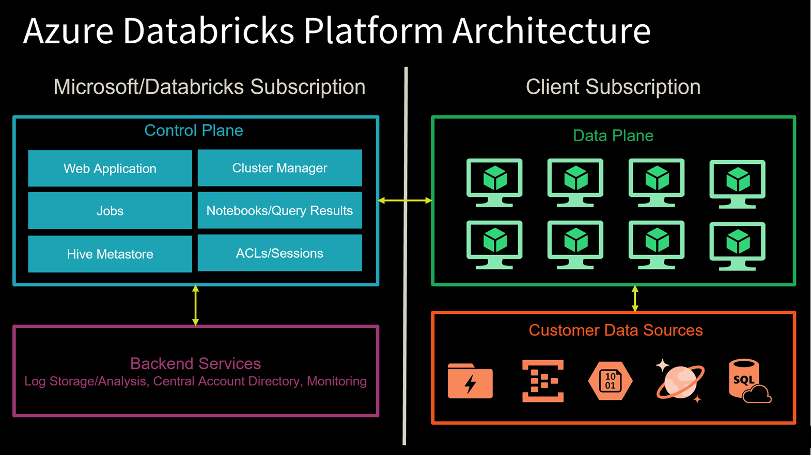
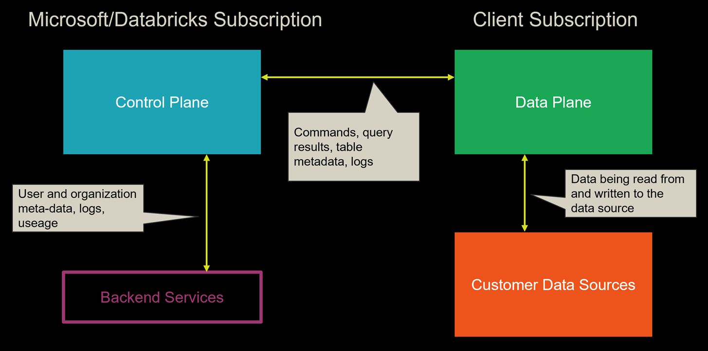
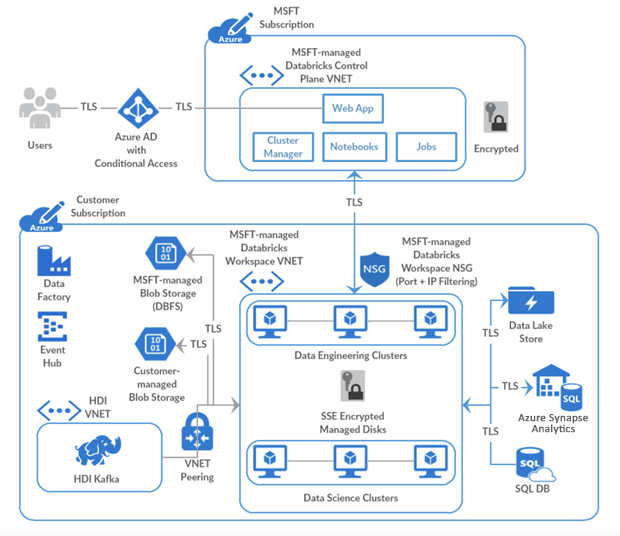

Azure Databricks is a fully-managed, cloud-based Big Data and Machine Learning platform, which empowers developers to accelerate AI and innovation by simplifying the process of building enterprise-grade production data applications. Built as a joint effort by Databricks and Microsoft, Azure Databricks provides data science and engineering teams with a single platform for Big Data processing and Machine Learning.

By combining the power of Databricks, an end-to-end, managed Apache Spark platform optimized for the cloud, with the enterprise scale and security of Microsoft's Azure platform, Azure Databricks makes it simple to run large-scale Spark workloads.

## Conceptual view of Azure Databricks

To provide the best platform for data engineers, data scientists, and business users, Azure Databricks is natively integrated with Microsoft Azure, providing a "first party" Microsoft service. The Azure Databricks collaborative workspace enables these teams to work together through features such as user management, git source code repository integration, and user workspace folders.

Microsoft is working to integrate Azure Databricks closely with all features of the Azure platform. Below is a list of some of the integrations completed so far:

- **VM types**: Many existing VMs can be used for clusters, including F-series for machine learning scenarios, M-series for massive memory scenarios, and D-series for general purpose.
- **Security and Privacy**: Ownership and control of data is with the customer, and Microsoft aims for Azure Databricks to adhere to all the compliance certifications that the rest of Azure provides.
- **Flexibility in network topology**: Azure Databricks supports deployments into virtual networks (VNETs), which can control which sources and sinks can be accessed and how they are accessed.
- **Orchestration**: ETL/ELT workflows (including analytics workloads in Azure Databricks) can be operationalized using Azure Data Factory pipelines.
- **Power BI**: Power BI can be connected directly to Databricks clusters using JDBC in order to query data interactively at massive scale using familiar tools.
- **Azure Active Directory**: Azure Databricks workspaces deploy into customer subscriptions, so naturally Azure AD can be used to control access to sources, results, and jobs.
- **Data stores**: Azure Storage and Data Lake Store services are exposed to Databricks users via Databricks File System (DBFS) to provide caching and optimized analysis over existing data. Azure Databricks easily and efficiently uploads results into Azure Synapse Analytics, Azure SQL Database, and Azure Cosmos DB for further analysis and real-time serving, making it simple to build end-to-end data architectures on Azure.
- **Real-time analytics**: Integration with IoT Hub, Azure Event Hubs, and Azure HDInsight Kafka clusters enables developers to build scalable streaming solutions for real-time analytics.

For developers, this design provides three things. First, it enables easy connection to any storage resources in their account, such as an existing Blob storage or Data Lake Store. Second, they are able to take advantage of deep integrations with other Azure services to quickly build data applications. Third, Databricks is managed centrally from the Azure control center, requiring no additional setup, which allows developers to focus on core business value, not infrastructure management.

## Azure Databricks platform architecture

When you create an Azure Databricks service, a "Databricks appliance" is deployed as an Azure resource in your subscription. At the time of cluster creation, you specify the types and sizes of the virtual machines (VMs) to use for both the Driver and Worker nodes, but Azure Databricks manages all other aspects of the cluster.

The "Databricks appliance" is deployed into Azure as a managed resource group within your subscription. This resource group contains the Driver and Worker VMs, along with other required resources, including a virtual network, a security group, and a storage account. All metadata for your cluster, such as scheduled jobs, is stored in an Azure Database with geo-replication for fault tolerance.

Internally, Azure Kubernetes Service (AKS) is used to run the Azure Databricks control-plane and data-planes via containers running on the latest generation of Azure hardware (Dv3 VMs), with NvMe SSDs capable of blazing 100us latency on IO. These make Databricks I/O performance even better. In addition, accelerated networking provides the fastest virtualized network infrastructure in the cloud. Azure Databricks utilizes this to further improve Spark performance.

The diagram above shows a Control Plane on the left, which hosts Databricks jobs, notebooks with query results, the cluster manager, web application, Hive metastore, and security access control lists (ACLs) and user sessions. These components are managed by  Microsoft in collaboration with Databricks and do not reside within your Azure subscription.

On the right-hand side is the Data Plane, which contains all the Databricks runtime clusters hosted within the workspace. All data processing and storage exists within the client subscription. This means no data processing ever takes place within the Microsoft/Databricks-managed subscription.

Moving one level deeper, the diagram above shows what is being exchanged between the Azure Databricks platform components. Since the web app and cluster manager are part of the Control Plane, any commands executed in a notebook are sent from the cluster manager to the customer's clusters in the Data Plane. This is because the data processing only occurs within the customer's own subscription, as stated earlier. Any table metadata and logs are exchanged between these two high-level components. Customer data sources within the client subscription exchange data with the Data Plane through read and write activities.

The diagram above shows a standard deployment that contains the boundaries between the Control Plane and the Data Plane with the Azure components deployed to each. At the top of the diagram is the Control Plane that exists within the Microsoft subscription. The customer subscription is at the bottom of the diagram, which contains the Data Plane and data sources.

A Microsoft-managed Azure Databricks workspace virtual network (VNet) exists within the customer subscription. Information exchanged between this VNet and the Microsoft-managed Azure Databricks Control Plane VNet is sent over a secure TLS connection through ports (22 and 5557) that are enabled by [Network Security Groups](/azure/virtual-network/manage-network-security-group) (NSGs) and protected with port IP filtering.

The Blob Storage account provides default file storage within the workspace ([databricks file system](/azure/databricks/data/databricks-file-system) (DBFS)). This resource and all other Microsoft-managed resources are completely locked from changes made by the customer. All other resources within the customer subscription are customer-managed and can be added or modified per your Azure subscription permissions. Connectivity between these resources and the Databricks clusters that reside within the Data Plane is secured via TLS.

To clarify, you can write to the default DBFS file storage as needed, but you cannot change the Blob Storage account settings since the account is managed by the Microsoft-managed Control Plane. As a best practice, only use the default storage for temporary files and mount additional storage accounts (Blob Storage or Azure Data Lake Storage Gen2) that you create in your Azure subscription, for long-term file storage. This is because the default file storage is tied to the lifecycle of your Azure Databricks account. If you delete the Azure Databricks account, the default storage gets deleted with it.

If you need advanced network connectivity, such as custom VNet peering and [VNet injection](/azure/databricks/administration-guide/cloud-configurations/azure/vnet-inject), you could deploy Azure Databricks Data Plane resources within your own VNet. We will cover this topic later.
