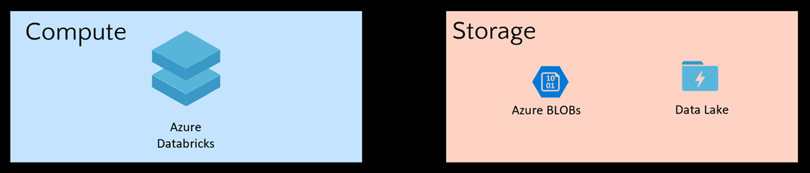
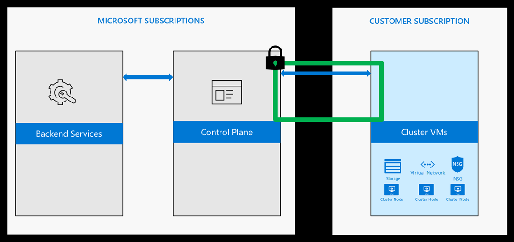
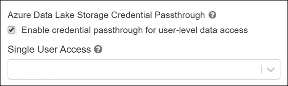
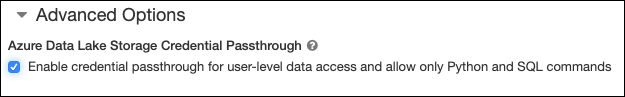
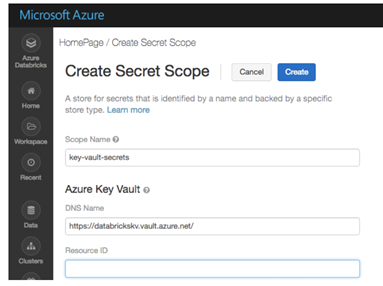

In this module, we cover the following facets of Azure Databricks security:

- Data Protection
- IAM/Auth
- Network
- Compliance

In this unit, we focus on Data Protection, which is comprised of the following:

- Encryption at-rest – Service Managed Keys, User Managed Keys
- Encryption in-transit (Transport Layer Security - TLS)
- File/Folder Level access control lists (ACLs) for Azure Active Directory (Azure AD) Users, Groups, Service Principals
- ACLs for Clusters, Folders, Notebooks, Tables, Jobs
- Secrets with Azure Key Vault

## Encryption at-rest

Azure Databricks has separation of compute and storage.

Azure Databricks is a compute platform. It does not store data, except for notebooks. Clusters are transient in nature. They process the data then are terminated. All data is stored in the customer's subscription. Because the Azure storage services use server-side encryption, communication between these services and the Databricks clusters is seamless.

Storage Services such as Azure Storage Blobs and Azure Data Lake Storage (Gen1/2) provide:

- Encryption of Data - Automatic server-side encryption in addition to encryption on storage attached to the VMs
- Customer Managed Keys - Bring your own keys with Key Vault integration
- File/Folder Level ACLs (Azure Data Lake Storage (Gen1/2))

## Encryption in-transit

All the traffic from the Control Plane to the clusters in the customer subscription (Data Plane) is always encrypted with TLS.

When clusters access data from various Azure services, TLS is always used to ensure encryption in-transit.

When customers access notebooks via their web browsers, the connection is also secured with TLS.

## Access control - ADLS Passthrough

When enabled, authentication automatically takes place in Azure Data Lake Storage (ADLS) from Azure Databricks clusters using the same Azure Active Directory (Azure AD) identity that one uses to log into Azure Databricks. Commands running on a configured cluster will be able to read and write data in ADLS without needing to configure service principal credentials. Any ACLs applied at the folder or file level in ADLS are enforced based on the user's identity.

ADLS Passthrough is configured when you create a cluster in the Azure Databricks workspace. ADLS Gen1 requires Databricks Runtime 5.1+. ADLS Gen2 requires 5.3+.

On a *standard cluster*, when you enable this setting you must set single user access to one of the Azure Active Directory (Azure AD) users in the Azure Databricks workspace. [Only one user is allowed to run commands](https://docs.microsoft.com/azure/databricks/data/data-sources/azure/adls-passthrough#single-user) on this cluster when Credential Passthrough is enabled.

*High-concurrency clusters* can be shared by multiple users. When you enable ADLS Passthrough on this type of cluster, it does not require you to select a single user.

## Access control - Folders

Access control is available only in the Premium SKU. By default, all users can create and modify workspace objects unless an administrator enables workspace access control. With workspace access control, individual permissions determine a user's abilities. This section describes the individual permissions and how to enable and configure workspace access control.

You can assign five permission levels to notebooks and folders: No Permissions, Read, Run, Edit, and Manage. The following tables lists the abilities for each permission.

## Access control - Notebooks

All notebooks in a folder inherit all permissions settings of that folder. For example, a user that has Run permission on a folder has Run permission on all notebooks in that folder.

To enable workspace access control:

- Go to the Admin Console.
- Select the Access Control tab.
- Click the Enable button next to Workspace Access Control.
- Click Confirm to confirm the change.

## Access control - Clusters

All users can view libraries. To control who can attach libraries to clusters, manage access control on clusters.

By default, all users can create and modify clusters unless an administrator enables cluster access control. With cluster access control, permissions determine a user's abilities. There are four permission levels for a cluster: No Permissions, Can Attach To, Can Restart, and Can Manage:

**Note**: You have `Can Manage` permission for any cluster that you create.

## Access control - Jobs

To control who can run jobs and see the results of job runs, manage access control on jobs.

There are five permission levels for jobs: No Permissions, Can View, Can Manage Run, Is Owner, and Can Manage. The Can Manage permission is reserved for administrators.

## Access control - Tables

Table access control (table ACLs) lets you programmatically grant and revoke access to your data from SQL, Python, and PySpark.

By default, all users have access to all data stored in a cluster's managed tables unless an administrator enables table access control for that cluster. Once table access control is enabled for a cluster, users can set permissions for data objects on that cluster.

Before you can grant or revoke privileges on data objects, an administrator must enable table access control for the cluster.

### View-based access control model

The Azure Databricks view-based access control model defines the following privileges:

- SELECT – gives read access to an object.
- CREATE – gives ability to create an object (for example, a table in a database)
- MODIFY – gives ability to add/delete/modify data to/from an object.
- READ_METADATA – gives ability to view an object and its metadata.
- CREATE_NAMED_FUNCTION – gives ability to create a named UDF in an existing catalog or database.
- ALL PRIVILEGES – gives all privileges (gets translated into all the above privileges)

The privileges above can apply to the following classes of objects:

- CATALOG - controls access to the entire data catalog.
- DATABASE - controls access to a database.
- TABLE - controls access to a managed or external table.
- VIEW - controls access to SQL views.
- FUNCTION - controls access to a named function.
- ANONYMOUS FUNCTION - controls access to anonymous or temporary functions.
- ANY FILE - controls access to the underlying filesystem.

## Secrets

Using the Secrets APIs, Secrets can be securely stored including in an Azure Key Vault or Databricks backend. Authorized users can consume the secrets to access services.

Azure Databricks has two types of secret scopes: Key Vault-backed and Databricks-backed. These secret scopes allow you to store secrets, such as database connection strings, securely. If someone tries to output a secret to a notebook, it is replaced by `[REDACTED]`. This helps prevent someone from viewing the secret or accidentally leaking it when displaying or sharing the notebook.

As a best practice, instead of directly entering your credentials into a notebook, use Azure Databricks secrets to store your credentials and reference them in notebooks and jobs.

To set up secrets you:

- Create a secret scope. Secret scope names are case insensitive.
- Add secrets to the scope. Secret names are case insensitive.
- If you have the Azure Databricks Premium Plan, assign access control to the secret scope.

Screenshot of creating an Azure Key Vault-backed secret scope:

