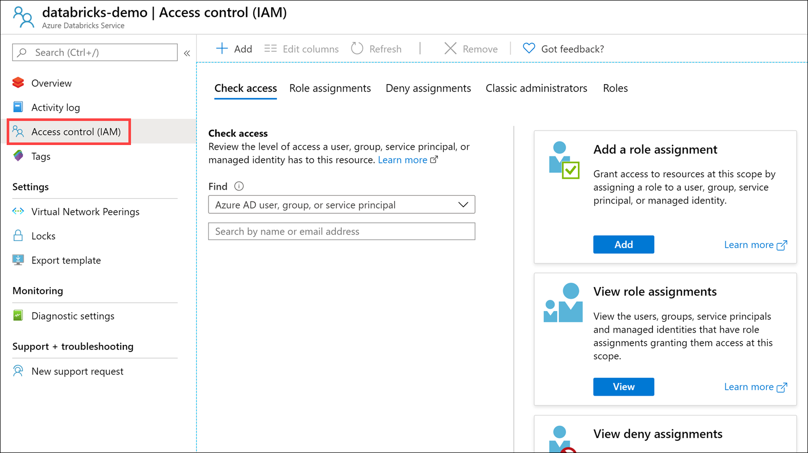
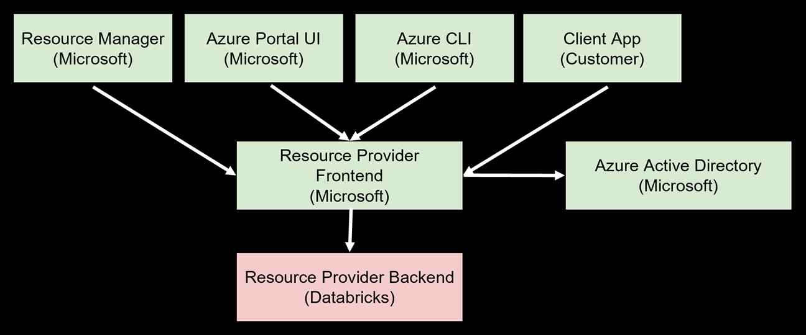
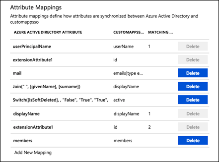
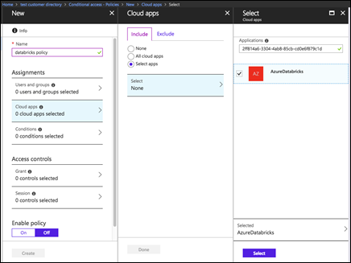
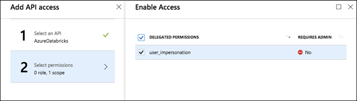

[Azure role-based access control (RBAC)](https://docs.microsoft.com/azure/role-based-access-control/overview) is the authorization system you use to manage access to Azure resources. To grant access, you assign roles to users, groups, service principals, or managed identities at a particular scope.

**Access control (IAM)** is the blade that you use to assign roles to grant access to Azure resources. It's also known as identity and access management and appears in several locations in the Azure portal.

The following shows an example of the Access control (IAM) blade for an Azure Databricks service:

RBAC and IAM are both enabled by Azure Active Directory (Azure AD), an enterprise identity service that provides single sign-on and multi-factor authentication, which helps users securely sign in and access resources in:

- External resources, such as Microsoft 365, the Azure portal, and thousands of other SaaS applications.
- Internal resources, such as apps on your corporate network and intranet, along with any cloud apps developed by your own organization.

## Azure Databricks provides first-party Azure AD integration

Users access Azure Databricks workspace with an Azure AD account. The Resource Provider Frontend checks a user's authorization against an Azure Active Directory tenant. The user's Azure AD account has to be added to the Azure Databricks workspace before they can access it.

## SCIM integration

Azure Databricks supports SCIM, or System for Cross-domain Identity Management, an open standard that allows you to automate user provisioning. SCIM lets you use Azure Active Directory to create users in Azure Databricks and give them the proper level of access, as well as remove access for users (deprovision them) when they leave the organization or no longer need access to Azure Databricks.

Customers can sync Azure Active Directory groups with Databricks groups using SCIM functionality. Using groups makes it easy to assign permissions to users in Databricks by applying them to groups instead of individuals if there are a lot of users.

Example attribute mappings:

## Conditional access

Azure Databricks supports Azure Active Directory conditional access, which allows administrators to control where and when users are permitted to sign in to Azure Databricks. For example, conditional access policies can restrict sign-in to your corporate network or can require multi-factor authentication.

> This feature is available in the Azure Databricks premium tier only.

## Azure Active Directory token support

You can use Azure AD tokens to automate provisioning of Azure Databricks workspaces and access the Databricks REST API. Typically, a user needs to use a personal access token (JWT token) that a they create in the Azure Databricks workspace in order to access the Databricks REST API. The problem with using personal access tokens for the REST API is that your ability to create new tokens exists only after a workspace is created. Since the Azure Databricks workspace creation can only occur within the Azure portal, it is difficult to perform end-to-end automation without using Azure Active Directory tokens. This means that, if you want to automate creating an Azure Databricks workspace, then within that workspace, use the REST API to automate creating users, clusters, jobs, etc., you would first need to create the workspace in the portal, then sign in to the workspace to create the first personal access token.

However, if you want to automate provisioning an Azure Databricks workspace and use the Databricks API in a completely non-interactive way through scripting, you can accomplish this by first creating an enterprise Azure AD application and adding a user to the application and an Azure Databricks workspace. In addition, you will need to enable user impersonation `user_impersonation` delegated API access in the Azure AD application, as shown in the screenshots below:

API access:

 
