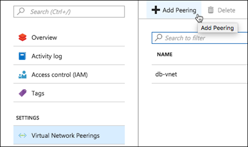
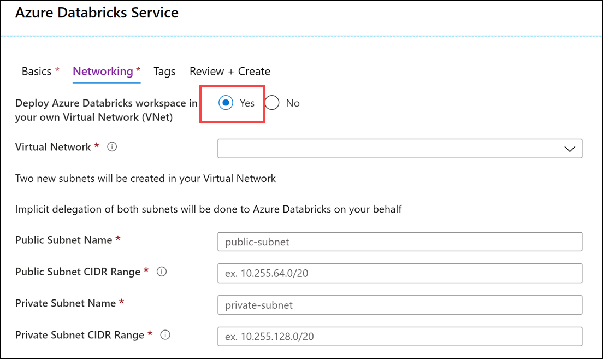
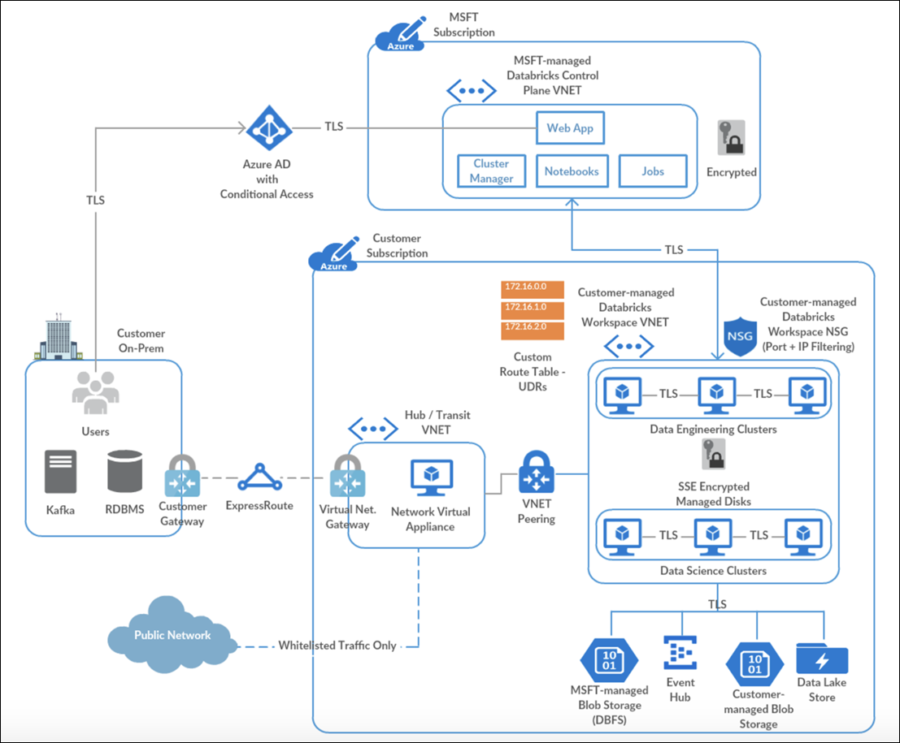

When planning and implementing your Azure Databricks deployments, you have a number of considerations about networking and network security implementation details.

## Network security

### VNet Peering

Virtual network (VNet) peering allows the virtual network in which your Azure Databricks resource is running to peer with another Azure virtual network. Traffic between virtual machines in the peered virtual networks is routed through the Microsoft backbone infrastructure, much like traffic is routed between virtual machines in the same virtual network, through private IP addresses only.

VNet peering is only required if using the standard deployment without VNet injection.

### VNet Injection

If you're looking to do specific network customizations, you could deploy Azure Databricks data plane resources in your own VNet. In this scenario, instead of using the managed VNet, which restricts you from making changes, you "bring your own" VNet where you have full control. Azure Databricks will still create the managed VNet, but it will not use it.

Features enabled through [VNet injection](/azure/databricks/administration-guide/cloud-configurations/azure/vnet-inject) include:

- On-Premises Data Access
- Single-IP SNAT and Firewall-based filtering via custom routing
- Service Endpoint

To enable VNet injection, select the **Deploy Azure Databricks workspace in your own Virtual Network** option when provisioning your Azure Databricks workspace.

When you compare the deployed Azure Databricks resources in a VNet injection deployment vs. the standard deployment you saw earlier, there are some slight differences. The primary difference is that the clusters in the Data Plane are hosted within a customer-managed Azure Databricks workspace VNet instead of a Microsoft-managed one. The Control Plane is still hosted within a Microsoft-managed VNet, but the TLS connection is still created for you that routes traffic between both VNets. However, the network security groups (NSG) becomes customer-managed as well in this configuration. The only resource in the Data Plane that is still managed by Microsoft is the Blob Storage service that provides DBFS.

Also, inter-node TLS communication between the clusters in the Data Plane is enabled in this deployment. One thing to note is that, while inter-node TLS is more secure, there is a slight impact on performance vs. the non-inter-node TLS found in a basic deployment.

If your Azure Databricks workspace is deployed to your own virtual network (VNet), you can use custom routes, also known as [user-defined routes](https://docs.microsoft.com/azure/virtual-network/virtual-networks-udr-overview#user-defined) (UDR), to ensure that network traffic is routed correctly for your workspace. For example, if you connect the virtual network to your on-premises network, traffic may be routed through the on-premises network and unable to reach the Azure Databricks control plane. User-defined routes can solve that problem. The diagram below shows UDRs, as well as the other components of a VNet injection deployment.

You can create different Azure Databricks workspaces in the same VNet. However, you will need separate pairs of dedicated subnets per Azure Databricks workspace. As such, the VNet network range has to be fairly large to accommodate those. The VNet CIDR can be anywhere between `/16` and `/24`, and the subnet CIDR can be anywhere between `/18` and `/26`.

### Secure connectivity to other Azure data services

Your Azure Databricks deployment likely includes other Azure data services, such as Azure Blob Storage, Azure Data Lake Storage Gen2, Azure Cosmos DB, and Azure Synapse Analytics. We recommend ensuring traffic between Azure Databricks and Azure data services such as these remains on the Azure network backbone, instead of traversing over the public internet. To do this, you should use Azure Private Link or Service Endpoints.

#### Azure Private Link

Using Azure [Private Link](/azure/private-link/private-link-overview) is currently the most secure way to access Azure data services from Azure Databricks. Private Link enables you to access Azure PaaS Services (for example, Azure Storage, Azure Cosmos DB, and SQL Database) and Azure hosted customer/partner services over a Private Endpoint in your virtual network. Traffic between your virtual network and the service traverses over the Microsoft network backbone, eliminating exposure from the public Internet. You can also create your own Private Link Service in your virtual network (VNet) and deliver it privately to your customers.

#### Azure VNet service endpoints

Virtual Network (VNet) [service endpoints](https://docs.microsoft.com/azure/virtual-network/virtual-network-service-endpoints-overview#key-benefits) extend your virtual network private address space. The endpoints also extend the identity of your VNet to the Azure services over a direct connection. Endpoints allow you to secure your critical Azure service resources to only your virtual networks. Traffic from your VNet to the Azure service always remains on the Microsoft Azure network backbone.

Read more about [securely accessing Azure data sources from Azure Databricks](https://databricks.com/blog/2020/02/28/securely-accessing-azure-data-sources-from-azure-databricks.html).

### Combining VNet injection and Private Link

The following diagram shows how you may use Private Link in combination with VNet injection in a [hub and spoke topology](/azure/architecture/reference-architectures/hybrid-networking/hub-spoke) to prevent data exfiltration:

1. Deploy Azure Databricks in a spoke virtual network using VNet injection.
1. Set up Private Link endpoints for your Azure Data Services in a separate subnet within the Azure Databricks spoke virtual network.
1. Optionally, set up Azure SQL database as External Hive Metastore to override as the primary metastore for all clusters in the workspace. This is meant to override the configuration for consolidated metastore housed in the control plane.
1. Deploy Azure Firewall (or other Network Virtual Appliance) in a hub virtual network.

[Read more about this sample architecture](https://databricks.com/blog/2020/03/27/data-exfiltration-protection-with-azure-databricks.html) and details about data exfiltration protection with Azure Databricks.

## Compliance

In many industries, it is imperative to maintain compliance through a combination of following best practices in storing and handling data, and by using services that maintain compliance certifications and attestations.

Azure Databricks has the following compliance certifications:

- HITRUST
- AICPA
- PCI DSS
- ISO 27001
- ISO 27018
- HIPAA (Covered by MSFT Business Associates Agreement (BAA))
- SOC2, Type 2

## Audit logs

Databricks provides comprehensive end-to-end audit logs of activities performed by Databricks users, allowing your enterprise to monitor detailed Databricks usage patterns. Azure Monitor integration enables you to capture the audit logs and make then centrally available and fully searchable.

Services / Entities included are:

- Accounts
- Clusters
- DBFS
- Genie
- Jobs
- ACLs
- SSH
- Tables
