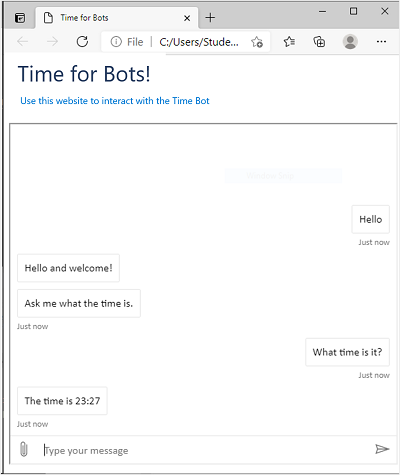

A *bot* is an application with a conversational interface.

While there are many ways you can implement a bot, some common features of bots include:

- Users interact with a bot by initiating *activities* in *turns*.
- Activities are events, such as a user joining a conversation or sending a message.
- Messages can be text, speech, or visual interface elements (such as *cards* or *buttons*).
- A flow of activities can form a *dialog*, in which state is maintained to manage a multi-turn conversation.
- Activities are exchanged across *channels*, such as web chat, email, Microsoft Teams, and others.

## Learning objectives

In this module, you will learn how to:

- Create a bot by using the Microsoft Bot Framework SDK.
- Deploy a bot to the Azure AI Bot Service.

## Pre-requisites

To complete this module, you will need:

- A Microsoft Azure subscription. If you don't have one, you can sign up for a free trial at [https://azure.microsoft.com/free](https://azure.microsoft.com/free?azure-portal-true).
- Experience of programming with C# or Python.
