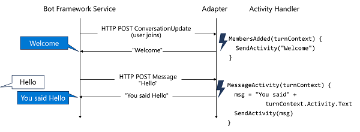
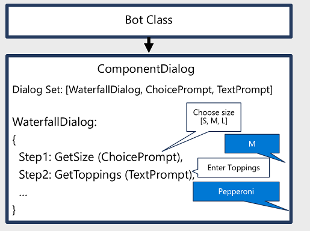
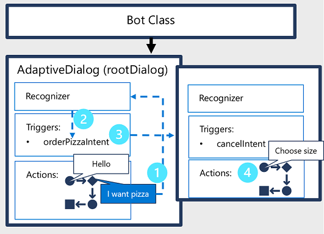

The logic for processing the activity can be implement in multiple ways. The Bot Framework SDK provides classes that can help you build bots that manage conversations using:

- **Activity handlers**: Event methods that you can override to handle different kinds of activities.
- **Dialogs**: More complex patterns for handling stateful, multi-turn conversations.

## Activity handlers

For simple bots with short, stateless interactions, you can use Activity Handlers to implement an event-driven conversation model in which the events are triggered by activities such as users joining the conversation or a message being received. When an activity occurs in a channel, the Bot Framework Service calls the bot adapter's **Process Activity** function, passing the activity details. The adapter creates a turn context for the activity and passes it to the bot's *turn handler*, which calls the individual, event-specific activity handler.

The **ActivityHandler** base class includes event methods for the many kinds of common activity, including:

- Message received
- Members joined the conversation
- Members left the conversation
- Message reaction received
- Bot installed
- Others...

You can override any activity handlers for which you want to implement custom logic.

### Turn context

An activity occurs within the context of a *turn*, which represents a single two-way exchange between the user and the bot. Activity handler methods include a parameter for the *turn context*, which you can use to access relevant information. For example, the activity handler for a message received activity includes the text of the message.

### More Information

For more information about activity handlers, see the [Bot Framework SDK documentation](https://docs.microsoft.com/azure/bot-service/bot-activity-handler-concept).

## Dialogs

For more complex conversational flows where you need to store *state* between turns to enable a *multi-turn conversation*, you can implement *dialogs*. The Bot Framework SDK dialogs library provides multiple dialog classes that you can combine to implement the required conversational flow for your bot.

There are two common patterns for using dialogs to compose a bot conversation:

### Component dialogs

A *component* dialog is a dialog that can contain other dialogs, defined in its *dialog set*. Often, the initial dialog in the component dialog is a *waterfall* dialog, which defines a sequential series of steps to guide the conversation. It's common for each step to be a *prompt* dialog so that conversational flow consists of gathering input data from the user sequentially. Each step must be completed before passing the output onto the next step

For example, a pizza ordering bot might be defined as a waterfall dialog in which the user is prompted to select a pizza size, then toppings, and finally prompted for payment.

### Adaptive dialogs

An *adaptive* dialog is another kind of container dialog in which the flow is more flexible, allowing for interruptions, cancellations, and context switches at any point in the conversation. In this style of conversation, the bot initiates a *root* dialog, which contains a flow of *actions* (which can include branches and loops), and *triggers* that can be initiated by actions or by a *recognizer*. The recognizer analyzes natural language input (usually using the Language Understanding service) and detects intents, which can be mapped to triggers that change the flow of the conversation - often by starting new child dialogs, which contain their own actions, triggers, and recognizers.

For example, the pizza ordering bot might start with a root dialog that simply welcomes the user. When the user enters a message indicating that they want to order a pizza, the recognizer detects this intent and uses a trigger to start another dialog containing the flow of actions required to gather information about the pizza order. At any point during the pizza order dialog, the user might enter a message indicating that they want to do something else (for example, cancel the order), and the recognizer for the pizza ordering dialog (or its parent dialog) can be used to trigger an appropriate change in the conversational flow.

> [!NOTE]
> Using dialogs offers greater flexibility than is possible with a bot based purely on activity handlers, but can be more complex to program. While you can use the Bot Framework SDK to implement dialogs in code, you may want to consider using the [Bot Framework Composer](https://docs.microsoft.com/composer/) to build bots with complex dialogs, taking advantage of its visual design interface.
