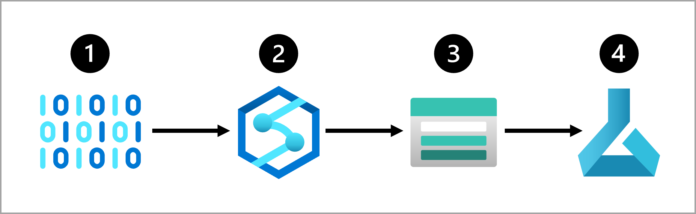

To move and transform data, you can use a **data ingestion pipeline**. A data ingestion pipeline is a sequence of tasks that move and transform the data. By creating a pipeline, you can choose to trigger the tasks manually, or schedule the pipeline when you want the tasks to be automated.

## Create a data ingestion pipeline

To create a data ingestion pipeline, you can choose which Azure service to use.

### Azure Synapse Analytics

A commonly used approach to create and run pipelines for data ingestion is using the data integration feature of **Azure Synapse Analytics**, also known as **Azure Synapse Pipelines**. With Azure Synapse Pipelines you can create and schedule data ingestion pipelines through the easy-to-use UI, or by defining the pipeline in JSON format.

When you create an Azure Synapse pipeline, you can easily copy data from one source to a data store by using one of the many standard connectors.

> [!Tip]
> Learn more about the [copy activity in Azure Synapse Analytics, and all supported data stores and formats](/azure/data-factory/copy-activity-overview?azure-portal=true).

To add a data transformation task to your pipeline, you can use a UI tool like **mapping data flow** or use a language like SQL, Python, or R.

Azure Synapse Analytics allows you to choose between different types of compute that can handle large data transformations at scale: serverless SQL pools, dedicated SQL pools, or Spark pools.

> [!Tip]
> Learn more about how to [perform data integration at scale with Azure Synapse Analytics](/training/paths/data-integration-scale-azure-data-factory?azure-portal=true). 

### Azure Databricks

Whenever you prefer a code-first tool and to use SQL, Python, or R to create your pipelines, you can also use **Azure Databricks**. Azure Databricks allows you to define your pipelines in a notebook, which you can schedule to run. 

Azure Databricks uses Spark clusters, which distribute the compute to transform large amounts of data in less time than when you don't use distributed compute. 

> [!Tip]
> Learn more about [data engineering with Azure Databricks](/training/paths/data-engineer-azure-databricks?azure-portal=true) and how to [prepare data for machine learning with Azure Databricks](/training/modules/prepare-data-for-machine-learning-azure-databricks?azure-portal=true)

### Azure Machine Learning

**Azure Machine Learning** provides compute clusters, which automatically scale up and down when needed. You can create a pipeline with the Designer, or by creating a collection of scripts. Though Azure Machine Learning pipelines are commonly used to train machine learning models, you could also use it to extract, transform, and store the data in preparation for training a machine learning model. 

Whenever you want to perform all tasks within the same tool, creating and scheduling an Azure Machine Learning pipeline to run with the on-demand compute cluster may best suit your needs. 

However, Azure Synapse Analytics and Azure Databricks offer more scalable compute that allow for transformations to be distributed across compute nodes. Therefore, your data transformations may perform better when you execute them with either Azure Synapse Analytics or Azure Databricks instead of using Azure Machine Learning.

## Design a data ingestion solution

A benefit of using cloud technologies is the flexibility to create and use the services that best suit your needs. To create a solution, you can link services to each other and represent the solution in an **architecture**. 

For example, a common approach for a data ingestion solution is to:

1. Extract raw data from its source (like a CRM system or IoT device).
1. Copy and transform the data with Azure Synapse Analytics.
1. Store the prepared data in an Azure Blob Storage.
1. Train the model with Azure Machine Learning.

It's a best practice to think about the architecture of a data ingestion solution before training your model. Thinking about how the data is automatically extracted and prepared for model training will help you to prepare for when your model is ready to go to production.
