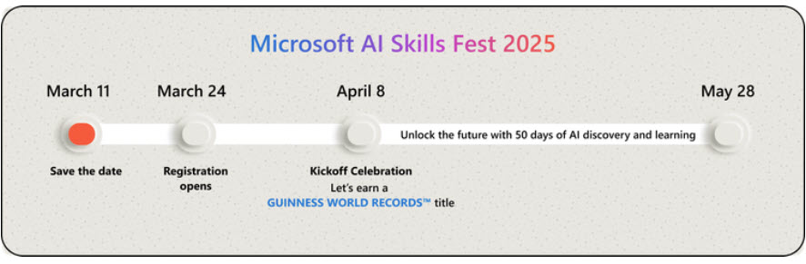
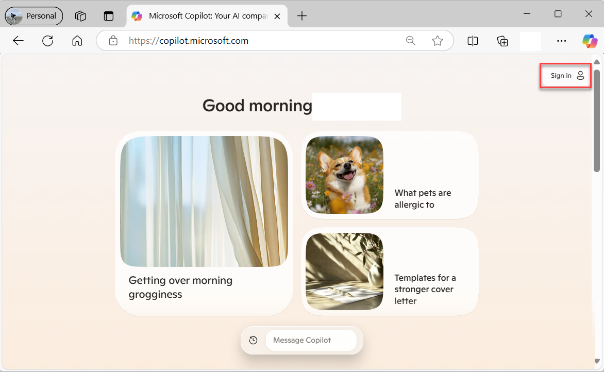
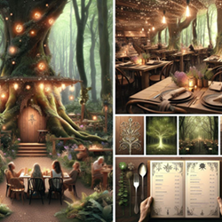

Generative AI can help with all sorts of content creation projects. In this module, learn how to use generative AI to create a story about an imaginary destination from your dreams. Bring your own interests to this endeavor as you reference a place you know well but work to reimagine with a twist. How can you make it unique and exciting? How might it reflect your own interests or passions? 

You co-create this vision with AI. Use Copilot in your browser to research, ideate, write copy, and create visuals to bring your idea to life. Each exercise in this module focuses on a different part of the experience and provides a sample prompt you can copy and edit. The structure of the steps and the prompts are created to highlight specific techniques or functionality. Sample responses are provided to show you examples of the content Copilot creates.  

> [!NOTE]
> **April 8, 2025 only**: Join us as we attempt a **GUINNESS WORLD RECORDSTM** title for "Most users to take an online multi-level artificial intelligence lesson in 24 hours!"
> To participate, you must:
> 1. **Register** for the [Microsoft AI Skills Fest](https://aka.ms/AISkillsFest?azure-portal=true).
> 2. **Complete this module**. You do not need to get the knowledge check questions correct, you just need to attempt them.
> 3. **Verify** [your involvement](https://aka.ms/AISkillsFest_TrainingAffirmation?azure-portal=true) and download your badge.
> 
> 

> [!NOTE]
>This module is based on a SkillUp AI Challenge, developed by the Microsoft Garage. The Garage drives a culture of innovation at Microsoft, delivering programs and experiences to employees and customers that enable collaboration, creativity, and experimentation. The SkillUp AI Challenge is so popular with Microsoft employees that we're now offering it as an online learning experience open to anyone. Learn more about [The Microsoft Garage.](https://www.microsoft.com/garage)

**Before you start**

1. In your browser, navigate to [copilot.microsoft.com](https://copilot.microsoft.com/). For this tutorial you need to use Copilot in the **full browser**, not in the browser sidebar.

2. Sign in to Copilot with your [personal Microsoft Account](https://signup.live.com/) (such as an outlook.com account).

> [!TIP] 
> **Pull it all together**.
> As you create everything you need to describe your idea and destination, save it. You can copy your AI-generated content into another format, such as a Microsoft PowerPoint presentation, to further refine and share with others.
> 
>
>