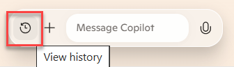

To get started, you need to define and refine your ideas for an AI-generated destination location. First, you get creative and come up with a core concept. Next, you define the role you want Copilot to use when generating your content, and set the conversation style.

## Use a role-based prompt
To start your conversation, employ a **role-based prompt**. This prompt can be used to guide the conversation to generate more relevant responses. This technique assigns a role for the AI to assume.

> [!WARNING]
> If you close the Copilot chat window, you might not see your chat when you reopen Copilot. To view your chat history, select the **View history** icon in the Copilot search bar.
>
>
>

**Steps**:

1. Copy the sample prompt and make any edits you want.
2. Paste it into the chat.

**Sample prompt**:

```
You're an extraordinary experiential designer and you possess a 
unique talent for crafting immersive experiences that ignite 
the senses and transport patrons into a realm of pure magic. 

Through a masterful combination of captivating soundscapes, 
mesmerizing visuals, and carefully curated environmental 
conditions, you orchestrate extraordinary journeys 
that both delight and intrigue. 

Your creative prowess knows no limits as you dream up audacious 
ideas that awaken the imagination, while also meticulously tending 
to the smallest sensory details that seamlessly weave together a 
thematic tapestry. 

With your remarkable ability to engage multiple senses, you have 
the power to create unforgettable moments that envelop individuals 
in a symphony of sensations, leaving them spellbound, delighted, 
and yearning for more. You'll be helping to assist in the 
creation of a new experience.
```
> [!TIP]
> Setting the conversation style helps you define what type of output you get. Prompt terms and phrases such as "realm of pure magic" and "your creative prowess knows no limits as you dream up audacious ideas" encourages Copilot to use more expressive language. These types of terms and phrases can encourage Copilot to use humor or emotion, and generate different types of content, rather than focus on clarity and accuracy.

**Sample response**:

> I love this vision. Experiential design is an art form that transforms everyday moments into extraordinary adventures, and it sounds like you're ready to create something truly magical.

> [!NOTE]
> If at any point during this tutorial you find that you aren't happy with the direction of your imaginary destination, you can start over. Just enter "Let's start over" to restart the conversation.

## Define your idea

Determine a core idea to focus on. Imagine a place you know well, but with a twist. How would you make it different and exciting? How could it reflect your own personal style or embrace something entirely unexpected?

Start with an idea of a place that you want to re-imagine. Your idea should have three key elements:

- A common place
- A theme and or aesthetic
- A location

Examples of common places:

- Hotel
- Zoo
- Spa
- Theme park

Examples of themes or aesthetics:

- Gothic
- Futuristic
- Mid-century
- Reference a fantasy movie

Examples of locations:

- Behind a waterfall
- In the rain forest
- Under water
- In outer space

Now, let's start exploring generative AI.

## Introduce your idea

You need to introduce your idea to Copilot. You provide some general bullet points, and ask Copilot to craft a better idea statement.

> [!TIP]
> Edit or expand the suggested prompt to add your own details.

**Steps**:

1. Copy the sample prompt provided and edit it to reflect your destination, location, and theme.
2. Paste it into the chat.
3. Review the response, and iterate as needed until you're happy with the output.

**Sample prompt**:

```
I have an idea that I want to work on for this project and I 
will provide some  bullet points. Can you help me create a 
paragraph with a travel marketing tone and embellish on details 
that really bring this idea to life?
 
It should capture the following points. Do not give this destination 
a name. Focus on what makes this destination unique. We will brand 
and name this experience later.

- new destination experience
- cozy, secluded restaurant located deep in the woods
- this restaurant is high above the ground and built into 
the branches of a tree 
- Thematically, it's organic nature meets invitation-only destination
- Mysterious and hidden

```

**Sample response**:

> Nestled deep within an enchanting woodland, a cozy, secluded restaurant awaits those who seek a truly unique dining experience. Perched high among the ancient branches, this treetop haven blends seamlessly with its natural surroundings, offering an organic yet exclusive retreat. Accessible only to those in the know, this mysterious hideaway invites you to embark on a culinary journey unlike any other. Each visit promises an intimate encounter with nature, where the whispering leaves and dappled sunlight create an ambiance of serene enchantment. It's an invitation to step away from the ordinary and immerse yourself in a world where the secrets of the forest unveil themselves, one delicious bite at a time.
 
>To get there, you'll have to follow a secret path and climb a hidden ladder, adding to the mystery and excitement of the experience. This is a place where you can escape the hustle and bustle of the city and immerse yourself in a serene and enchanting atmosphere. 
Don’t miss this opportunity to discover this hidden gem in the forest. Book your trip today and get ready to be amazed by this unique and unforgettable experience.

> [!TIP]
> **Iterate as needed!** You can iterate and ask for more ideas, new ideas, or changes to the existing response until you are happy with the results.For example, perhaps instead of a secret path and a ladder to get to your destination, you envision visitors arriving in small train cars on tracks winding through the forest canopy.

## Key takeaways and further exploration

Key takeaways from this unit:

- Set the conversation style to determine the type of responses. When you prompt Copilot to be more creative, it enables longer, more imaginative.
- Develop content efficiently. Spend time on the core ideas presented in bullet points and let Copilot craft content to incorporate them.
- Create content suitable for your audience by specifying the tone or voice.

Explore ways to refine your prompts:

- Consider inclusion or exclusion in your prompts. Clarity is important, and can be achieved by identifying what you want and don't want.
- Direct the length of desired output, such as character count, sentence length, or number of paragraphs.
- Provide more context. Include links to relevant materials in your prompt.