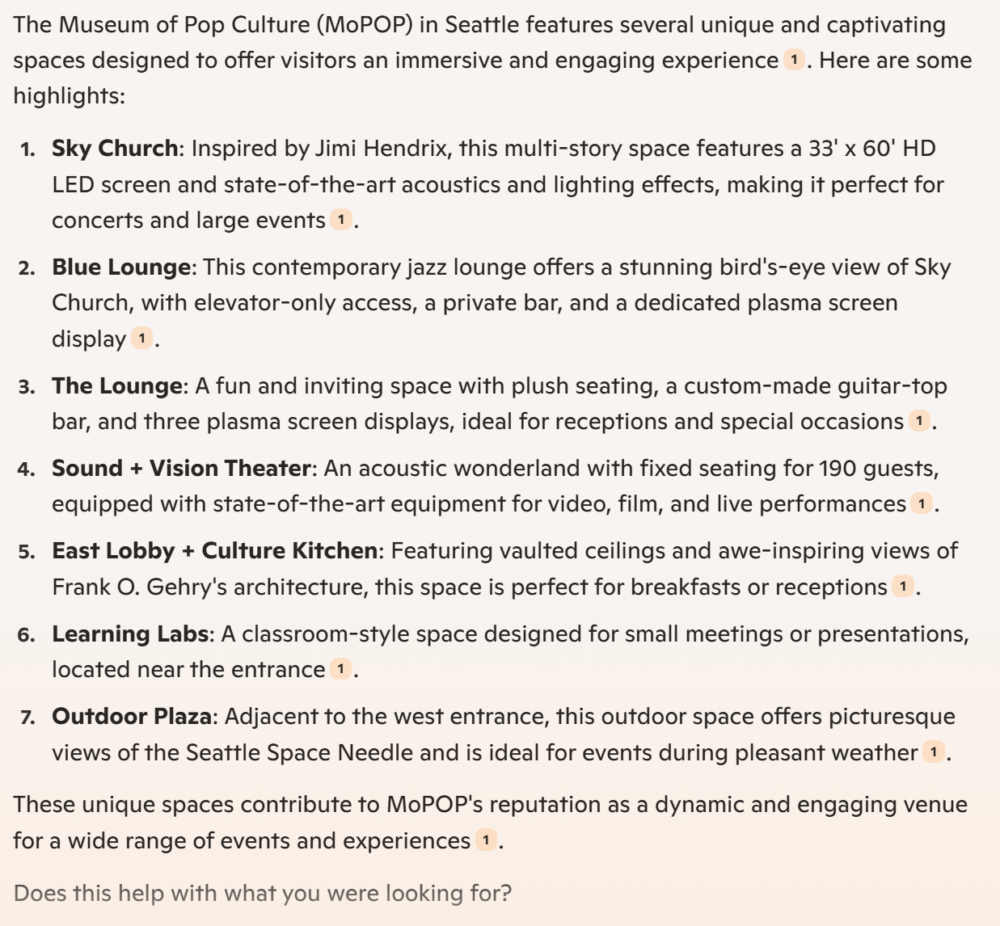
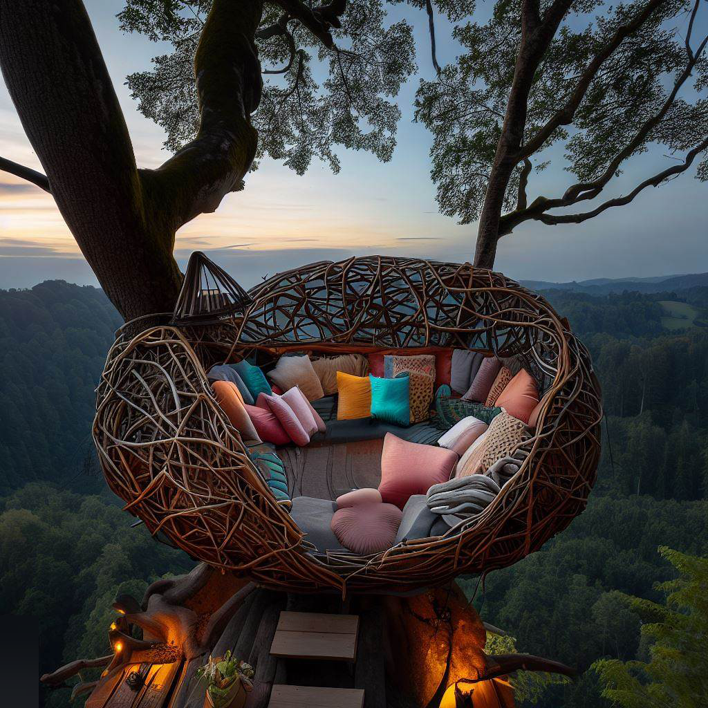

Destination locations have various interior and exterior spaces that are features. Let’s use Copilot to brainstorm and visualize some creative ideas for these spaces.

## Ideate
Return to your conversation in Copilot. You start by ideating with your co-creator to think about unique features or spaces within your destination.

**Steps**:
1. Copy the sample prompt and edit as needed.
2. Paste the prompt into the chat.
3. Review the response, and iterate as needed until you're happy with the output.

**Sample prompt**:
``` 
We are now going to work on the part of the project called 
The Features. 

Given what you know about this destination, can you suggest 
5 unique interior or exterior features or spaces that people 
might visit, spend time in, or enjoy? Please list them with 
the name, followed by the description. 

```
**Sample response**:

> Absolutely, let's craft some unique features for this enchanting destination:
> 
> **The Nest**
> A cozy and intimate seating area that is shaped like a bird’s nest and made of woven branches and cushions. It is located on the highest branch of the tree and offers a panoramic view of the forest and the sky. It is a perfect spot for couples or small groups to enjoy a drink and a conversation.

> **The Swing**
 A large and sturdy swing that hangs from a thick rope on the side of the tree. It can fit up to four people and allows them to swing back and forth over the forest floor. It is a fun and exhilarating way to experience the thrill of flying and the beauty of nature.
> 
> **The Library**
 A small and quiet room that is filled with books,
magazines, and board games. It is located inside the trunk of the tree and has a circular window that lets in natural light. It is a great place for visitors who want to relax, read, or play in a peaceful environment.
> 
> **The Lounge**
 A spacious and stylish room that is decorated with vintage furniture, art, and lighting. It is located on the main branch of the tree and has a stage for live music and performances. It is the heart of the bar, where visitors can mingle, dance, or enjoy the entertainment.
> 
>  **The Garden**
 A lush and colorful area that is planted with flowers, herbs, and fruits. It is located on the lower branch of the tree and has a fountain and a fire pit. It is a lovely place for visitors who want to enjoy the fresh air, smell the flowers, or roast marshmallows.

> [!TIP]
> If you know an existing destination that has great spaces, try prompting Copilot to summarize or pull specific information from a web page for inspiration. For example, ask Copilot to "Summarize the article at https://wikipedia.org/wiki/Museum_of_Pop_Culture. Format the summary as a bulleted list of interesting spaces in the museum."
> 
> **Sample response**:
> 

## Expand the ideas
Select **two of the ideas** to explore. For each idea, you need to work on creating a description and then creating an image.

**Steps**:
1. Copy the following sample prompt, and edit as needed.
2. Paste the prompt into the chat.
3. Review the response, and iterate as needed until you're happy with the output.

**Sample prompt**
```
I want to work on visualizing a few of these ideas. 
Let's work on the first idea called The Nest. Can you 
rewrite that description in a travel publication tone 
and keep it about the same length? Can you also suggest 
three alternative names for the Nest?
```

> [!NOTE]
> **Complex directive**. You asked the model to do a few things here in a single prompt. Copilot will work to figure out what it needs to do when you issue multiple directives in a single prompt.

**Sample response**:

> Sure, I can rewrite the description and suggest some names. Here is a possible rewrite:
>
> **The Nest**
>
> High above the forest floor, The Nest is an intimate hideaway designed to resemble a bird’s nest, intricately woven from branches and adorned with plush cushions. Situated at the highest point of the tree, it offers sweeping panoramic views of the verdant canopy and the open sky. This cozy enclave is an idyllic retreat for couples or small groups, providing the perfect setting to unwind with a drink and engage in heartfelt conversations. The serene atmosphere and breathtaking vistas make The Nest a truly magical spot to experience the beauty of nature from an unparalleled vantage point.
> 
> Alternative Names:
> - Canopy Nook
> - Roost
> - Tree Top Hideaway
>
> How’s this for capturing the essence of The Nest? Ready to visualize the next feature, or explore another element of this enchanting destination?

If you're happy with the result, move on to create an image. Perhaps you like the description, but would like some different alternative names, so now is the time to iterate.

## Create an image
Once you're happy with the generated images, select one and ask Copilot to visualize it.

> [!TIP]
> Edit or expand the suggested prompt to add your own details, such as prompting Copilot to make the image bright and sunny, or at sunset.

**Steps**:
1. Copy the sample prompt and edit it as needed.
2. Paste the prompt into the chat.
3. Refine your prompt until you get an image you like.
4. Download that image.

**Sample prompt**:
```
I like the second idea you proposed. Can you create an 
image to visualize what you called the Roost? 
```
**Sample response**:
> Got it! Your image of The Roost is on its way. I hope it captures the cozy, intimate feel we're aiming for.
> 

> [!IMPORTANT]
> Repeat the **Expand the ideas** and **Create an image** sections so that you have a name, description, and image for **at least two spaces**.

When you have two spaces complete and the images downloaded, you can move to the next exercise.

## Key takeaways and further exploration

Key takeaways from this unit:

- Copilot understands complex directives. A single prompt can have several tasks and it can infer what is required.  

Explore ways to refine your prompts:

- Craft a more detailed prompt. Provide several examples for format or organizing content.
- Brainstorm with Copilot. The Copilot-generated ideas can be iterated or expanded.