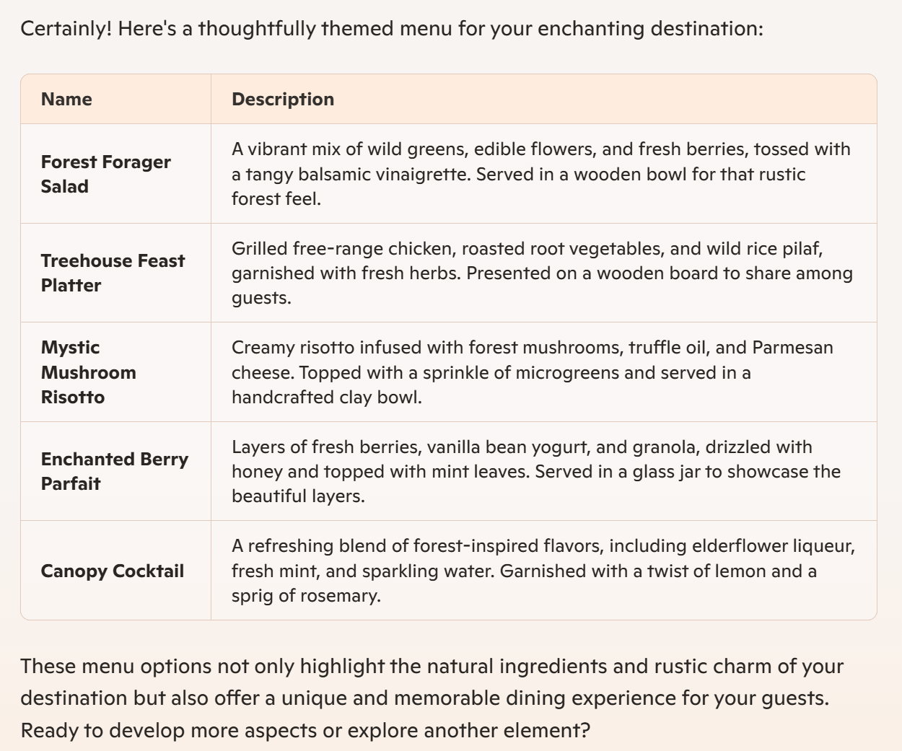
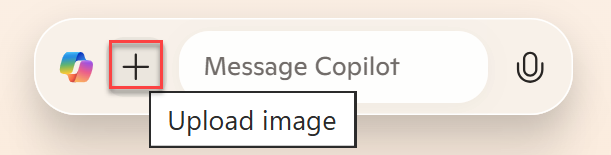

Food and refreshments are an important part of any destination. They can enhance the mood, theme, and experience of the visitors. Whether it’s a hotel, a theme park, or something else, let’s think about what kind of food your destination offers. Use Copilot to visualize the menu.

## Ideate

Return to your conversation in Copilot. You start by ideating to think about some food options that would match your theme.

**Steps**:
1. Copy the sample prompt and edit as needed.
2. Paste the prompt into the chat.
3. Review the response, and iterate as needed until you're happy with the output.

**Sample prompt**:
``` 
For this destination we have been working on together, 
I’d like to think about food options available. 
This part of the project is called The Food. 
Could you create me a menu formatted as a table which 
includes the name and the description. The descriptions 
should clearly outline the ingredients and how it's served. 
The name and description should also embrace the theme 
of our destination. Please provide 5 ideas.   

```
> [!NOTE]
> **Specify format**. You specified a "table" format for the output, which makes it very easy for you to copy and paste and put right into a spreadsheet like Microsoft Excel.

**Sample response**:

> 

> [!TIP]
> **Iterate as needed!** Perhaps you'd like a vegetarian menu, or you'd like your dishes to be served family style.

## Generate the image
Select one or two of the menu items and create an image for each of them.

> [!TIP]
> Edit or expand the suggested prompt to add your own details.

**Steps**:
1. Copy the sample prompt and edit it as you need.
2. Paste the prompt into the chat.
3. Select an image you like and download it.

If you have trouble using this prompt, which relies on the context of the conversation, try using the description you created for the prompt.

**Sample prompt**:
```
Can you create an image for the first menu item suggested?
```
**Sample response**:
> Sure! here is an image of the Forest Forager Salad.
>
> 

You need at least one image for food, but you're welcome to make more.  

## Ideate a signature drink
A signature drink is a drink that reflects your personality or your destination’s theme. It should feel special. It could be anything, as long as it suits your destination.

### Research for inspiration
Use Copilot to do some research. Copilot can search the internet and bring back links, so let's ask it to gather inspiration for us. If you find an image from researching that you like because of the colors, the shape of the glass, or the lighting, save the image. At the end of this exercise, you can use that image to influence your outcomes.

**Steps**:
1. Copy the sample prompt and edit it as needed to reflect your vision.
2. Paste this prompt into the chat.
3. Explore the response it gave you, and refine as needed.
4. Save any images you might want to use later to influence image iterations.

**Sample prompt**:
```
A signature drink is a refreshment that truly embodies the theme of
the destination. It should be unique and an experience it itself. 
It might embrace local ingredients, culture, or cues from the theme 
that influence how they look, how they're served, or how they're made. 
They delight customers. We need to find some photo inspiration to help 
generate ideas for refreshments that would be fun to enjoy. Can you 
provide some inspiration for unique refreshments that are highly 
creative? It could be their colors, their ingredients, the container 
they're served in, how they're made, or how someone needs to enjoy it.
```

**Sample response**:

> Sure, I can help you brainstorm some vivid ideas for unique refreshments!
>
> - **Forest Elixir**: A vibrant green drink made from freshly squeezed cucumber, mint, and a hint of lime, served in a carved bamboo cup with a sprig of rosemary.
> - **Berry Blossom Iced Tea**: A deep purple tea brewed with a mix of wild berries and hibiscus, garnished with edible flowers and served in a mason jar with a twist of lemon.
> - **Sunrise Citrus Spritzer**: Layers of orange, grapefruit, and passion fruit juices topped with sparkling water, creating a gradient effect in a tall, clear glass. Each sip reveals a new burst of flavor.
> - **Mystic Mist Lemonade**: A refreshing blue butterfly pea flower lemonade that changes color to a vibrant purple when stirred with a bit of lemon juice. Served in a glass teapot so guests can witness the transformation.
> - **Enchanted Herbal Infusion**: A calming blend of chamomile, lavender, and honey, served in a glass teacup that’s been lightly smoked for a mystical, aromatic experience.
> - **Acorn Ambrosia**: A nutty, creamy concoction made from almond milk, vanilla, and a hint of maple syrup. Served in a hollowed-out acorn shell with a dusting of cinnamon on top, offering a whimsical touch.
> 
> Each of these drinks offers a unique sensory experience that complements the enchanting theme of your destination. Imagine how these could come to life visually! Ready to dive into one of these ideas or another element of our project?

> [!TIP]
> You can iterate, and ask Copilot to refine the ideas or generate more ideas.

## Ideate with Copilot

Ask Copilot to imagine three signature drink ideas that would embrace the theme of your destination. Remember to give any details to help craft the right results - consider the container, accessories, regional flavors, or anything else that make it special.

> [!TIP]
> Edit or expand the suggested prompt to add your own details.

**Steps**:
1. Copy the sample prompt and edit it as needed.
2. Paste the prompt into the chat.

**Sample prompt**:
```
We need to ideate about a signature drink. It should embrace 
the theme of the destination and should surprise and delight 
people. What it's served in matters, the glass or container 
should be really unique and it should embrace the theme of 
the destination. 

Can you give me three ideas for signature refreshments or drinks? 
Please be inclusive, and include something in your suggestions 
for everyone. Please also name them something clever that reflects 
the theme.
```

**Sample response**:

> Absolutely, let's craft some signature drinks that embody the essence of our magical destination:
> 
> **Acorn Ambrosia**
> This nutty, creamy elixir combines almond milk, vanilla, and a hint of maple syrup, served in a hollowed-out acorn shell with a dusting of cinnamon on top. It's a whimsical and cozy delight that brings a touch of forest charm to every sip.
> 
> **Enchanted Forest Fizz**
> A refreshing blend of elderflower, mint, and cucumber infused with sparkling water, served in a glass shaped like a forest leaf. Garnished with a twist of lemon and a sprig of rosemary, it offers a crisp, revitalizing taste of nature.
> 
> **Woodland Berry Breeze**
> A vibrant mix of wild berries, hibiscus tea, and a splash of honey, served in a carved wooden cup adorned with edible flowers. This drink is not only visually stunning but also provides a burst of fruity flavors, perfect for anyone seeking a sweet yet sophisticated refreshment.
> 
> Each of these drinks is designed to surprise and delight, capturing the enchanting spirit of the destination while offering something unique and memorable for all guests. Which one excites you the most?

## Generate an image
Now you generate an image for one of the drink ideas.

**Steps**:
1. Copy the sample prompt and edit it as you need.
2. Paste the prompt into the chat.
3. Review the output, and iterate as needed until you're happy with the output.
4. Select an image you like.
5. Download that image.

**Sample prompt**:
```
Can you create an image to visualize the first drink you 
suggested called The Acorn?
```
**Sample response**:
> Hope you love the whimsy of this forest-inspired drink!🍂
> 

## Iterate on image with reference

Remember those images you looked at earlier for inspiration? Let's explore if you can use them to influence your output. Select something you liked about your inspiration photo, like the colors or the shape of the glass, and tell Copilot what to do.

You can upload an image using the **Upload image** icon in the search bar.


**Steps**:
1. Copy the sample prompt and edit it needed.
2. When you paste it into the chat, select the image icon to the right of the chat box.
3. Upload a photo you want to reference.
4. Submit the prompt  and your reference image to the chat.
5. Decide if this image is more interesting to you!

**Sample prompt**:
```
Could you take The Acorn image just created and add some of the smoke shown in this image?
*Upload your image using the  the Upload image icon on the input box.*

```
This sample is how Copilot applied that reference image to create a new one.
> 

Try some of the other photos you saved for inspiration until you have one you're happy with.

> [!TIP]
> This prompt relies on the context of the conversation. If Copilot can't generate an image for you, try including the description of the image you created in the prompt.

## Key takeaways and further exploration

Key takeaways from this unit:

- Research, ideate, and create in one place. Copilot can search the web and provide links to references.  
- The multimodal capabilities in Copilot enable images as input.  

Explore ways to refine your prompts:

- Try speech as an input.  
- Discover the computer vision capabilities by using images as input. Ask what is in an image, or reference something in the image.