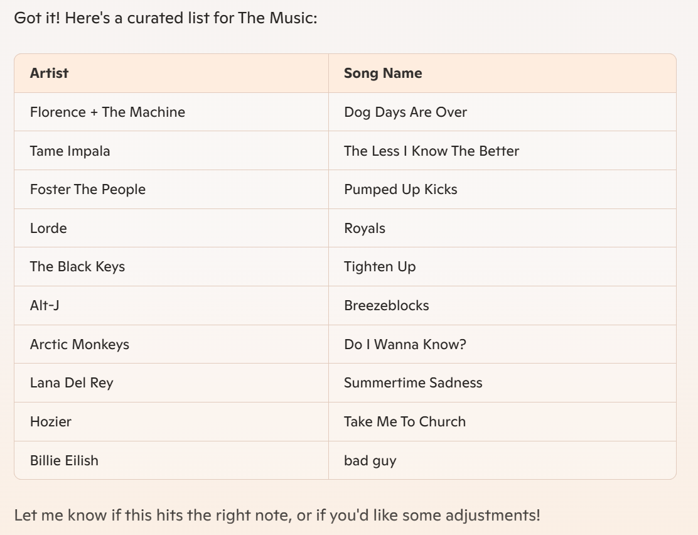

Music is a powerful way to set the mood and atmosphere of your destination. It can also express your theme and personality. How about making a playlist that matches your vision? You can use songs from different genres, artists, and languages to craft your own soundtrack. Use  Copilot to create your playlist.

## Ideate
Ask Copilot to create a playlist of 10 songs that would be appropriate for your destination. Add any details or references to help guide Copilot. You're going to format this list as a table.

> [!TIP]
> **Get creative with directions**. Add details to get more interesting results. Ask for one-hit wonders, indie artists, provide references to other soundtracks, or describe the vibe you are going for.

**Steps**:
1. Copy the sample prompt and edit as desired.
2. Paste the prompt into the chat.
3. Review the response, and iterate as needed until you're happy with the output.
4. Take a screen capture of the table of songs it gave you, and save that image.

**Sample prompt**:
``` 
We need to think about music. This part of the project is called 
The Music. Can you create a table of 10 songs with the Artist and 
Song Name that would fit the theme of this destination? 

```
**Sample response**:

> 

> [!TIP]
> **Iterate as needed!** For example, you could ask Copilot to include or exclude specific artists or genres.

## Key takeaways and further exploration

Key takeaways from this unit:

- Content can be formatted as a table. This format is useful for future applications or exploration in a spreadsheet.

Explore ways to refine your prompts:

- Try asking for links or playlists from common music streaming platforms.
- Create cover art for your playlist.  
- Add modifiers or more descriptive language to the prompt such as identifying music genre or era.