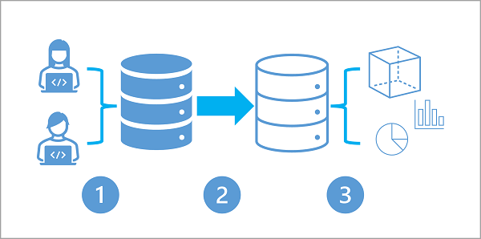

Many business application architectures separate transactional and analytical processing into separate systems with data stored and processed on separate infrastructures. These infrastructures are commonly referred to as OLTP (online transaction processing) systems working with operational data, and OLAP (online analytical processing) systems working with historical data, with each system is optimized for their specific task.

OLTP systems are optimized for dealing with discrete system or user requests immediately and responding as quickly as possible.

OLAP systems are optimized for the analytical processing, ingesting, synthesizing, and managing large sets of historical data. The data processed by OLAP systems largely originates from OLTP systems and needs to be loaded into the OLAP systems by ETL (Extract, Transform, and Load) batch processes.

Due to their complexity and the need to physically copy large amounts of data, this approach creates a delay in data being available to analyze in OLAP systems.

## Hybrid Transactional / Analytical Processing (HTAP)

As more businesses move to digital processes, they increasingly recognize the value of being able to respond to opportunities by making faster and well-informed decisions. HTAP (Hybrid Transactional/Analytical processing) enables business to run advanced analytics in near-real-time on data stored and processed by OLTP systems.

The following diagram illustrates the generalized pattern of an HTAP architecture:

1. A business application processes user input and stores data in a transactional database that is optimized for a mix of data reads and writes based on the application's expected usage profile.
2. The application data is automatically replicated to an analytical store with low latency.
3. The analytical store supports data modeling, analytics, and reporting without impacting the transactional system.
