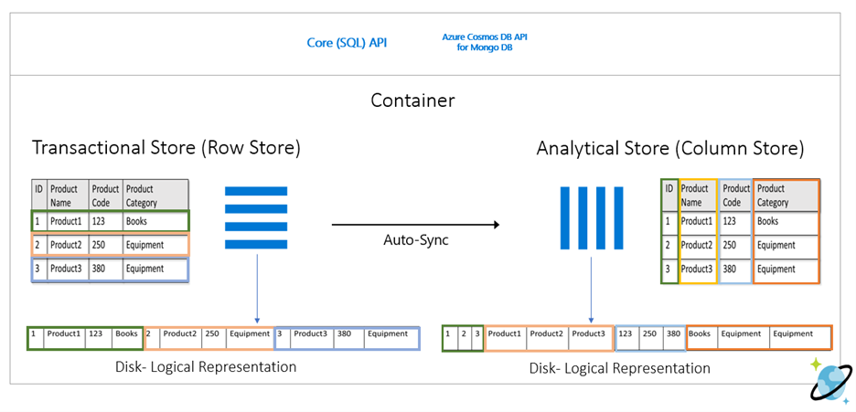

Azure Cosmos DB analytical store is a fully isolated column store for enabling large-scale analytics against operational data in your Azure Cosmos DB, without any impact to your transactional workloads.

## Row-oriented transactional store

Operational data in an Azure Cosmos DB container is internally stored in an indexed row-based "transactional store". The row store format and its associated b-tree index are designed to allow fast transactional reads and writes with single-digit millisecond response times, and high-performance operational queries. As your dataset grows large, complex analytical queries can become expensive as they use up more of the provisioned throughput resources. The increased consumption of provisioned throughput in turn impacts the performance of transactional workloads.

## Column-oriented analytical store

Azure Cosmos DB analytical store addresses the complexity and latency challenges that occur with the traditional ETL pipelines. Azure Cosmos DB analytical store can automatically sync data from the transactional store into a separate column store. Column store format is suitable for large-scale analytical queries to be performed in an optimized manner, resulting in improving the latency of such queries.

## Features of the analytical store

When you create an Azure Cosmos DB container you have the option of enabling analytical store, a new column-store structure is created within the container duplicating the data of the transactional store. This column store structure data is persisted separately from the row-oriented transactional store with the inserts, updates, and deletes performed on the transactional store being transparently copied by means of a fully managed internal autosync process to the analytical store in near real time.

> [!Note]
> You can only enable analytical store at the time of creating a new container.

> [!Note]
> Azure Synapse Link is supported for the Azure Cosmos DB SQL (Core) API and for the Azure Cosmos DB API for MongoDB.

Data is typically automatically synchronized between the transactional store and the analytical store within 2 minutes by means of the autosync process. However, in some circumstances -most notably in situations shared throughput database with many containers, the autosync latency could take up to 5 minutes. 

Due to the fact that the transactional store and analytical store are persisted and queried separately the workloads associated with these stores are isolated from each other, that is to say queries against the analytical store (or the autosync process itself) does not impact the performance of nor use up resources (throughput or request units) provisioned for the transactional store, and operations performed against the transactional store does not impact autosync latency.

> [!Note]
> The transactions (read & write) and storage costs for the analytical store are charged separately from the transactional store storage and throughput. 

The autosync process also takes care of schema updates to the schematized analytical store automatically for you as unique new properties are added over time to items within your container. This allows you to take advantage of the performance advantages provided by schematization without any effort on your part. We will get into more of the details of how analytical store schema is managed and exposed to the Synapse Analytics query capabilities in the next unit. 

You can configure the default Time to Live (TTL) property for records stored within the transactional store and analytical store independently of each other. The TTL value of a record defines when it will be automatically deleted from the store. By configuring the default TTL value of both stores, you can manage the lifecycle of data and define how long it will be retained for in each store. You can override the default TTL value (at the item level) for the transactional store however the default TTL value will always apply to data in the analytical and cannot be overwritten at the item level. 

Azure Cosmos DB support global distributed accounts replicating your containers transparently to the Azure regions choose. When enabled on a container the analytical store will automatically be configured in all chosen global distribution regions, you cannot selectively choose which regions to deploy an analytical store. It is also recommended that you choose and configure your global distribution regions on the account prior to enabling analytical store on a container.
