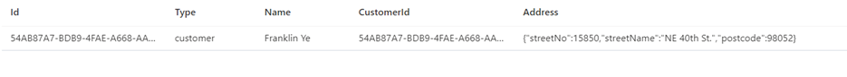
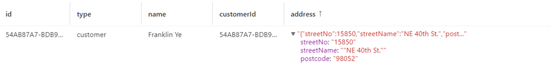
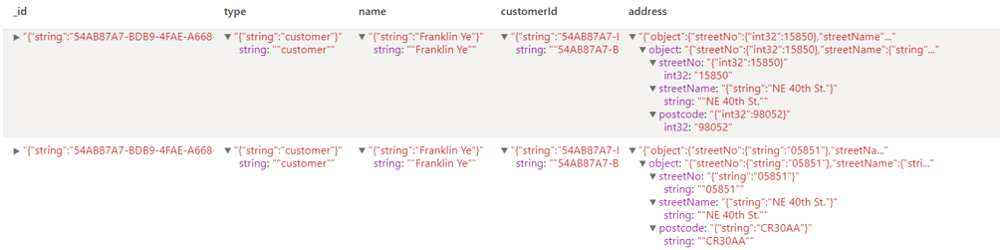
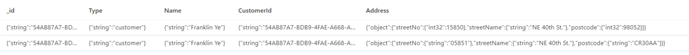

There are two constraints that apply to the schema inferencing done by the autosync process as it transparently maintains the schema in the analytical store based on items added or updated in the transactional store:
- You can have a maximum of unique 1000 properties at any nesting level within the items stored in a transactional store. Any property above this and its associated values will not be present in the analytical store.
- Property names must be unique when compared in a case insensitive manner. For example, the properties {"name": "Franklin Ye"} and {"Name": "Franklin Ye"} cannot exit at the same nesting level in the same item or different items within a container given that “name” and “Name” are not unique when compared in a case insensitive manner.

There are two modes of schema representation for data stored in the analytical store. These modes have tradeoffs between the simplicity of a columnar representation, handling the polymorphic schemas, and simplicity of query experience:
- Well-defined schema representation
- Full fidelity schema representation

For SQL (Core) API accounts, when analytical store is enabled, the default schema representation in the analytical store is well-defined. Whereas for Azure Cosmos DB API for MongoDB accounts, the default schema representation in the analytical store is full fidelity schema representation. (If you have scenarios requiring a different schema representation than the default offering for each of these APIs, reach out to the Azure Cosmos DB team to enable it.)

## Well-defined schema representation

The well-defined schema representation creates a simple tabular representation of the schema-agnostic data in the transactional store as it copies it to the analytical store. 

The following code fragment is an example JSON document representing a customer profile record:

```json
{
  "id": "54AB87A7-BDB9-4FAE-A668-AA9F43E26628",
  "type": "customer",
  "name": "Franklin Ye",
  "customerId": "54AB87A7-BDB9-4FAE-A668-AA9F43E26628",
  "address": {
    "streetNo": 15850,
    "streetName": "NE 40th St.",
    "postcode": "CR30AA",
  }
}
```

The well-defined schema representation has the top-level properties of the documents exposed as columns when queried from both Synapse SQL and Synapse Spark, along with column values that representing the property values, except in the case where those values are of object type or array type, in which case a JSON representation of the properties values contained within are assigned to the column values, and have the following additional considerations:

1.	A property always has the same type across multiple items.
    
    For example, ```{"postcode":98065}``` and ```{"postcode": "CR30AA"}``` does not have a well-defined schema because "postcode" is sometimes a string and sometimes a number. In this case, the analytical store registers the data type of the postcode attribute within the analytical store, as the data type of the postcode property on its first occurrence in the lifetime of the container, the items where the data type of the postcode attribute differs from this registered value will not be included in the analytical store.
    
2.  This condition does not apply for null properties. 
    
    For example, {"postcode":98065} {"postcode":null} is still well-defined.

3. 	Array types must contain a single repeated type.
    
    For example, {"postcode": [98065, “CR30AA”]} is not a well-defined schema because the array contains a mix of integer and string types.

Importantly when the Azure Cosmos DB analytical store is using well-defined schema representation mode the data stored in documents added to the container that violates the above rules, these documents will not be included in the analytical store.

When queried from Azure Synapse Analytics, the analytical store record sample will look similar to the following:



The following is the result set as shown in Spark:


 
## Full-fidelity schema representation

The full-fidelity schema representation creates a more complex tabular representation of the schema-agnostic data in the transactional store as it copies it to the analytical store. The full-fidelity schema representation has the top-level properties of the documents exposed as columns when queried from both Synapse SQL and Synapse Spark along with a JSON representation of the properties values contained within as column values. This is extended to include the data type of the properties along with their property values and as such can better handle polymorphic schemas of operational.  With this schema representation, no items are dropped from the analytical store due to the need to meet the well-defined schema rules.
For example, let’s take the following sample document in the transactional store:

```json
{
  "id": "54AB87A7-BDB9-4FAE-A668-AA9F43E26628",
  "type": "customer",
  "name": "Franklin Ye",
  "customerId": "54AB87A7-BDB9-4FAE-A668-AA9F43E26628",
  "address": {
    "streetNo": 15850,
    "streetName": "NE 40th St.",
    "postcode": "CR30AA",
  }
}
```

The leaf property streetNo within the nested object address will be represented in the analytical store schema as "streetNo":{"int32":"15850"} JSON. The datatype is added as a suffix to the embedded JSON for the address column. 

This way, if another document is added to the transactional store where the value of leaf property streetNo is "05851" (note it’s a string), the schema of the analytical store automatically evolves without the need to conform to the previously written property types. The leaf property streetNo within the nested address will be represented in the analytical store as "streetNo":{"string":"05851"} JSON.

```json
{
  "id": "54AB87A7-BDB9-4FAE-A668-AA9F43E26629",
  "type": "customer",
  "name": "Franklin Ye",
  "customerId": "54AB87A7-BDB9-4FAE-A668-AA9F43E26629",
  "address": {
    "streetNo": “05851”,
    "streetName": "NE 40th St.",
    "postcode": 98052
  }
}
```

The following is the resultset shown in Spark:



The following is the resultset shown in SQL:



For reference here is a map of all the property data types and their suffix representations in the analytical store along with an indication of the API where these property data types are supported

|Original data type|SQL (Core) API|MongoDB API|Suffix name|Example|
|---|---|---|---|---|
|Double|X|X|".float64"|24.99|
|Array|X|X|".array"|["a", "b"]|
|Binary||X|".binary"|0|
|Boolean|X|X|".bool"|TRUE|
|Int32|X|X|".int32"|123|
|Int64|X|X|".int64"|255486129307|
|Null|X|X|".null"|null|
|String|X|X|".string"|"ABC"|
|Timestamp||X|".timestamp"|Timestamp(0, 0)|
|DateTime||X|".date"|ISODate("2020-08-21T07:43:07.375Z")|
|ObjectId||X|".objectId"|ObjectId("5f3f7b59330ec25c132623a2")|
|Document|X|X|".object"|{"a": "a"}|