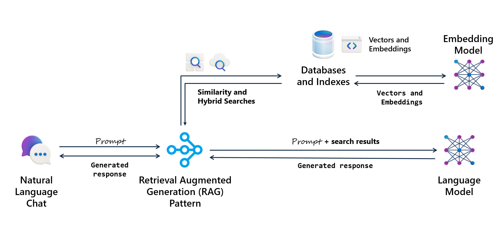

Large Language Models (LLM) don't know your organization. Your products, customers, policies. None of that exists in their training data. When a customer asks "Which pedals fit the mountain bike I bought last month?", the model can only guess.

Retrieval Augmented Generation (RAG) fixes this issue by feeding the model your data when it needs to answer. You retrieve information from your database, add it to the prompt, and let the model respond based on what you provided. The model doesn't need to "know" your catalog because you give it what it needs for each question.

In previous modules, you learned to find relevant data using full-text, vector, and hybrid search. That step becomes the retrieval piece in RAG. Now you complete the pattern by augmenting prompts with retrieved data and generating grounded responses.

## Understand how RAG works

RAG combines three steps. First, retrieve relevant data from your database. For the pedals question, find the customer's order, identify the bike model, and look up compatible components. Second, augment the prompt by adding that data as context. The model receives both the question and the information to answer it. Third, the model generates a response grounded in your data rather than its training.

The following diagram shows a RAG architecture with SQL Database. A natural language chat sends a prompt to a RAG orchestration layer, which runs similarity and hybrid searches against the database. The database exchanges vectors and embeddings with an embedding model. The orchestration layer forwards the prompt plus search results to a language model, which returns a grounded response.

This approach differs from fine-tuning, which retrains a model on your data. Fine-tuning bakes knowledge in permanently. RAG keeps data in your database and supplies only what each request needs. When specs change or new components arrive, answers reflect those changes immediately.

## Recognize when RAG fits your scenario

RAG works when data changes frequently. Fine-tuned models can't keep pace with daily inventory updates, but RAG retrieves current data every time. RAG also fits when you need to trace answers. You control retrieval, so you know which records informed each response.

Privacy matters too. Fine-tuning sends data to the model provider for training. RAG keeps data in your database and sends only the context needed per request. For sensitive customer data or proprietary knowledge, RAG provides a cleaner separation.

Consider whether users ask domain-specific questions. General models handle common knowledge, but struggle with your products, processes, or history. RAG bridges that gap by grounding responses in your information.

## Explore common RAG scenarios

RAG applies wherever users need answers that depend on your specific data. Here are some scenarios where SQL-based RAG adds value:

- **Customer support**: A customer asks "Can I return the bike I ordered three weeks ago?" The system retrieves their order history, checks your return policy, and generates an answer that cites the specific order and applicable policy terms.

- **Product configuration**: A shopper says "Build me a complete mountain biking setup under $2,000." RAG retrieves compatible frames, components, and accessories from your catalog, checks current inventory and pricing, and assembles a configuration that meets the budget.

- **Internal knowledge base**: An employee needs the expense reimbursement process for international travel. RAG searches policy documents stored in your database and summarizes the relevant steps with links to forms.

- **Sales enablement**: A sales rep preparing for a call says "Draft a follow-up email for this customer based on their recent purchases and open issues." RAG pulls order history and support tickets, then generates a personalized email grounded in the actual relationship context.

- **Technical documentation**: A developer asks "Generate a migration script to move our user table to the new schema." RAG searches your documentation and schema definitions, retrieves the relevant structures, and produces a script based on your actual table definitions.

Each scenario follows the same pattern: retrieve context from SQL, augment the prompt, and generate a grounded response. The difference is what you retrieve and how you structure it. There's an endless variety of use cases where RAG enhances LLM capabilities with your data.

## Understand SQL's role in RAG architecture

Azure SQL Database and SQL Server 2025 participate in RAG without hosting models. Your database stores products, orders, documents, and embeddings. T-SQL handles retrieval using full-text, vector, or hybrid search. You format results as JSON, construct prompts, call the LLM via `sp_invoke_external_rest_endpoint`, and parse responses.

The LLM runs elsewhere, for example Azure OpenAI. Your T-SQL orchestrates the flow: retrieve data, build a prompt, call the model, extract the answer, return it. This flow keeps logic close to data and lets you add AI to existing apps by modifying T-SQL rather than rearchitecting.

> [!NOTE]
> SQL Server 2025 and Azure SQL Database both support RAG. However, `sp_invoke_external_rest_endpoint` is enabled by default only in Azure SQL Database. In SQL Server 2025, enable it with `sp_configure`.

## Key takeaways

RAG grounds model responses in your database by combining retrieval, augmentation, and generation. It fits when data changes often, when you need traceable answers, or when privacy requires keeping data in your control. SQL handles retrieval and orchestration; the model handles generation. Next, you prepare context as JSON, construct prompts, and call LLM endpoints.
