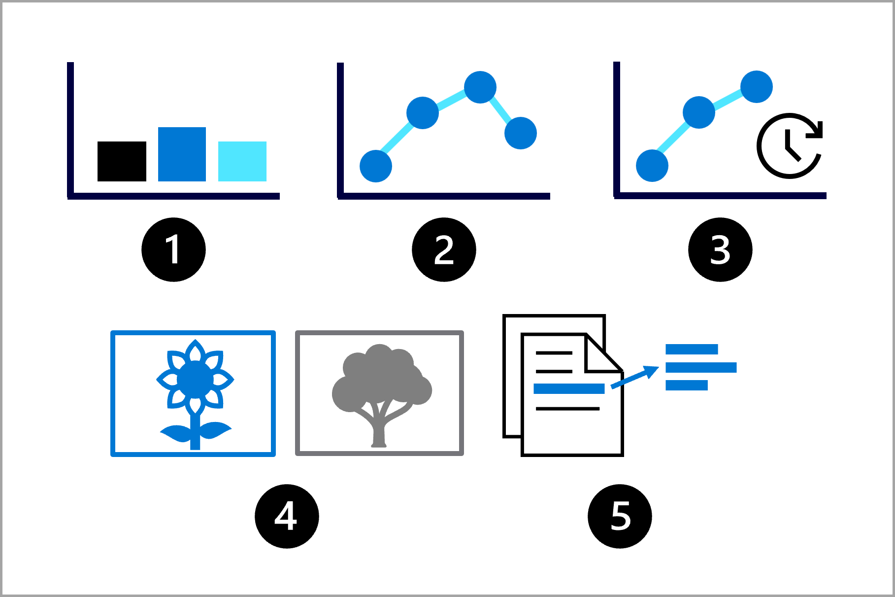

Imagine you're a data scientist and have been asked to train a machine learning model. 

You aim to go through the following six steps to plan, train, deploy, and monitor the model:

:::image type="content" source="../media/machine-learning-process.png" alt-text="Diagram showing the six steps of the machine learning process.":::

1. **Define the problem**: Decide on what the model should predict and when it's successful. 
1. **Get the data**: Find data sources and get access. 
1. **Prepare the data**: Explore the data. Clean and transform the data based on the model's requirements.
1. **Train the model**: Choose an algorithm and hyperparameter values based on trial and error.
1. **Integrate the model**: Deploy the model to an endpoint to generate predictions.
1. **Monitor the model**: Track the model's performance.

> [!Note]
> The diagram is a simplified representation of the machine learning process. Typically, the process is iterative and continuous. For example, when monitoring the model you may decide to go back and retrain the model.

Starting with the first step, you want to **define the problem** the model will solve by understanding:

- What the model’s output should be.
- What type of machine learning task you’ll use.
- What criteria makes a model successful.

Depending on the data you have and the expected output of the model, you can identify the machine learning task. The task will determine which types of algorithms you can use to **train the model**. 

Some common machine learning tasks are:

1. **Classification**: Predict a categorical value.
2. **Regression**: Predict a numerical value.
3. **Time-series forecasting**: Predict future numerical values based on time-series data.
4. **Computer vision**: Classify images or detect objects in images.
5. **Natural language processing** (**NLP**): Extract insights from text. 

To train a model, you have a set of algorithms that you can use, depending on the task you want to perform. To evaluate the model, you can calculate performance metrics such as accuracy or precision. The metrics available will also depend on the task your model needs to perform and will help you to decide whether a model is successful in its task.

When you know what the problem is you're trying to solve and how you'll assess the success of your model, you can choose the service to train and manage your model.

