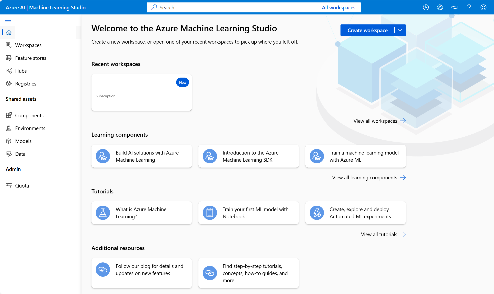

You can use **Azure Machine Learning studio**, a browser-based portal for managing your machine learning resources and jobs, to access many types of machine learning capabilities. 

In Azure Machine Learning studio, you can (among other things):

- Import and explore data.
- Create and use compute resources.
- Run code in notebooks.
- Use visual tools to create jobs and pipelines.
- Use automated machine learning to train models.
- View details of trained models, including evaluation metrics, responsible AI information, and training parameters.
- Deploy trained models for on-request and batch inferencing.
- Import and manage models from a comprehensive model catalog.

## Provisioning Azure Machine Learning resources

The primary resource required for Azure Machine Learning is an *Azure Machine Learning workspace*, which you can provision in an Azure subscription. Other supporting resources, including storage accounts, container registries, virtual machines, and others are created automatically as needed. You can create an Azure Machine Learning workspace in the *Azure portal*. 

#### Decide between compute options

When you use Azure Machine Learning to train a model, you need to select **compute**. Compute refers to the computational resources required to perform the training process. Every time you train a model, you should monitor how long it takes to train the model and how much compute is used to execute your code. By monitoring the compute utilization, you know whether to scale your compute up or down.

When you choose to work with Azure instead of training a model on a local device, you have access to scalable and cost-effective compute.

| Compute options | Considerations |
|---|---|
| **Central Processing Unit** (**CPU**) or a **Graphics Processing Unit** (**GPU**) | For smaller tabular datasets, a CPU is sufficient and cost-effective. For unstructured data like images or text, GPUs are more powerful and efficient. GPUs can also be used for larger tabular datasets, if CPU compute is proving to be insufficient.|
| **General purpose** or **memory optimized** | Use general purpose to have a balanced CPU-to-memory ratio, which is ideal for testing and development with smaller datasets. Use memory optimized to have a high memory-to-CPU ratio. Great for in-memory analytics, which is ideal when you have larger datasets or when you're working in notebooks. |

Which compute options best fit your needs is often a case of trial and error. When running code, you should monitor the compute utilization to understand how much compute resources you're using. If training your model takes too long, even with the largest compute size, you can use GPUs instead of CPUs. Alternatively, you can choose to distribute model training by using Spark compute which require you to rewrite your training scripts.

## Azure Automated Machine Learning 

When you use Azure Machine Learning's Automated machine learning capabilities, you are automatically assigned compute. **Azure Automated machine learning** automates the time-consuming, iterative tasks of machine learning model development.

In Azure Machine Learning studio, you can use Automated machine learning to design and run your training experiments with the same steps described in this module, without needing to write code. Azure Automated machine learning provides a step-by-step wizard that helps you run machine learning training jobs. The automated training can be used for many machine learning tasks, including regression, time-series forecasting, classification, computer vision, and natural language processing tasks. Within AutoML, you have access to your own datasets. Your trained machine learning models can be deployed as services. 

Next, let's look at model deployment options.
