There is more to a data warehouse than simply storing business data. Data grows at an exponential rate, year over year. Not just the volume of data, but the variety of data, from structured, to semi-structured, and to a greater degree, unstructured that must be managed. The velocity and variety of data leads to data engineering challenges when it comes to ingesting, transforming, and preparing the data for machine learning, reporting, and other purposes.

The modern data warehouse serves to address these challenges. A good data warehouse adds value, such as acting as a central location for all your data, scale with the data as it grows over time, and providing familiar tools and ecosystem for your data engineers, data analysts, data scientists, and developers.

Let's look at each of these elements in detail.

## One place for all your data

With a modern data warehouse, we have one hub for all data when using Synapse Analytics.

Synapse Analytics enables you to ingest data from multiple data sources through its orchestration pipelines.

1.	Select the **Integrate** hub.
 
    

    Manage integration pipelines within the Integrate hub. If you are familiar with Azure Data Factory (ADF), then you will feel at home in this hub. The pipeline creation experience is the same as in ADF, which gives you another powerful integration built into Azure Synapse Analytics, removing the need to use Azure Data Factory for data movement and transformation pipelines.

1.	Expand Pipelines and select **Customize EMail Analytics (1)**. Select the **Copy data** activity on the canvas **(2)**, select the **Source** tab **(3)**, then select **Preview data (4)**.
 
    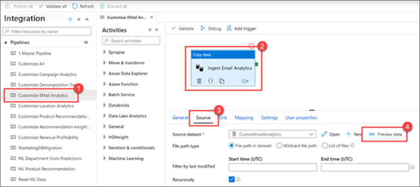

    Here we see the source CSV data that the pipeline ingests.
 
    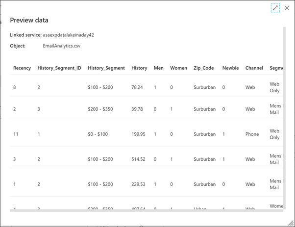

2.	Close the preview, then select **Open** next to the **CustomEmailAnalytics** source dataset.
 
    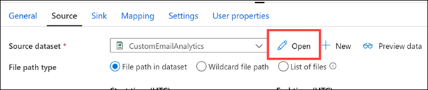

3.	Show the **Linked service** associated with the dataset's connection, as well as the CSV file path **(1)**. **Close (2)** the dataset to return to the pipeline.
 
    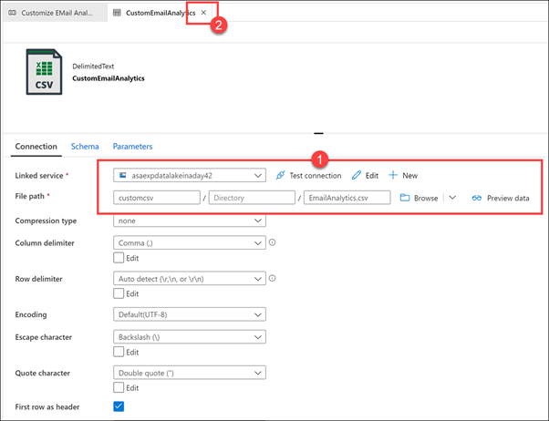

4.	On the pipeline, select the **Sink** tab **(1)**. The bulk insert copy method is selected and there is a pre-copy script that truncates the **EmailAnalytics** table, which runs prior to copying the data from the CSV source **(2)**. Select **Open** next to the **EmailAnalytics** sink dataset **(3)**.
 
    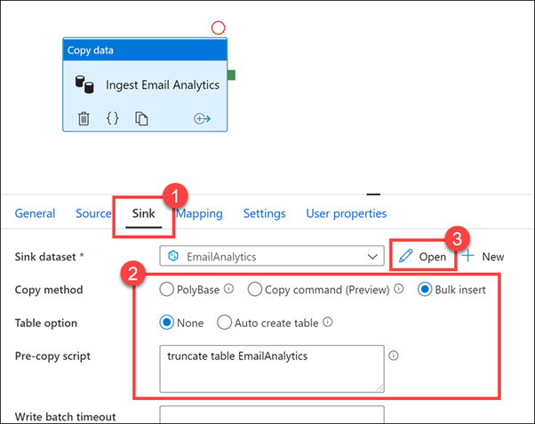

5.	The **Linked service** is the Azure Synapse Analytics SQL pool, and the **Table** is **EmailAnalytics (1)**. The Copy data activity in the pipeline uses the connection details in this dataset to copy data from the CSV data source into the SQL pool. Select **Preview data (2)**.
 
    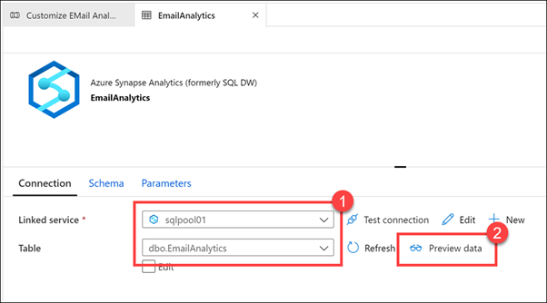

    We can see that the table already contains data, which means that we have successfully run the pipeline in the past.
 
    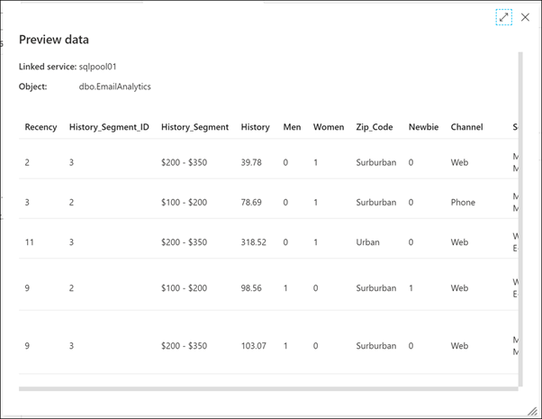

6.	**Close** the **EmailAnalytics** dataset.
 
    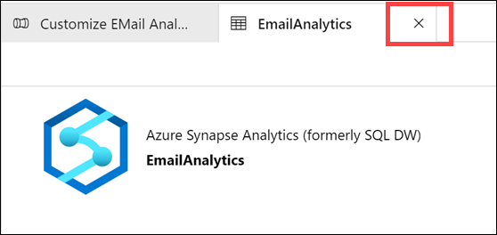

7.	Select the **Mapping** tab. This is where you configure the mapping between the source and sink datasets. The **Import schemas** button attempts to infer the schema for your datasets if they are based on unstructured or semi-structured data sources, like CSV or JSON files. It also reads the schema from structured data sources, like Synapse Analytics SQL pools. You also have the option to manually create your schema mapping by clicking on **+ New mapping** or by modifying the data types.
 
    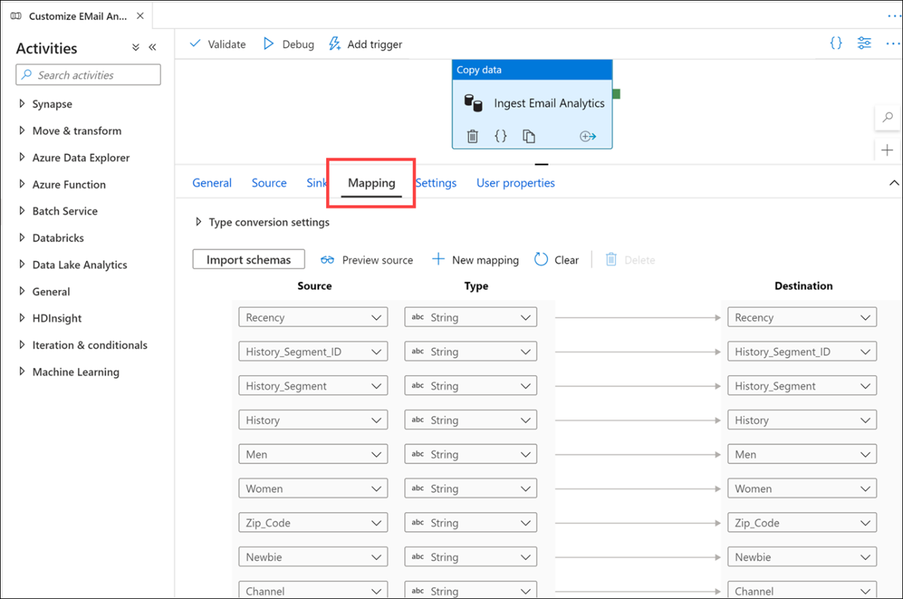

8.	Select the **MarketingDBMigration (1)** pipeline. Direct your attention to the pipeline's canvas **(2)**.
 
    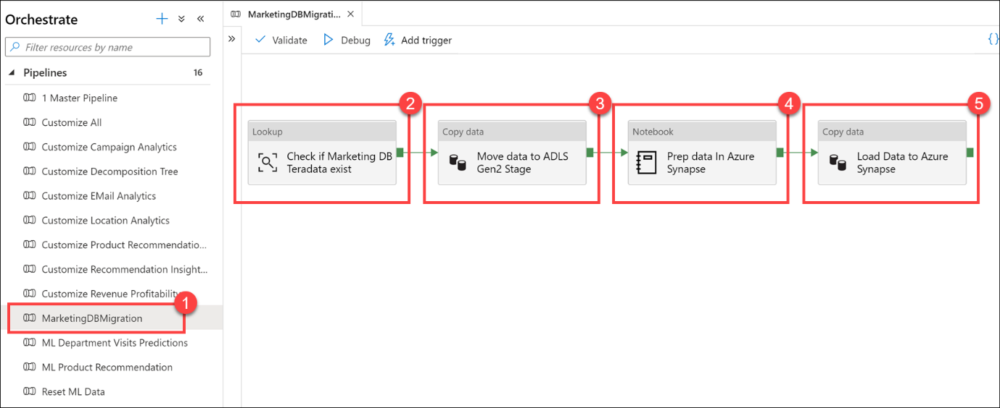

    This pipeline is responsible for copying data from a Teradata database. The first activity is a **lookup (2)** to make sure that the source data exists. If data exists, it flows to the **copy data activity (3)** to move the source data into the data lake (ADLS Gen2 primary data source). The next step is a **Notebook activity (4)**, which uses Apache Spark within a Synapse Notebook to perform data engineering tasks. The last step is another **copy data activity (5)** that loads the prepared data and stores it into an Azure Synapse SQL pool table.

    This workflow is common when conducting data movement orchestration. Synapse Analytics pipelines makes it easy to define data movement and transformation steps, and encapsulates these steps into a repeatable process that you can maintain and monitor within your modern data warehouse.

9.	Select the **SalesDBMigration (1)** pipeline. Direct your attention to the pipeline's canvas **(2)**.
 
    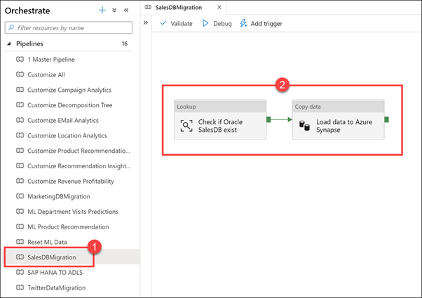

    Here is another example of a data movement orchestration pipeline that helps us combine external data sources into our warehouse. In this case, we load data from an Oracle sales database into an Azure Synapse SQL pool table.

10.	Select the **SAP HANA TO ADLS** pipeline. This pipeline copies data from a financial SAP HANA data source into the SQL pool.

11.	Select the **+** button at the top of the **Orchestrate** blade, then select **Pipeline** to create a new pipeline.
 
    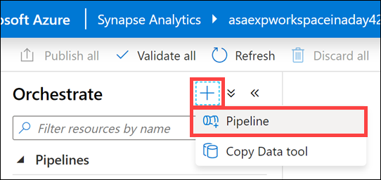

    When the new pipeline opens, the **Properties** blade appears **(1)**, allowing you to name the pipeline **(2)**.
 
    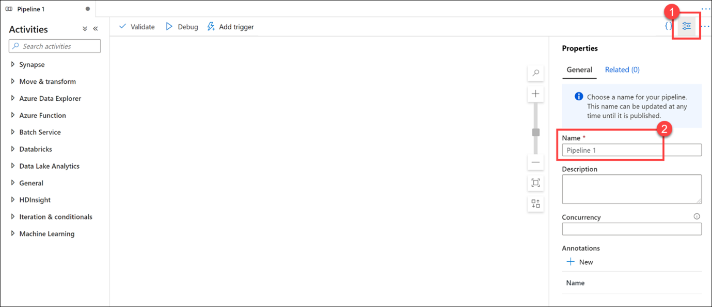

12.	Expand the Move & transform activity group, then drag the **Copy data** activity onto the design canvas **(1)**. With the Copy data activity selected, select the **Source** tab **(2)**, then select **+ New (3)** next to the source dataset.
 
    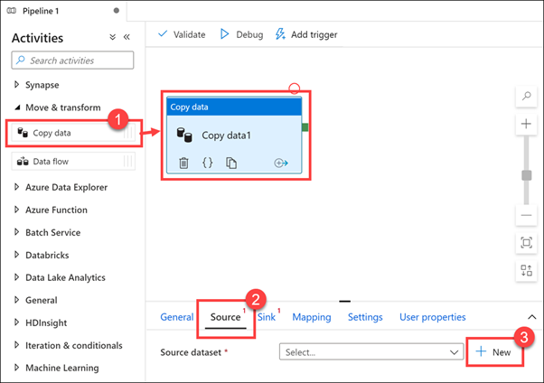

13.	Scroll through the list of dataset sources to show the large number of data connections at your disposal, and then click cancel.
 
    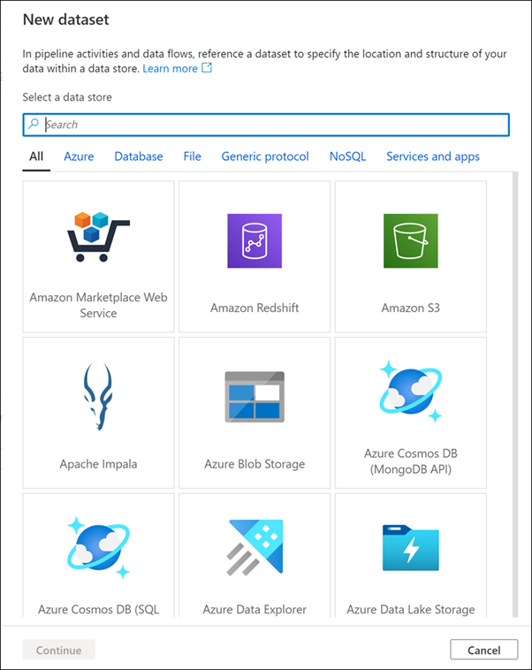

## Unlimited data scale

1.	Select the **Manage** hub.
 
    

2.	Select **SQL pools (1)**. Hover over **SQLPool01** and select the **Scale** button **(2)**.
 
    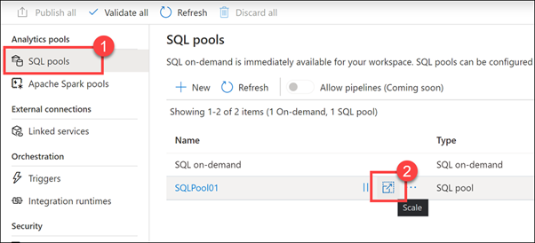

3.	Drag the **Performance level** slider right and left.
 
    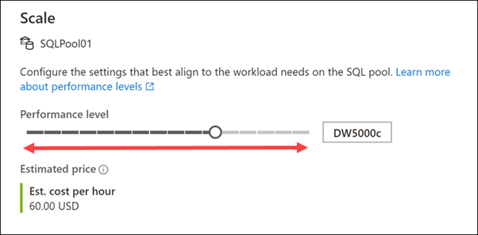

    You can scale out or back compute by adjusting the number of Data Warehouse Units (DWUs) assigned to your SQL pool. This adjusts the loading and query performance linearly as you add more units.

    To perform a scale operation, SQL pool first kills all incoming queries and then rolls back transactions to ensure a consistent state. Scaling only occurs once the transaction rollback is complete.

    You can scale SQL compute at any time by using this slider. You can also programmatically adjust the Data Warehouse Units, enabling scenarios where you automatically scale your pool based on a schedule or other factors.

4.	Cancel the Scale dialog, then select **Apache Spark pools (1)** in the Manage hub left-hand menu. Hover over **SparkPool01** and select the **auto-scale settings** button **(2)**.
 
    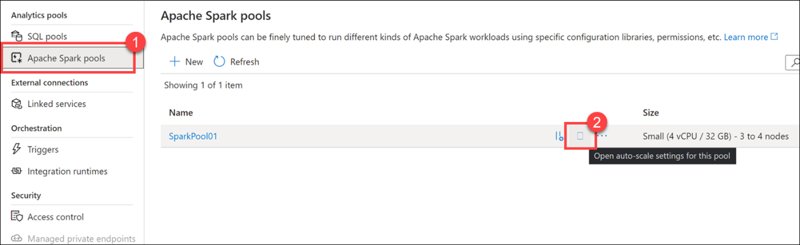

5.	Drag the **Number of nodes** slider right and left.
 
    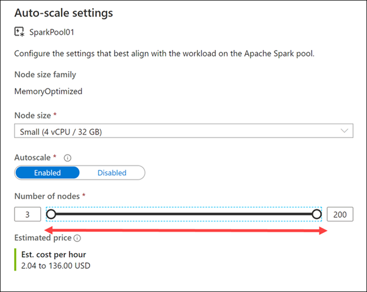

    You can configure the Apache Spark pool to have a fixed size by disabling the autoscale setting. Here we have enabled autoscale and set the minimum and maximum number of nodes to control the amount of scale applied. When you enable autoscale, Synapse Analytics monitors the resource requirements of the load and scales the number of nodes up or down. It does this by continuously monitoring pending CPU, pending memory, free CPU, free memory, and used memory per node metrics. It checks these metrics every 30 seconds and makes scaling decisions based on the values.

    It can take 1-5 minutes for a scaling operation to complete.

6.	Cancel the auto-scale dialog, then select **Linked services (1)** in the Manage hub left-hand menu. Make note of the **WorkspaceDefaultStorage** ADLS Gen2 storage account **(2)**.
 
    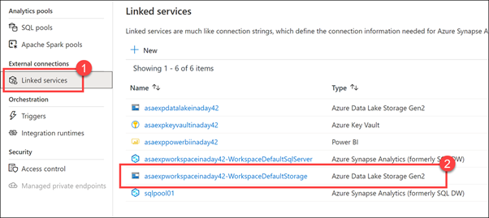

    When you provision a new Azure Synapse Analytics workspace, you define the default storage Azure Data Lake Storage Gen2 account. Data Lake Storage Gen2 makes Azure Storage the foundation for building enterprise data lakes on Azure. Designed from the start to service multiple petabytes of information while sustaining hundreds of gigabits of throughput, Data Lake Storage Gen2 allows you to easily manage massive amounts of data.

    Its hierarchical namespace organizes files into a hierarchy of directories for efficient access and more granular security, down to the file-level.

    ADLS Gen2 provides virtually limitless scale for your data lake. You can attach additional ADLS Gen2 accounts for greater scale and flexibility as needed.

## Familiar tools and ecosystem

1.	Select the **Develop** hub.
 
    

2.	Expand **SQL scripts** and select **1 SQL Query With Synapse (1)**. Make sure you are connected to **SQLPool01 (2)**. **Highlight (3)** the first line of the script and execute. Observe that the number of records in the Sales table is 3,443,486 **(4)**.
 
    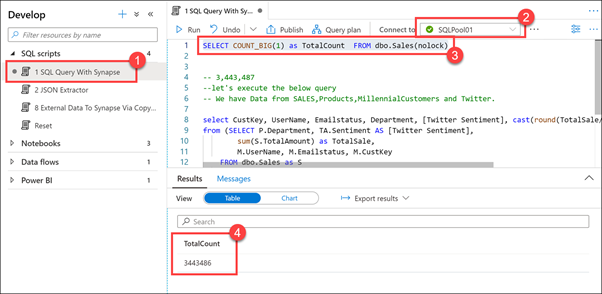

    If we execute the first line in this SQL script, we can see that we have almost 3.5 million rows contained within.

3.	**Highlight** the rest of the script (lines 8 - 18) and execute.
 
    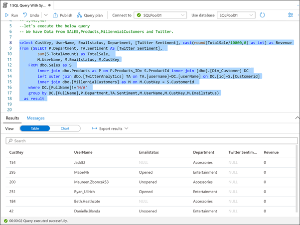

    One of the benefits of using a modern data warehouse like Synapse Analytics is that you can combine all your data in one place. The script we just executed joins data from a sales database, product catalog, millennial customers extracted from demographics data, and twitter.

4.	Select the **2 JSON Extractor (1)** script and make sure you're still connected to **SQLPool01**. Highlight the **first select statement (2)** (line 3). Observe that the data stored in the **TwitterData** column **(3)** is in JSON format.
 
    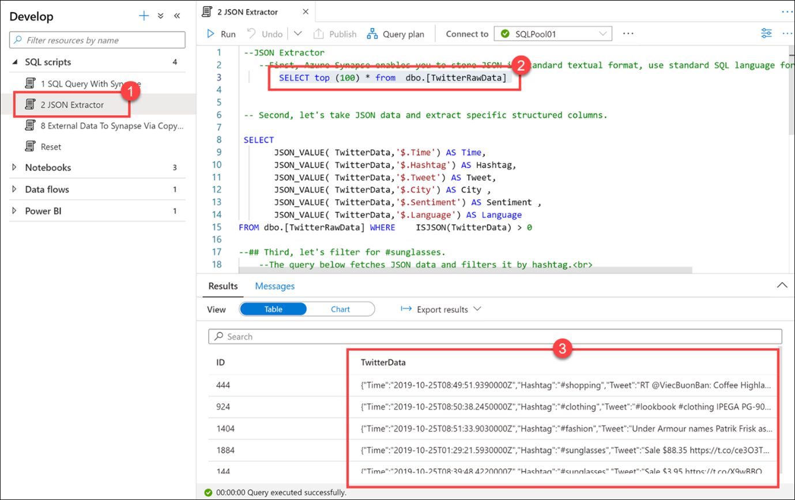

    Azure Synapse enables you to store JSON in standard textual format. Use standard SQL language for querying JSON data.

5.	Highlight the next SQL statement (**lines 8 - 15**) and execute.
 
    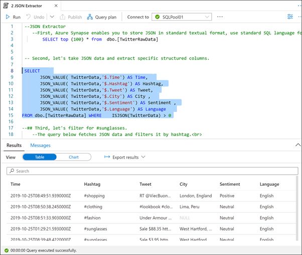

    We can use JSON functions, such as JSON_VALUE and ISJSON to extract the JSON data and extract it to specific structured columns.

6.	Highlight the next SQL statement (**lines 21 - 29**) and execute.
 
    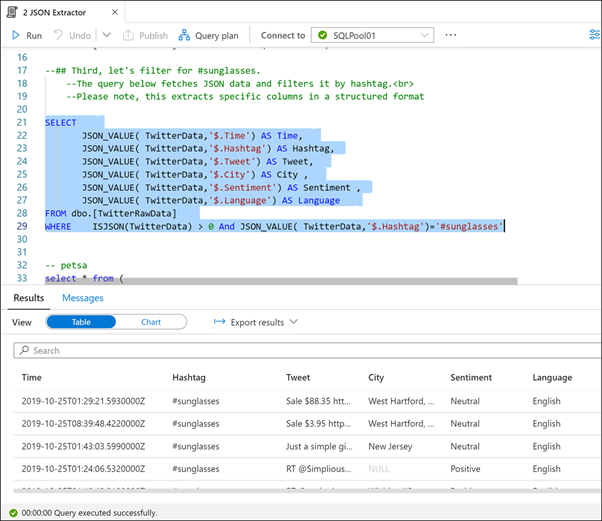

    We want to filter for the **#sunglassess** hashtag. This query fetches and extracts the JSON data into structured columns, then filters on the derived Hashtag column.

    The last script does the same thing, but just using a subquery format.

7.	Select the **8 External Data To Synapse Via Copy Into (1)** script. **DO NOT EXECUTE**. Scroll through the script file, using the commentary below to explain what it does.
 
    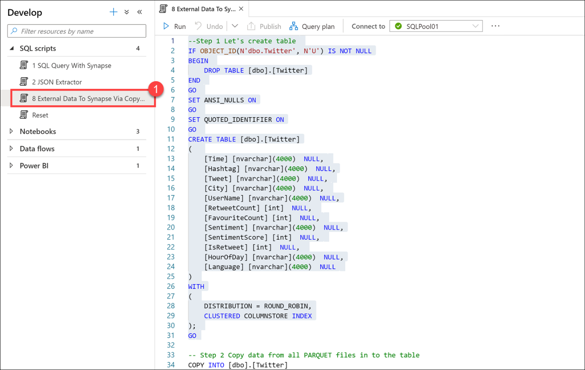

    In this script, we create a table to store Twitter data stored in Parquet files. We use the **COPY** command to quickly and efficiently load all data stored in Parquet files into the new table.

    Finally, we select the first 10 rows to verify the data load.

    The COPY command and PolyBase can be used to import data from various formats into the SQL pool, either through T-SQL scripts like we see here, or from orchestration pipelines.

8.	Select the **Data** hub.
 
    

9.	Select the **Linked tab (1)**, expand the Azure Data Lake Storage Gen2 group, expand the Primary storage account, then select the **twitterdata** container **(2)**. Right-click on the **dbo.TwitterAnalytics.parquet** file (3), then select **New notebook (4)**.
 
    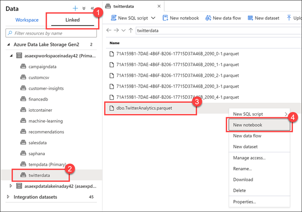

    Synapse Studio provides several options to work with files stored in attached storage accounts, such as creating a new SQL script, a notebook, data flow, or new dataset.

    Synapse Notebooks enable you to harness the power of Apache Spark to explore and analyze data, conduct data engineering tasks, and do data science. Authentication and authorization with linked services, such as the primary data lake storage account, are fully integrated, allowing you to immediately start working with files without dealing with account credentials.

    Here we see a new notebook that loads a Spark DataFrame **(1)** with the Parquet file that we right-clicked on in the Data hub. We can immediately start exploring the file contents in just a couple simple steps. At the top of the notebook, we see that it is attached to **SparkPool01**, our Spark pool, and the notebook language is set to **Python (2)**.

    Do not execute the notebook unless the Spark pool is ready **(3)**. It can take up to 5 minutes to start the pool if it is idle. Alternatively, you can execute the notebook, then come back to it later to view the results.
 
    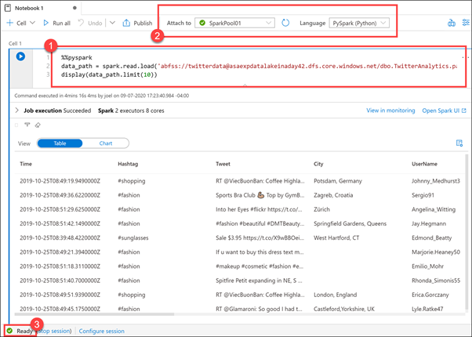
